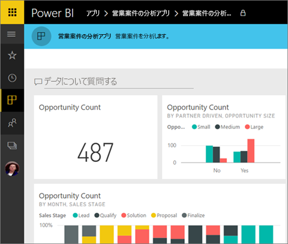
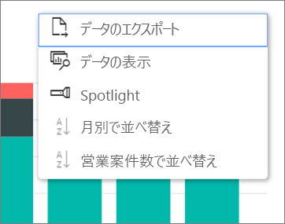

# Power BI でダッシュボードとレポートを含むアプリをインストールして使用する
これで[アプリの基礎を理解](end-user-apps.md)できたので、次はアプリを開いて操作する方法を学習しましょう。 

## 新しいアプリの入手方法
新しいアプリの入手には、いくつか方法があることを既に説明しました。 レポートのデザイナーである同僚は、あなたの Power BI アカウントにアプリを自動的にインストールするか、アプリの直接リンクを送信することができます。 それからご自分で AppSource に進み、社内と社外の両方から提供されているアプリを検索することができます。 

モバイル デバイスの Power BI では、直接リンクからのみアプリをインストールできます。AppSource からはインストールできません。 アプリの作成者が自動的にアプリをインストールした場合は、アプリの一覧に表示されます。

## 直接リンクからのアプリをインストールする
新しいアプリをご自分でインストールする最も簡単な方法は、アプリの作成者からメールでの直接リンクを得ることです。  

**コンピューターで** 

電子メールのこのリンクを選択すると、ブラウザーで Power BI サービス ([https://powerbi.com](https://powerbi.com)) が開きます。 アプリのインストールを確認すると、Power BI によってアプリのランディング ページが開かれます。

**iOS または Android モバイル デバイスで** 

モバイル デバイスで電子メールにあるリンクを選択すると、アプリが自動的にインストールされ、モバイル アプリでアプリのコンテンツ リストが開きます。 

## Microsoft AppSource からアプリを取得する
アプリを Microsoft AppSource から検索してインストールすることもできます。 アクセスできる (つまり、アプリの作成者があなたまたはすべてのユーザーにアクセス許可を与えた) アプリのみが表示されます。

1. **[アプリ]** ![左側のナビゲーション ウィンドウの [アプリ]](./media/end-user-apps/power-bi-apps-bar.png) > **[アプリの取得]** の順に選択します。 
   
     ![[アプリの取得] アイコン](./media/end-user-app-view/power-bi-get-apps.png)
2. [AppSource] の **[My organization (自分の組織)]** で、結果を絞り込むための検索を行って、探しているアプリを見つけることができます。
   
     ![AppSource の [自分の所属組織]](./media/end-user-app-view/power-bi-appsource-my-org.png)
3. **[今すぐ入手する]** を選択して、これをアプリのコンテンツ リストに追加します。 

## アプリのダッシュボードとレポートを操作する
これで、アプリのダッシュボードおよびレポートのデータを探索できます。 フィルター処理、強調表示、並べ替え、ドリル ダウンなど、Power BI の標準機能にすべてアクセスできます。 レポート内のテーブルや他のビジュアルから [Excel にデータをエクスポートする](end-user-export-data.md)こともできます。 [Power BI でレポートを使用する方法](end-user-reading-view.md)に関するページをご覧ください。 

## 次の手順
* [外部サービス用の Power BI アプリ](end-user-connect-to-services.md)
* わからないことがある場合は、 [Power BI コミュニティで質問してみてください](http://community.powerbi.com/)。

