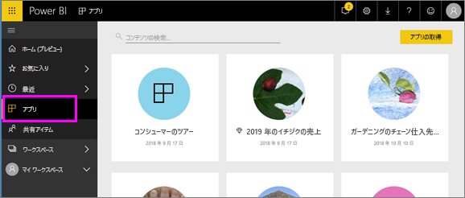

# Power BI のアプリ
## Power BI とは?
*アプリ*とは、関連するダッシュ ボードとレポートがすべて 1 か所にまとめられた Power BI のコンテンツの種類です。 アプリでは、1 つ以上のダッシュ ボードと 1 つ以上のレポートをすべてまとめることができます。 アプリは、あなたのような*コンシューマー*に、アプリを配布するおよび共有する Power BI *デザイナー*によって作成されます。 

ご使用のアプリは、**[アプリ]** コンテンツ リストにまとめられます。

> [!NOTE]
> アプリの機能を使うには、Power BI Pro ライセンスが必要です。 <!-- add link to how to figure out your license -->

## アプリの***デザイナー***とアプリの***コンシューマー***
自分の役割に応じて、あなたは自分で使用したり、同僚と共有したりするアプリの作成者 (デザイナー) である場合があります。 または、他のユーザーが作成したアプリを受け取りダウンロードするコンシューマーである場合があります。 この記事は、アプリの*コンシューマー*を対象としています。

## アプリの利点
アプリは Power BI サービス ([https://powerbi.com](https://powerbi.com)) とご利用のモバイル デバイスに簡単に検索してインストールできます。 アプリのインストール後は、さまざまなダッシュボードの名前を覚えておく必要がありません。ブラウザー内やモバイル デバイス上では 1 つのアプリにまとめて表示されるためです。

アプリの作者が更新プログラムを公開するたびに、自動的に変更が反映されます。 作成者はデータの更新頻度も制御するため、最新の状態が維持されているかを気にする必要はありません。 

<!-- add conceptual art -->
## 新しいアプリを取得する
さまざまな方法でアプリを入手できます。 
- アプリの作成者が、アプリを Power BI アカウントに自動的にインストールすると、Power BI を次回開いたときに、新しいアプリが **[アプリ]** コンテンツ リストに表示されます。 
- アプリの作成者は、アプリの直接リンクをメールで送信できます。 このリンクを選択すると、アプリが Power BI で開きます。
- アプリは、アクセスできるすべてのアプリが表示される AppSource で検索することができます。 AppSource には、社内と社外の両方のレポート デザイナーが公開したアプリがあります。 たとえば、AppSource には、Google Analytics、GitHub または Microsoft Dynamics など、既に使用しているサービスのアプリがあります。 
- モバイル デバイスの Power BI では、直接リンクからのみアプリをインストールできます。AppSource からはインストールできません。 アプリの作成者が自動的にアプリをインストールした場合は、アプリの一覧に表示されます。

## 次の手順
* [アプリを開いて操作する](end-user-app-view.md)

