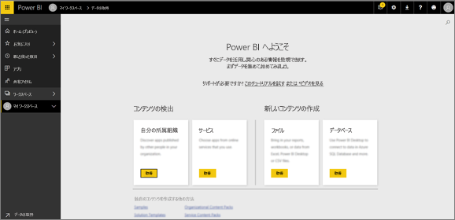
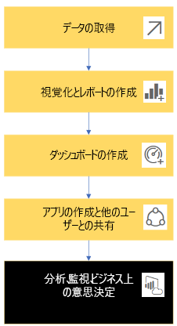
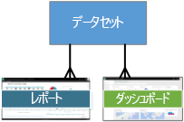
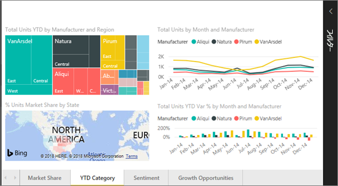
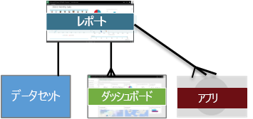
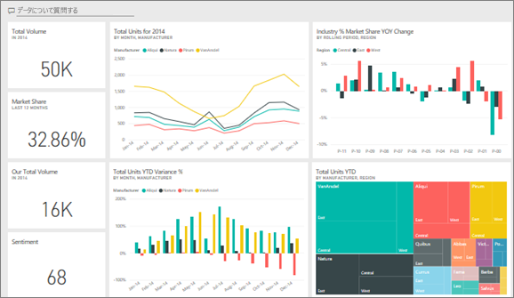
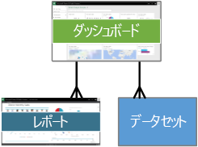
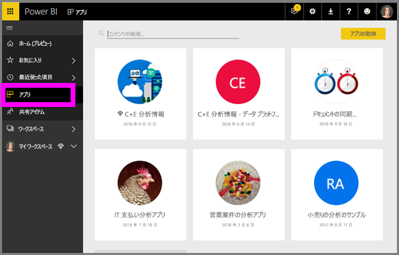
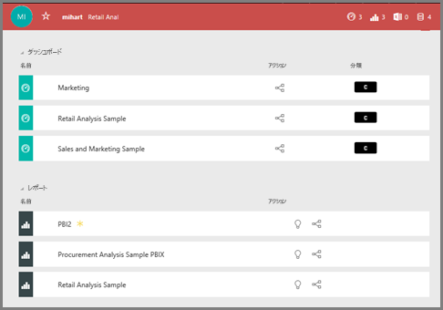

# Power BI サービス ***コンシューマー***の基本的な概念

## Power BI の*コンシューマー*と*デザイナー*
この記事は、[Power BI の概要](../power-bi-overview.md)に関するページを既に読んでいて、ご自分を Power BI ***コンシューマー***と認識していることを前提としています。 コンシューマーは、仕事仲間からダッシュボードやレポートなどの Power BI のコンテンツを受け取ります。 コンシューマーは、Power BI の Web サイト ベースのバージョンである Power BI サービスを使用します。

"Power BI Desktop" (または "Desktop" のみ) という用語をご存知かと思います。これは、ダッシュボードおよびレポートをビルドし、お客様と共有する*デザイナー*によって使用されるスタンドアロン ツールです。 他の Power BI ツールが存在することを理解していることが重要ですが、お客様がコンシューマーである限り、Power BI サービスのみを操作します。 この記事は Power BI サービスにのみ適用されます。

## 用語と概念
この記事は、Power BI の視覚的なツアーでも、実践的なチュートリアルでもありません。 そうではなく、これは Power BI の用語と概念になじんでいただけるようにする概要の記事です。 用語や状況を説明するようなものです。 Power BI サービスとそのナビゲーションのツアーについては、[ツアーの開始](end-user-experience.md)に関するページにアクセスしてください。

## Power BI サービスを初めて開く
Power BI コンシューマーのほとんどは Power BI サービスを入手しています。1) 会社でライセンスを購入し、2) 管理者がお客様のような従業員にそれらのライセンスを割り当てているためです。

開始するには、単純にブラウザーを開いて、「**app.powerbi.com**」と入力します。 まったく初めて Power BI サービスを開くと、このようなものが表示されます。

Power BI を使用するときに、Web サイトを開くたびに表示する内容をカスタマイズします。  たとえば、一部の人は [ホーム] ページを Power BI で開くことを好み、一方、最初に表示したいお気に入りのダッシュボードがある人もいます。 ご安心ください。この操作を行う方法について説明します。
- [ホームのプレビュー](https://powerbi.microsoft.com/blog/introducing-power-bi-home-and-global-search)    
- [コンテンツを**おすすめ**に設定](end-user-featured.md)

しかし、さらに進める前に、話を戻して Power BI サービスを構成する文書パーツについて説明しましょう。

## Power BI の***コンテンツ***
### 文書パーツの概要
Power BI コンシューマーの場合、文書パーツは 5 つあります。***視覚エフェクト***、***ダッシュボード***、***レポート***、***アプリ***、および***データセット***です。 これらは *Power BI* の***コンテンツ***と呼ばれる場合があります。 *コンテンツ*は***ワークスペース***内に存在します。 一般的なワークフローには、これらすべての文書パーツが関係します。Power BI "*デザイナー*" (以下の図の黄色) は、"*データセット*" からデータを収集し、分析のために Power BI に移動し、関心のある事実や分析情報を強調表示する完全な "*視覚化*" の "*レポート*" を作成し、レポートからダッシュボードに視覚エフェクトをピン留めし、"*アプリ*" の形式またはその他の種類の共有コンテンツで、ご自身のような "*コンシューマー*" (以下の図の黒色) とレポートやダッシュボードを共有します。

突き詰めれば、次のとおりです。
*  ***視覚エフェクト*** (*ビジュアル*) は、*レポート*と*データセット*のデータを使用して、Power BI *デザイナー*によってビルドされたグラフの種類です。 通常、*デザイナー*は Power BI Desktop でビジュアルをビルドします。

    詳細については、「[Visualizations for Power BI *consumers*](end-user-visualizations.md)」 (Power BI コンシューマー向けの視覚エフェクト) を参照してください

*  *データセット*はデータのコンテナーです。 たとえば、これは世界保健機関の Excel ファイルであったり、会社が所有している顧客のデータベース、あるいは Salesforce ファイルである可能性があります。  

*  *ダッシュボード*は対話型のビジュアル、テキスト、グラフィックを含む単一の画面です。 ダッシュボードでは、ストーリーを伝えたり、質問に回答したりするために、ご自分の最も重要なメトリックを収集します (1 つの画面上)。 ダッシュボードのコンテンツは、1 つ以上のレポートおよび 1 つ以上のデータセットからのものです。

    詳細については、「[Power BI サービスのダッシュボード*consumers*](end-user-dashboards.md)」を参照してください

*  *レポート*は、単一のレポートをまとめて構成する対話型のビジュアル、テキスト、グラフィックの 1 ページまたは複数のページです。 レポートは、単一のデータセットに基づいています。 多くの場合、レポート ページは、アドレスごとに関心の中心部を表すか、または単一の質問に回答するように整理されます。

    詳細については、「[Power BI のレポート*consumers*](end-user-reports.md)」のコンシューマーに関するセクションを参照してください

*  *アプリ*は、*デザイナー*が管理するダッシュボードとレポートをまとめてバンドルおよび共有する方法です。 *コンシューマー*は一部のアプリを自動的に受け取りますが、仕事仲間やコミュニティによって作成されたその他のアプリを検索することができます。 たとえば、既にご利用中かもしれませんが、Google アナリティクスや Microsoft Dynamics CRM などの外部サービスでは、Power BI アプリを提供します。

明確にするために示しますが、まったく新しいユーザーで、初めて Power BI にログインした場合、まだダッシュボード、アプリ、レポートはありません。
_______________________________________________________

## データセット
*データセット*は、*デザイナー*がインポートまたは接続して、レポートとダッシュボードをビルドするために使用するデータのコレクションです。 コンシューマーとして、データセットを直接操作することはありませんが、どのように大きい画像に適合されるかを理解しておくことは良いことです。  

各データセットは、データの 1 つのソースを表します。たとえば、OneDrive の Excel ブック、オンプレミスの SSAS 表形式データセット、Salesforce データセットなどです。 多くの異なるデータ ソースがサポートされています。

デザイナーがアプリをお客様と共有する場合、アプリに含まれるデータセットを確認できます。

![選択されたアプリと、キャンバスの [データセット] セクションを指している矢印](media/end-user-basic-concepts/power-bi-dataset-list.png)

**1 つの** データセットを...

* 何度も使用できます
* 多くのさまざまなレポートで使用できます
* その 1 つのデータセットからの視覚エフェクトを、多くのさまざまなダッシュボードで表示できます

  

さらに、他のワークスペースのデータセットを使用して、自分のワークスペースにコンテンツ (レポート、ダッシュ ボード) を作成できます。 こうしたデータセットを表示するには、次の参照データセット アイコンを使用します。

次の文書パーツ「視覚化」に進みます。
__________________________________________________________

## 視覚化
視覚エフェクト (ビジュアルとも呼ばれる) は、データ内で検出された洞察を表示します。 たとえば、お客様の脳では数字のスプレッドシートよりも画像を早く理解できるため、視覚エフェクトを使用すると、分析情報を解釈しやすくなります。

Power BI で発生する視覚エフェクトの一部には、ウォーターフォール、リボン、ツリーマップ、円、フィルター、カード、散布図、およびゲージがあります。 [Power BI に含まれる視覚エフェクトの完全な一覧](../power-bi-visualization-types-for-reports-and-q-and-a.md)に関するページを参照してください。

   

視覚エフェクトはコミュニティからも利用でき、これらは*カスタム ビジュアル*と呼ばれます。 理解できないビジュアルでレポートを受信した場合、カスタム ビジュアルである可能性が高いです。 カスタム ビジュアルの解釈でサポートが必要な場合は、<!--[look up the name of the report or dashboard *designer*](end-user-owner.md)-->レポートまたはダッシュボードの*デザイナー*の名前を参照して、そのデザイナーにお問い合わせください。

レポート内の **1** つの視覚エフェクトを...

* コピー/貼り付けを使用して同じレポート内で繰り返し使用できます
* 多くのさまざまなダッシュボードで使用できます
__________________________________________________
## レポート
Power BI レポートは、視覚エフェクト、グラフィック、テキストの 1 つ以上のページです。 レポートのすべての視覚エフェクトは 1 つのデータセットから取得されます。 *デザイナー*は、[*閲覧表示*](end-user-reading-view.md)でレポートを操作する*コンシューマー*とレポートを共有します。

**1 つの** レポートを...

* 複数のダッシュボードに関連付けることができます (その 1 つのレポートから固定されたタイルが、複数のダッシュボードに表示されることがあります)。
* 1 つのデータセットのみからデータを使用して作成されます。  
* 複数のアプリの一部である可能性があります

  

________________________________________________

## ダッシュボード
ダッシュボードは、基になるデータセットの一部のサブセットのカスタマイズしたビューを表します。 *デザイナー*はダッシュボードをビルドし、個別またはアプリの一部として*コンシューマー*と共有します。 ダッシュボードは*タイル*、グラフィック、テキストを含む、1 つのキャンバスです。

  

タイルは、*デザイナー*が、(たとえば、レポートからダッシュボードに) *ピン留めする*ビジュアルのレンダリングです。  ピン留めされたタイルはそれぞれ、データセットから作成され、ダッシュボードにピン留めされた[視覚エフェクト](end-user-visualizations.md)が表示されます。 また、タイルにはレポート ページ全体を含めることもでき、ライブ ストリーミング データまたはビデオを含めることができます。 *デザイナー*でダッシュボードにタイルを追加する方法は多数ありますが、多すぎるためこの概要トピックでは紹介できません。 詳しくは、「[Power BI のダッシュボードのタイル](end-user-tiles.md)」をご覧ください。

コンシューマーの立場から、ダッシュボードを編集することはできません。 ただし、コメントの追加、関連するデータの表示、お気に入りとしての設定、受信登録などを行うことができます。

ダッシュボードにはどのような目的がありますか?   その一部を次に示します。

* 意思決定に必要なすべての情報をひとめで確認できるようにするため
* 業務に関する最も重要な情報を監視するため
* すべての同僚が、同じ情報を表示および使用して、同じ考えを持てるようにするため
* ビジネス、製品、ビジネス単位、またはマーケティング キャンペーンの正常性を監視するため
* 大きなダッシュボードの個人ビューを作成して、自分の関心のあるメトリックスをそこに表示するため

**1 つの** ダッシュボードに...

* 多くの異なるデータセットの視覚エフェクトを表示できます。
* 多くの異なるレポートの視覚エフェクトを表示できます。
* 他のツール (Excel など) からピン留めされた視覚エフェクトを表示できます。

  

________________________________________________

## アプリ
これらのダッシュボードとレポートのコレクションは、関連するコンテンツが 1 つのパッケージにまとめて整理されます。 Power BI *Designers* は、これらをビルドし、個人、グループ、組織全体、またはパブリックと共有します。 コンシューマーとして、お客様と仕事仲間が同じデータ (単一の真実の信頼されたバージョン) を操作することに自信を持つことができます。

アプリは Power BI サービス (https://powerbi.com)) とご利用のモバイル デバイスで簡単に検索してインストールすることができます。 アプリのインストール後は、さまざまなダッシュボードの名前を覚えておく必要がありません。ブラウザー内やモバイル デバイス上では 1 つのアプリにまとめて表示されるためです。

このアプリには、単一のアプリを構成する 3 つの関連するダッシュボードと 3 つの関連するレポートがあります。

アプリの作者が更新プログラムを公開するたびに、自動的に変更が反映されます。 作成者はデータの更新頻度も制御するため、最新の状態が維持されているかを気にする必要はありません。

さまざまな方法でアプリを入手できます。 アプリのデザイナーは、ユーザーの Power BI アカウントに自動的にアプリをインストールしたり、アプリへの直接リンクを送信したりできます。あるいはユーザーが Microsoft AppSource でアプリを検索することもできます。AppSource にはユーザーがアクセスできるアプリがすべて表示されます。 ご利用のモバイル デバイスの Power BI では、直接リンクからのみアプリをインストールできます。AppSource からはインストールできません。 アプリのデザイナーが自動的にアプリをインストールした場合は、アプリの一覧に表示されます。

アプリがインストールされたら、ご自分のアプリの一覧からそのアプリを選択し、最初に開いて参照するダッシュボードまたはレポートを選択するだけです。   

この記事で、コンシューマー向けの Power BI サービスを構成する文書パーツをご理解いただければ幸いです。

## 次の手順
- [用語](end-user-glossary.md)を確認してブックマークする    
- [Power BI サービスのツアー](end-user-experience.md)
- [コンシューマー専用に作成さらた Power BI の概要](end-user-consumer.md)を確認する    
- Will が Power BI サービスの基本的な概念を確認し、ツアーを提供するビデオを見る。 <iframe width="560" height="315" src="https://www.youtube.com/embed/B2vd4MQrz4M" frameborder="0" allowfullscreen></iframe>
