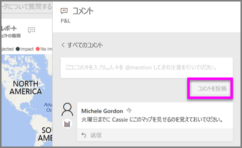
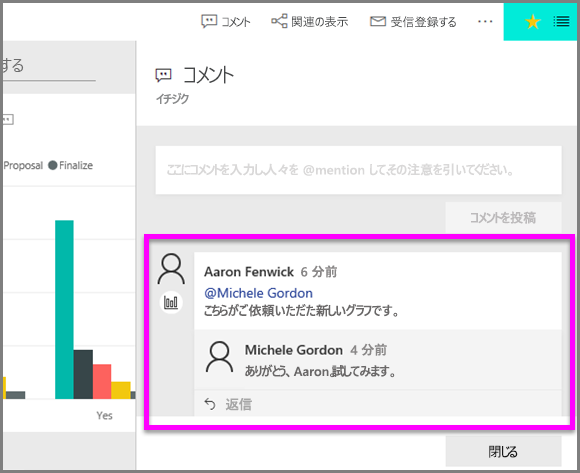

# コメントを視覚エフェクトに追加する
個人のコメントを追加するか、同僚と視覚エフェクトに関する会話を開始します。 **コメント**機能は、*コンシューマー*が視覚エフェクトを操作できる方法の 1 つにすぎません。 

## コメント機能を使用する方法

1. 視覚エフェクトをポイントし、省略記号 (...) を選びます。    
2. ドロップダウンから、**[コメントの追加]** を選択します。

    ![[コメントの追加] が最初の選択肢](media/end-user-comment/power-bi-comment.png)  

3.  コメントを入力し、**[コメントを投稿]** を選択します。 これは自分自身へのコメントで、スペルミスがあります。

      

4. これは、視覚エフェクトの*デザイナー*と行っている会話です。 @ 記号を使用して、コメントを確認するようにしています。 このコメントは自分に対するものであることはわかっています。 Power BI でこのアプリ ダッシュボードを開くときに、ヘッダーから **[コメント]** を選択します。 **[コメント]** ウィンドウに会話が表示されます。 

      

5. **[閉じる]** をクリックして、ダッシュボードまたはレポートに戻ります。

## 次の手順
[コンシューマーの視覚エフェクト](end-user-visualizations.md)  に戻る  
<!--[Select a visualization to open a report](end-user-open-report.md)-->