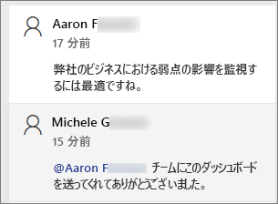
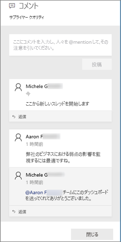
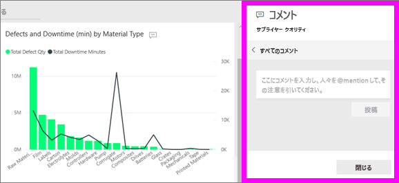
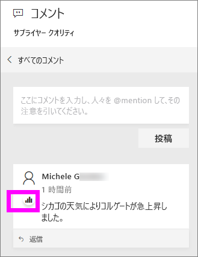
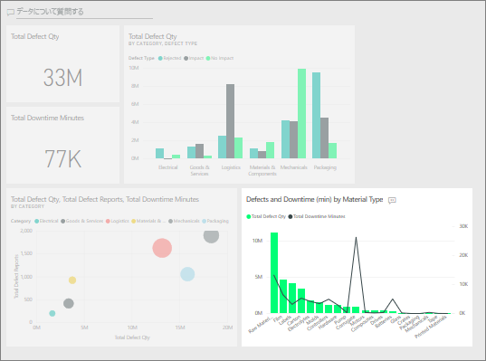
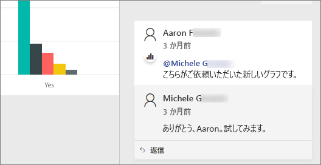

# ダッシュボードにコメントを追加する
個人のコメントを追加するか、同僚とダッシュボードに関する会話を開始します。 **コメント**機能は、*コンシューマー*が共同作業するための方法の 1 つにすぎません。 

## コメント機能を使用する方法
コメントは、ダッシュボード全体またはダッシュボード上の個々のビジュアルに追加できます。 一般的なコメントまたは特定の同僚に宛てたコメントを追加します。  

### ダッシュボードへの一般的なコメントの追加
1. Power BI ダッシュボードを開き、**[コメント]** アイコンを選択します。 これによって [コメント] ダイアログが開きます。

    ![[コメント] アイコン](media/end-user-comment/power-bi-comment-icon.png)

    ここでは、ダッシュ ボードの作成者が既に一般的なコメントを追加しています。  このコメントは、このダッシュボードにアクセスできるすべてのユーザーが参照できます。

    ![[コメント] アイコン](media/end-user-comment/power-bi-dash-comment.png)

2. 返信するには、**[返信]** を選択し、返信を入力し、**[投稿]** を選択します。  

    ![コメントの [返信] アイコン](media/end-user-comment/power-bi-comment-reply.png)

    Power BI では、既定でコメントのスレッドを開始した同僚に、あなたの返信が仕向けられます。この場合は、Aaron F です。 

    

 3. ダッシュボードの既存のスレッドに対してではないコメントを追加する場合、コメントは上部のテキスト フィールドに入力します。

    ![コメントの [返信] アイコン](media/end-user-comment/power-bi-new-comment.png)

    このダッシュボードに対するコメントは、次のように表示されます。

    

### 特定のダッシュボード ビジュアルにコメントを追加する
1. ビジュアルをポイントし、省略記号 (...) を選びます。    
2. ドロップダウンから、**[コメントの追加]** を選択します。

    ![[コメントの追加] が最初の選択肢](media/end-user-comment/power-bi-comment.png)  

3.  **[コメント]** ダイアログ ボックスが開きます。 このビジュアルには、まだコメントがありません。 

      

4. コメントを入力し、**[投稿]** を選択します。

      

    [グラフ] アイコンは、 ![[グラフ] アイコン付きのコメント](media/end-user-comment/power-bi-comment-chart-icon.png) このコメントが特定のビジュアルと関連付けられていることを示します。 アイコンを選択し、ダッシュボードの関連ビジュアルを強調表示します。

    

5. **[閉じる]** を選択して、ダッシュボードまたはレポートに戻ります。

### @ 記号を使用して同僚の注目を得る
ダッシュボードにコメントする場合でも、特定のビジュアルにコメントする場合でも、"\@" 記号を使用すると、同僚の注目を集めることができます。  "\@" 記号を入力すると、Power BI では、組織のユーザーを検索および選択できるドロップダウンが開かれます。 "\@" 記号が前につく検証済みのすべての名前は、青のフォントで表示されます。 

これは、視覚エフェクトの*デザイナー*と行っている会話です。 @ 記号を使用して、コメントを確認するようにしています。 このコメントは自分に対するものであることはわかっています。 Power BI でこのアプリ ダッシュボードを開くときに、ヘッダーから **[コメント]** を選択します。 **[コメント]** ウィンドウに会話が表示されます。

  

## 次の手順
[コンシューマーの視覚エフェクト](end-user-visualizations.md)  に戻る  
<!--[Select a visualization to open a report](end-user-open-report.md)-->
