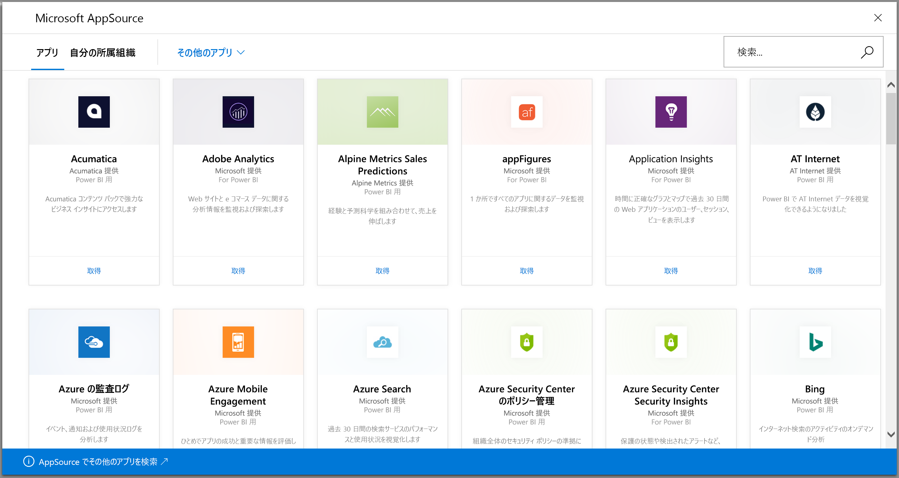
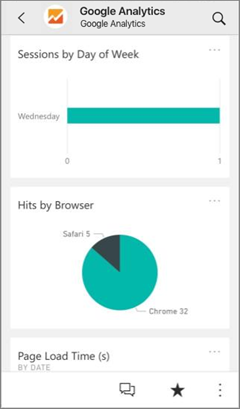
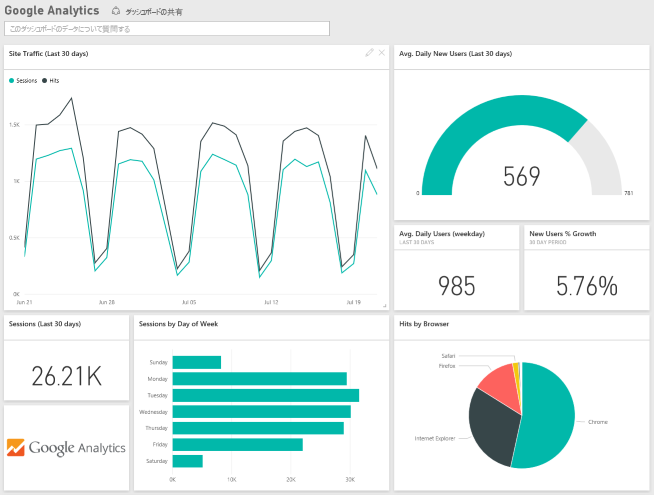

# Power BI で使用するサービスに接続する
Salesforce、Microsoft Dynamics、Google Analytics など、ビジネスに使用するさまざまなサービスに接続できます。 Power BI は最初に資格情報でサービスに接続し、それからダッシュボードと一連の Power BI レポートで Power BI アプリを作成します。Power BI レポートにはデータが自動的に表示され、ビジネスに関する洞察が視覚的に提示されます。 

Power BI にログインし、[接続できるすべてのサービス](https://app.powerbi.com/getdata/services)を表示します。 Power BI チームは新しいサービスを定期的に追加します。

アプリをインストールすると、Power BI サービス ([https://powerbi.com](https://powerbi.com)) と Power BI モバイル アプリでダッシュボードとレポートを表示できます。 

## 作業の開始
[!INCLUDE [powerbi-service-apps-get-more-apps](../includes/powerbi-service-apps-get-more-apps.md)]

## ダッシュ ボードとレポートを表示する
インポートが完了すると、新しいアプリが [アプリ] ページに表示されます。

1. 左側のナビゲーション ウィンドウで **[アプリ]** を選択し、該当アプリを選択します。
   
     ![[アプリ] ページ](./media/end-user-connect-to-services/power-bi-service-apps-open-app.png)
2. Q&A ボックスに質問を入力したり、タイルをクリックして基になっているレポートを開いたりできます。 
   
    
   
    レポートのデータを絞り込んだり、強調表示したりできますが、変更は保存できません。

## 含まれるもの
サービスに接続すると、ダッシュボード、レポート、データセットを含む、新しく作成されたアプリが表示されます。 サービスからのデータは特定のシナリオに重点を置いたものであり、そのサービスのすべての情報が入っているとは限りません。 データは、1 日に 1 回自動的に更新されます。 データセットを選択し、このスケジュールを変更できます。

また、[Power BI Desktop](../desktop-get-the-desktop.md) を使用して Google Analytics などのサービスに接続し、カスタマイズして独自のダッシュボードとレポートを作成することもできます。  

特定のサービスに接続する方法については、個々のヘルプ ページをご覧ください。

## トラブルシューティング
**タイルが空になっている**  
Power BI が初めてサービスに接続するとき、ダッシュボードに空のタイル セットが表示されることがあります。 2 時間後、空のダッシュボードが依然として表示される場合、接続に失敗した可能性があります。 問題の修正の関する情報を含むエラー メッセージが表示されなかった場合、サポート チケットをご利用ください。

* 右上隅にある疑問符アイコン (**?**) を選択し、**[ヘルプを取得]** を選択します。
  
    ![[ヘルプを取得] アイコン](./media/end-user-connect-to-services/power-bi-service-get-help.png)

**情報が不足している**  
ダッシュボードとレポートには、特定のシナリオに重点を置いたサービスのコンテンツが含まれ、そのサービスのすべての情報が入っているわけではありません。 コンテンツ パックに特定のメトリックが見つからない場合は、[[Power BI サポート]](https://support.powerbi.com/forums/265200-power-bi) ページからご意見をお寄せください。

## サービスを提案する
Power BI アプリにしてほしいサービスがある場合は、 [[Power BI サポート]](https://support.powerbi.com/forums/265200-power-bi) ページでお知らせください。

アプリの作成を希望するサービスがある場合は、 まず、[対象のサービスを送信](https://azure.microsoft.com/marketplace/programs/certified/apply/)し、[Power BI コンテンツ パックの公開] を選択します。

## 次の手順
* [Power BI のアプリについて](end-user-apps.md)
* [Power BI でデータを取得する](../service-get-data.md)
* 他にわからないことがある場合は、 [Power BI コミュニティで質問してみてください](http://community.powerbi.com/)。

