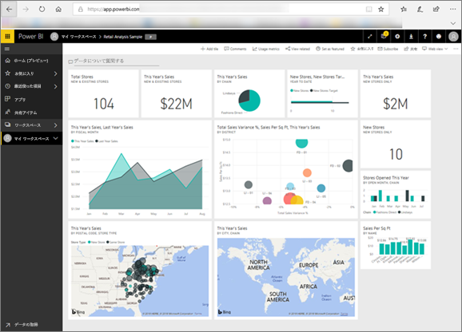

# 利用者向けの Power BI
Power BI をどのように操作するかは、ご自分の仕事上の役割により異なります。 *エンドユーザー*または*コンシューマー*であるあなたは、同僚からダッシュボード、レポート、アプリを受け取ります。 ***Power BI サービス***を使用して、このコンテンツの確認や操作を行い、ビジネス上の意思決定をします。

Power BI が初めての場合、「[Power BI とは?](../power-bi-overview.md)」をまずお読みになることをお勧めします。 ここでは、Power BI を構成する一連のツールが説明されています。

コンシューマーは、Power BI の全機能にはアクセスできません (ダッシュボードやレポートを作成するのがお仕事ではないので、これは問題がありません)。 あなたのお仕事は、Power BI を分析、監査、探索および意思決定に使用することです。

コンシューマー向けの記事に目を通していただけると、その用語、Power BI サービス、コンテンツへのナビゲーション方法、そのコンテンツの操作方法を学習できます。  では、開始しましょう。

## 次の手順

[Power BI "*コンシューマー*" の用語と概念](end-user-basic-concepts.md)

<!-- [Get started guide for *consumers*] -->
[Power BI サービスを使い始める](../service-get-started.md)

