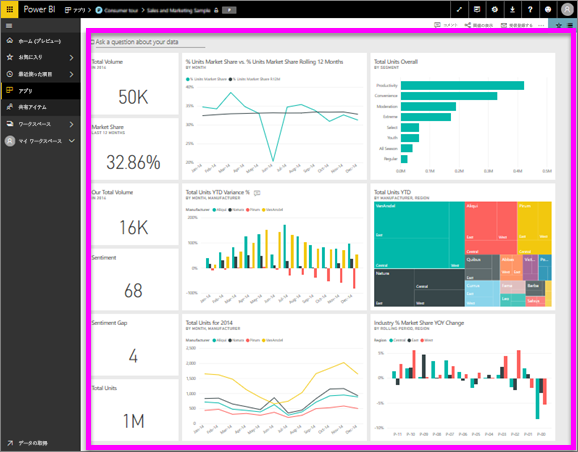

# ダッシュボードの表示
Power BI コンシューマーは、ダッシュボードの表示に多くの時間を使います。 ダッシュボードは、基になるレポートとデータセットから特定の情報を強調表示するために設計されています。 Power BI コンシューマーは、その情報を追跡、監視、質問への回答、テストなどに使用して、データ駆動型のビジネス上の意思決定を行います。

Power BI Pro は、ダッシュボードの共有、および共有ダッシュボードの表示の両方に必要です。

## ダッシュボードを開く
ダッシュボードは、Power BI サービスのさまざまな場所から開くことができます。  重要な点は、(たとえばレポートと比較して) どのコンテンツがダッシュボードかを把握することです。 ダッシュボードを特定したら、簡単に開くことができます。クリックするだけで、ダッシュボードが Power BI のキャンバスに表示されます。

|              |         |
|------------|--------------------------------|
|      |ダッシュボードを特定する最も簡単な方法は、この  ダッシュボード アイコンを探すことです。 このアイコンが表示されたコンテンツを見つけて選択すると、ダッシュボードが開きます。 |
|                    |          |

 

<!--insert aGIF-->

ダッシュボードは左側のナビゲーション バーにあるすべてのコンテナーで見つけることができます。 
- **[ホーム]** (プレビュー)
- **[お気に入り]**: [お気に入りとしてダッシュボードを設定](end-user-favorite.md)した場合
- **[最近]**: ダッシュボードに最近アクセスした場合
- **[アプリ]**: ほとんどのアプリにはダッシュボードとレポートの両方が含まれています
- **[自分と共有]**: 同僚が[自分とダッシュボードを共有した場合](end-user-shared-with-me.md)
- **[マイ ワークスペース]**: [Power BI サンプル](../sample-datasets.md)のいずれかをダウンロードした場合

## 次の手順
* [サンプル ダッシュボード](../sample-tutorial-connect-to-the-samples.md)のツアーを利用してダッシュボードに慣れます。
* [ダッシュボードのタイル](end-user-tiles.md)およびタイルを選んだときの結果について学習します。
* ダッシュボードの個々のタイルを追跡し、特定のしきい値に達したときにメールを受け取りたい場合は、 [タイルに通知を作成](end-user-alerts.md)します。
* ダッシュボードに質問したい場合は、 [Power BI Q&A](end-user-q-and-a.md) を使ってデータについて質問し、視覚化の形式で回答を受け取る方法を学習します。 