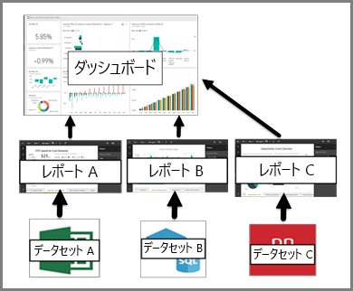

# Power BI サービスの利用者向けのダッシュボード

Power BI の "***ダッシュボード***" は、視覚化を使ってストーリーを伝える単一のページであり、キャンバスと呼ばれることもよくあります。 ダッシュボードは 1 ページに制限されているため、適切に設計されたダッシュボードには、そのストーリーの最も重要な要素のみが含まれます。

ダッシュボードに表示される視覚化は "*タイル*" と呼ばれ、レポート デザイナーによってダッシュボードに "*ピン留め*" されます。 タイルを選択すると、その視覚化が作成されたレポート ページに移動します。 Power BI を初めて使うときは、[Power BI の基本的な概念](end-user-basic-concepts.md)に関するページを読むと基礎がよくわかります。

> [!NOTE]
> ダッシュボードは、[モバイル デバイス上で表示および共有する](mobile/mobile-apps-view-dashboard.md)ことができます。
>
> 自分と共有されているダッシュボードを表示するためには、Power BI Pro が必要です。
> 

ダッシュボード上の視覚化はレポートから取得され、各レポートは 1 つのデータセットが基になっています。 実際、ダッシュボードは基になっているレポートとデータセットへの入り口と考えることもできます。 視覚化を選ぶと、その作成に使われたレポート (およびデータセット) に行き着きます。

## ダッシュボードの利点
ダッシュボードは、ビジネスを注視し、答えを探し、すべての最も重要なメトリックを一目で見るための、素晴らしい手段です。 ダッシュボード上の視覚化は、1 つまたは複数の基になっているデータセット、および 1 つまたは複数の基になっているレポートから取得できます。 ダッシュボードでは、オンプレミスとクラウドのデータが結合され、データの保存場所に関わらず統合されたビューを利用できます。

ダッシュボードは単なる美しい画像ではありません。高度な対話機能とカスタマイズ機能を備え、基になっているデータが変化するとタイルが更新されます。

## Power BI "***コンシューマー***" 向けのダッシュボードとレポート
レポートも視覚化が表示されたキャンバスであるため、ダッシュボードと混同されることがよくあります。 しかし、Power BI "*コンシューマー*" の観点からは大きな違いがいくつかあります。

| **機能** | **ダッシュボード** | **レポート** |
| --- | --- | --- |
| ページ |1 ページ |1 ページ以上 |
| データ ソース |ダッシュボードごとに、1 つ以上のレポートおよび 1 つ以上のデータセット |レポートごとに 1 つのデータセット |
| 受信登録する |ダッシュボードのメールをサブスクライブできます |レポート ページのメールをサブスクライブできます |
| フィルター処理 |フィルター処理またはスライスはできません |さまざまな方法でフィルター処理、強調表示、スライスできます |
| 通知の設定 |特定の条件が満たされたときにユーザーにメールを送る通知を作成できます |いいえ |
| おすすめ |1 つのダッシュボードを "おすすめの" ダッシュボードとして設定できます |おすすめのレポートを作成することはできません |
| 自然言語クエリ |ダッシュボードから利用できます |レポートからは利用できません |
| 基になっているデータセットのテーブルとフィールドの表示 |いいえ。 データをエクスポートすることはできますが、ダッシュボード自体でテーブルとフィールドを表示することはできません。 |はい。 データセットのテーブル、フィールド、値を表示することができます。 |

## ダッシュボードの "作成者" とダッシュボードの "利用者"
Power BI "***コンシューマー***" は、"*作成者*" からダッシュボードを受信します。 次のトピックについて、ダッシュボードに関する学習を続けてください。

* [ダッシュボードの表示](end-user-dashboard-open.md)
* [ダッシュボードのタイル](end-user-tiles.md)およびタイルを選んだときの結果について学習します。
* ダッシュボードの個々のタイルを追跡し、特定のしきい値に達したときにメールを受け取りたい場合は、 [タイルに通知を作成](end-user-alerts.md)します。
* ダッシュボードに質問したい場合は、 [Power BI Q&A](end-user-q-and-a.md) を使ってデータについて質問し、視覚化の形式で回答を受け取る方法を学習します。

> [!TIP]
> 知りたいことがここで見つからない場合は、左側の目次で探してください。
> 

## 次の手順
[ダッシュボードの表示](end-user-dashboard-open.md) 