# クイック スタート - Power BI サービス内の移動

Power BI の基本を理解したので、**Power BI サービス**の操作について説明します。 前に説明したように、ユーザーによっては、**Power BI Desktop** だけを使って、データを組み合わせたり、他のユーザーのためのレポートを作成したりすることがあります。 一方で、Power BI サービスだけを使って、他のユーザーが作成したコンテンツを表示し、操作するユーザーもいます (エクスペリエンスの**消費**)。 このクイック スタートでは、サンプル データをインポートし、そのデータを使って Power BI サービスの操作方法を説明します。 
 
## 前提条件

- Power BI にサインアップしていない場合は、[無料の試用版にサインアップ](https://app.powerbi.com/signupredirect?pbi_source=web)してください。

- [Power BI サービスの基本概念](end-user-basic-concepts.md)についてお読みください

## Power BI サービスを開いてデータを取得する
この Power BI サービスのツアーに使用するサンプル データを取得します。 調査用にあらゆる種類のサンプル データが提供されていますが、今回は小売り店に関するデータを使います。    
1. app.powerbi.com を開き、**[サンプル]** のリンクを選びます。 

    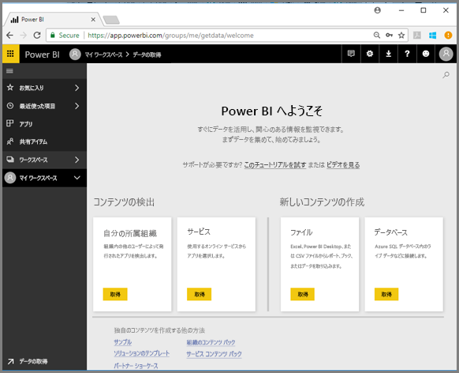

2. **[小売りの分析のサンプル] > [接続]** を選びます。

    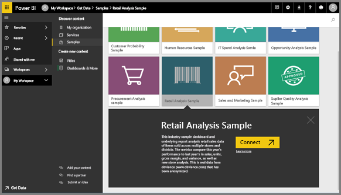

    Power BI サービスがサンプルをインポートしてダッシュボードを表示します。 ダッシュボードは、Power BI サービスが Power BI Desktop と異なる点です。 サンプルにはレポートとデータセットも含まれます。これには後でアクセスします。

    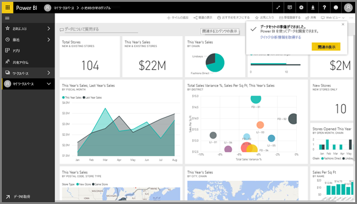

Amanda が Power BI サービスのナビゲーション操作を説明するツアーのビデオをご覧ください。  その後、ビデオで説明されている手順に従って、ご自分でやってみてください。

<iframe width="560" height="315" src="https://www.youtube.com/embed/G26dr2PsEpk" frameborder="0" allowfullscreen></iframe>

## コンテンツの表示 (ダッシュボード、レポート、ワークスペース、データセット、ワークスペース、アプリ)
最初に、基本コンテンツ (ダッシュボード、レポート、データセット、ブック) がどのようにまとめられるか確認してみましょう。 コンテンツはワークスペースのコンテキスト内で表示されます。 この時点では、**[マイ ワークスペース]** という名前のワークスペースが 1 つだけあります。 通常、コンシューマーは他のワークスペースを必要とせず、使用しません。 [マイ ワークスペース] には、ユーザーが所有しているすべてのコンテンツが格納されます。 これは、個人用サンドボックスまたはユーザーのコンテンツの作業領域と考えることができます。 マイ ワークスペースは、ダウンロードした小売りの分析のサンプルが保存されている場所です。 

[マイ ワークスペース] でコンテンツは、ダッシュボード、レポート、ブックおよびデータセットの 4 つのタブにまとめられます。

![[マイ ワークスペース] 画面](./media/end-user-experience/power-bi-my-workspace.png)

左側のナビゲーション ウィンドウでワークスペースを選ぶと、関連するコンテンツのタブ (ダッシュボード、レポート、ブック、データセット) が右側の Power BI キャンバスに表示されます。

新しいユーザーの場合は、1 つのワークスペース (**[マイ ワークスペース]**) のみが表示されます。

これらのタブには ("*コンテンツ ビュー*" とも呼ばれます)、コンテンツについての情報と、そのコンテンツで実行できるアクションが表示されます。  たとえば、[ダッシュボード] タブからは、ダッシュボードを開いたり、検索したり、並べ替えたりできます。

![[ダッシュボード] タブ](./media/end-user-experience/power-bi-dashboard-tab.png)

ダッシュボードの名前を選択してダッシュボードを開きます。

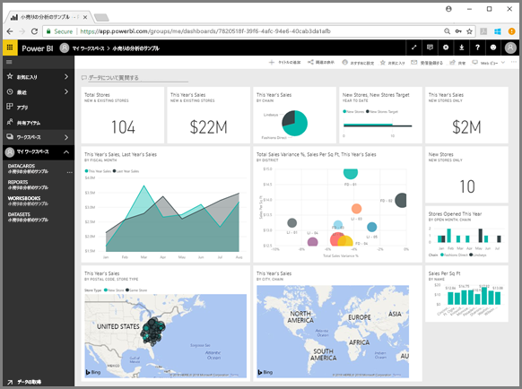

## ダッシュボードやレポートをお気に入りに追加する
**[お気に入り]** を使用すると、最も重要なコンテンツに簡単にアクセスできます。  

1. ダッシュボードを開き、右上隅の **[お気に入り]** を選びます。
   
   
   
   **[お気に入り]** が **[お気に入りから外す]** に変わり、星形アイコンが黄色になります。
   
   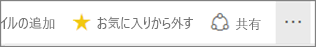

2. お気に入りとして追加したすべてのコンテンツの一覧を表示するには、左側のナビゲーション ウィンドウで、**[お気に入り]** の右にある矢印を選びます。 左側のナビゲーション ウィンドウは Power BI サービスの固定機能であるため、Power BI サービス内のどこからでもこの一覧にアクセスできます。
   
    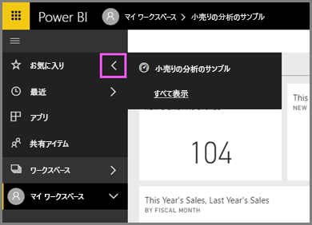
   
    現在は、お気に入りは 1 つだけです。 ダッシュボード、レポート、またはアプリをお気に入りに指定できます。  

1. コンテンツ ビュー タブの **[ダッシュボード]** と **[レポート]** からダッシュボードまたはレポートをお気に入りとして設定することもできます。**[レポート]** タブを開き、レポート名の左側の星形アイコンを選びます。
   
   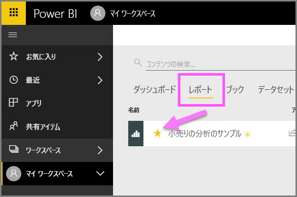

3. 左側のナビゲーション ウィンドウで **[お気に入り]** を選ぶか、星形アイコン  を選んで、**[お気に入り]** *ウィンドウ*を開きます。
   
   ![[お気に入り] 画面を開く](./media/end-user-experience/power-bi-favorite-pane.png)
   
   お気に入りがダッシュボードとレポートの 2 つになっています。 ここからは、コンテンツを開いたり、探したり、お気に入りから削除したり、同僚と共有したりできます。

4. レポート名を選び、レポート エディターで開きます。

    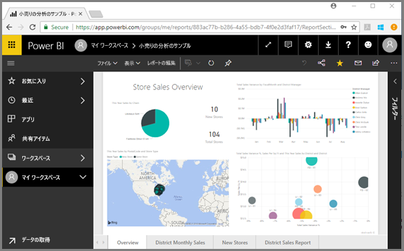

詳細については、[お気に入り](end-user-favorite.md)に関するページを参照してください。

## 最新のコンテンツを探す

1. [お気に入り] と同様に、左側のナビゲーション ウィンドウの **[最近]** の矢印を選んで、Power BI サービス内のどこからでも最近アクセスしたコンテンツをすぐに見ることができます。

   ![[最近] ポップアップ](./media/end-user-experience/power-bi-recent-flyout.png)

    フライアウトから、開くコンテンツを選びます。

2. 最近のコンテンツを開かずに、情報を見たり、分析情報の表示や Excel へのエクスポートなど、他のアクションを実行したりしたい場合があります。 そのような場合は、左側のナビゲーション ウィンドウで **[最近]** またはそのアイコンを選んで、**[最近]** ウィンドウを開きます。 複数のワークスペースがある場合、この一覧にはすべてのワークスペースのコンテンツが含まれます。

   ![[最近] ウィンドウ](./media/end-user-experience/power-bi-recent.png)

詳しくは、「[Power BI サービスの [最近] のコンテンツ](end-user-recent.md)」をご覧ください。

### コンテンツの検索と並べ替え
コンテンツ ビューでは、コンテンツを簡単に検索、フィルター処理、並べ替えできます。 ダッシュボード、レポート、またはブックを検索するには、検索領域に入力します。 名前の一部に検索文字列が含まれるコンテンツだけが表示されます。

サンプルは 1 つだけなので、検索や並べ替えの必要はありません。  ただし、ダッシュボード、レポート、ブック、データセットのリストが長い場合は、検索や並べ替えが非常に役立ちます。

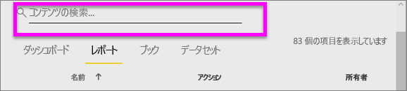

コンテンツは、名前または所有者で並べ替えることもできます。 **[名前]** の右にある上矢印をご覧ください。 現在、83 個の項目が名前のアルファベット順に昇順で並べられています。 並べ替え順序を降順に変更するには、**[名前]** を選択します。 上矢印が下矢印に変わります。

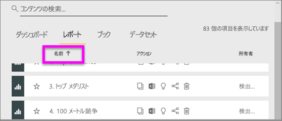

並べ替えることができるのは一部の列に限られます。 列見出しの上にカーソルを合わせると、並べ替えることができる列を確認できます。

詳細については、[Power BI ナビゲーションの検索と並べ替え](end-user-search-sort.md)に関するページをご覧ください。

## リソースをクリーンアップする
このクイックスタートが完了した後、希望する場合は、小売りの分析のサンプルのダッシュ ボード、レポート、およびデータセットを削除できます。

1. Power BI サービス (app.powerbi.com) を開いてサインインします。    
2. 左側のナビゲーション ウィンドウで、**[ワークスペース > マイ ワークスペース]** を選択します。  
    お気に入りを示す黄色のアスタリスクがわかりますか。    
3. **[ダッシュ ボード]** タブで、小売りの分析ダッシュ ボードの横にあるゴミ箱を **[削除]** アイコンを選択します。    

    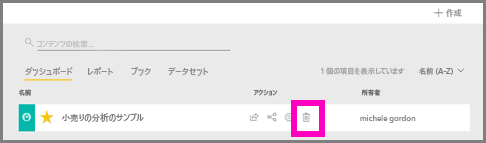

4. **[レポート]** タブを選び、小売りの分析のレポートでも同様にします。
1. **[レポート]** タブを選び、小売りの分析のデータセットでも同様にします。

## 次の手順

> [!div class="nextstepaction"]
> [Power BI サービスの読み取りビュー](end-user-reading-view.md)