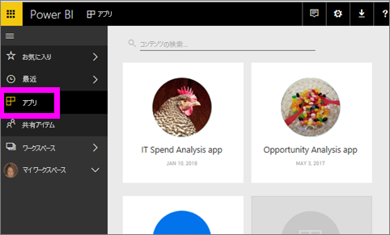
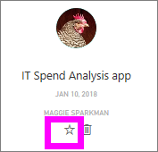

# Power BI サービスのお気に入りのダッシュボード、レポート、アプリ
コンテンツを設定するときに、*お気に入り*からすばやくアクセスすることができます、**お気に入り**コンテンツ リストから**Power BI ホーム** >  **お気に入りと frequents**します。  お気に入りは、最も頻繁に利用して黄色のアスタリスクが付いている通常コンテンツです。

   

   

として単一のダッシュ ボードを選択することも、[おすすめのダッシュ ボード](end-user-featured.md)Power BI サービスでします。

## "*お気に入り*" としてダッシュボードまたはレポートを追加する

1. よく使用するダッシュボードまたはレポートを開きます。 他のユーザーによって共有を設定されたコンテンツを "*お気に入り*" にすることもできます。

2. Power BI サービスの上部のリボンから選択**お気に入り**または星アイコン。
   
   
   
   好きなことができますダッシュ ボードまたはレポートをどこからでも自分とホーム、最近、アプリ、および共有など、星のアイコンが表示されます。 
   
   ![黄色の星が表示された [ダッシュボード] タブ](./media/end-user-favorite/power-bi-recent.png)

## アプリを "*お気に入り*" として追加する

1. ナビゲーション ウィンドウで、次のように選択します。**アプリ**します。

   

2. アプリの上にカーソルを合わせると、詳細が表示されます。  星   アイコンを選んでお気に入りとして設定します。
   
   

## *お気に入り*の操作
1. [お気に入り] にアクセスするには、右側にあるポップアップ矢印を選択します。**お気に入り**します。  ここからお気に入りを選んで開くことができます。 一覧に表示されるお気に入りは (アルファベット順に) 5 つだけです。 5 つ以上の場合、選択**すべて**を開く、お気に入りコンテンツの一覧 (以下の #2 を参照してください)。 
   
   
2. 表示する**すべて**、ナビゲーション ウィンドウで、お気に入りの選択と追加したコンテンツ**お気に入り**またはお気に入りアイコン。  
   
    ![[お気に入り] ウィンドウ](./media/end-user-favorite/power-bi-favorites-screen.png)
   
   ここからコンテンツを開いたり、所有者を確認したり、同僚と共有したりすることができます。

## コンテンツをお気に入りから外す
あまり使用しなくなったレポートは、  お気に入りから外すことができます。 コンテンツをお気に入りから外すと、お気に入りの一覧から削除されますが、Power BI からは削除されません。

1. 左側のナビゲーション ウィンドウで **[お気に入り]** を選択し、 **[お気に入り]** 画面を開きます。
   
   ![[お気に入り] 画面](./media/end-user-favorite/power-bi-unfavorites-screen.png)
2. お気に入りから外すコンテンツの横にある黄色の星を選びます。

> [!NOTE]
> ダッシュボード、レポート、アプリ自体をお気に入りから外すこともできます。 コンテンツを開き、黄色のアイコンの選択を解除します。   
> 
> 
## 制限事項と考慮事項
現在のところ、お気に入りのアプリとこの自動的にお気に入りのすべてのレポートとダッシュ ボードにそのアプリはことができます。 個々 のアプリをお気に入りのレポートやダッシュ ボードにことはできません。 

## 次の手順
[Power BI - 基本的な概念](end-user-basic-concepts.md)

他にわからないことがある場合は、 [Power BI コミュニティを利用してください](http://community.powerbi.com/)。

