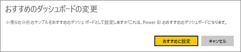

# Power BI サービスのおすすめのダッシュボード
## おすすめのダッシュボードを作成する
多くのユーザーには、他のダッシュボードより頻繁にアクセスする 1 つのダッシュボードがあります。  それはビジネスの運営に使用するダッシュボードかもしれません。また、多くの異なるダッシュボードとレポートから取られたタイルの集合体が含まれるダッシュボードであることもあります。

ダッシュ ボードを選択すると*機能を備えた*たびに、Power BI サービスを開く、表示されるダッシュ ボードが開き、します。  

複数のダッシュボードを選んで、"*お気に入り*" に設定することもできます。 「[お気に入りのダッシュボード](end-user-favorite.md)」を参照してください。

おすすめのダッシュ ボードをまだ設定していない場合、または Power BI ホームを使用した最後のダッシュ ボードを Power BI で開きます。  

### ダッシュボードを**おすすめ**として設定するには
Amanda がおすすめのダッシュボードを作成するビデオを参照してください。その後、ビデオ下部にある指示に従って、自分で試してください。

<iframe width="560" height="315" src="https://www.youtube.com/embed/G26dr2PsEpk" frameborder="0" allowfullscreen></iframe>

1. *おすすめ*に設定するダッシュボードを開きます。 
2. 上部のメニュー バーで、省略記号 (...) を選択し、**おすすめに設定**します。  
   
    
3. 選択内容を確認します。
   
    

## おすすめのダッシュボードを変更する
もちろん、後で考えが変わった場合、新しいダッシュボードをおすすめのダッシュボードとして設定できます。

1. 前述の手順 1 と 2 を実行します。
   
    
2. **[おすすめに設定]** を選択します。 ダッシュボードをおすすめにしない場合、ダッシュボードはワークスペースから削除されません。  
   
    

## おすすめのダッシュボードを削除する
おすすめのダッシュボードを 1 つも設定しない場合に、ダッシュボードのおすすめを解除する方法を次に示します。

1. 現在おすすめに設定しているダッシュボードを開きます。
2. 上部のメニュー バーで、省略記号 (...) を選択し、 **おすすめをオフ**します。

    
   
## 次の手順
[ダッシュボードをお気に入りにする](end-user-favorite.md)

他にわからないことがある場合は、 [Power BI コミュニティを利用してください](http://community.powerbi.com/)。

