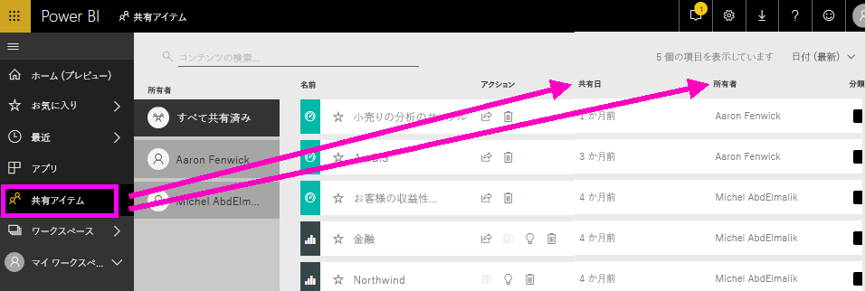
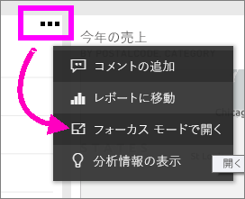
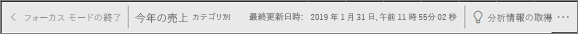
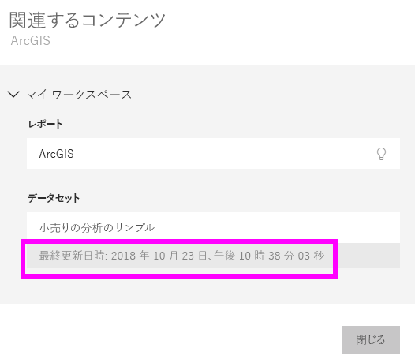

# コンテンツが最新の状態に維持される
*コンシューマー*は、*デザイナー*が作成し、コンシューマーと共有したコンテンツを使用します。 そのコンテンツが最新の状態になっているか気になることがあるでしょう。あるいは、コンテンツの最終更新日が知りたくなることもあります。 最新のコンテンツを使用していることがわかれば、自信を持って作業できます。  
 

必ず最新のデータを使用することは、多くの場合、正しい意思決定をする上で重要です。 最新のコンテンツを確実に使用するには何ができるでしょうか。 ほとんどの場合、何もする必要はありません。 共有アプリはアプリ デザイナーが設定したスケジュールに基づいて自動的に更新されます。 共有ダッシュボードや共有レポートの場合も同じです。デザイナーが手作業か、自動更新スケジュールを利用し、コンテンツが最新の状態に維持されるように取り計らいます。  

データの新しさについて疑問があれば、デザイナーにお問い合わせください。

## デザイナーの名前を見つける方法

### アプリ

アプリ画面には、デザイナーの名前とアプリの作成日付が表示されます。  

1. 左側のナビゲーション ウィンドウから **[アプリ]** を選択します。

    

    アプリごとに、タイトルと作成日付が表示されます。 

2. アプリの上にカーソルを合わせる方法でもデザイナーの名前が表示されます。 

    

### 共有アイテム
**[共有アイテム]** 画面には、コンテンツ所有者の名前とコンテンツが共有された日付が表示されます。

 

## 最終更新日を調べる方法
最終更新日に興味があれば、ほとんどのコンテンツでそれを調べることができます。 

### データのプッシュ時の
ダッシュボード タイルの場合、タイルをフォーカス モードで表示すると、最終更新日のタイムスタンプが表示されます。

1. ダッシュボード タイルで省略記号 (...) を選択し、**[フォーカス モードで開く]** を選択します。

    

2. 右上隅に最終更新日が表示されます。 表示されない場合、ブラウザーの幅を大きくしてください。 

    

### ダッシュボードとレポートから
最終更新日を調べるもう 1 つの方法に **[関連の表示]** を使用する方法があります。  **[関連の表示]** は Power BI の上部メニュー バーから利用できます。

![メニューから [関連の表示] を選択する](media/end-user-fresh/power-bi-view-related.png)

**[関連コンテンツ]** ウィンドウに、ダッシュボードまたはレポートの基になるデータセットの最終更新情報が表示されます。

## デザイナーがアプリを削除するとどうなるか

デザイナーがアプリを削除すると、そのアプリに関連付けられているダッシュボードやレポートも Power BI ワークスペースから自動的に削除されます。 今後は利用できなくなり、アプリは [ナビゲーション] ウィンドウに表示されなくなります。

## サブスクライブして変更を確認する
最新の状態に維持する別の方法として、レポートやダッシュボードにサブスクライブするという方法があります。 ログインしてレポートやダッシュボードを開く代わりに、設定したスケジュールに基づいてスナップショットを送信するように Power BI に指示します。  詳細については、[ダッシュボードとレポートにサブスクライブする](end-user-subscribe.md)方法に関するページを参照してください。

## データ アラートの設定
設定した上限を超えてデータが変化した場合、通知を受けますか。 [データ アラートを作成します](end-user-alerts.md)。  データ アラートを使用すれば、最新の状態を維持することが簡単になります。 データ アラートでは、レポート内の値が特定のしきい値を超えた場合、電子メールを送信するように Power BI に指示します。  たとえば、在庫が 25 ユニットを下回った場合や売上が目標を超えた場合にメールを受信します。  

## 次の手順
[データ アラートを作成する](end-user-alerts.md)    
[ダッシュボードとレポートにサブスクライブする](end-user-subscribe.md)    
[関連するコンテンツを表示する](end-user-related.md)    
