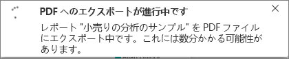
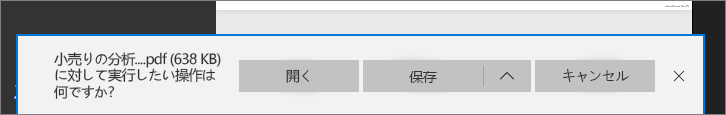

# Power BI から PDF にレポートをエクスポートする
Power BI では、レポートを PDF 形式に発行すると、Power BI レポートに基づくドキュメントを容易に作成することができます。 **PDF にエクスポート**すると、Power BI レポート内の各ページが PDF ドキュメント内の個々のページになります。

## Power BI レポートを PDF にエクスポートする方法
Power BI サービスで、レポートを選択してそれをキャンバス上に表示します。 また、[ホーム] ページや [アプリ] など、左側のナビゲーション ウィンドウで選択した場所からレポートを選択することもできます。

1. メニュー バーから、**[ファイル]** > **[PDF にエクスポート]** の順に選択します。

    ![メニュー バーから [ファイル] を選択 (矢印は [PDF にエクスポート] を指している)](media/end-user-pdf/power-bi-export-pdf.png)

    右上隅に進行状況バーが表示されます。 エクスポートには数分間かかる場合があり、レポートのエクスポート中も Power BI で作業を進めることができます。

    

    完了すると、Power BI サービスのエクスポート処理が終了したことが通知バナーで示されます。

2. ファイルは、ブラウザーがダウンロードしたファイルを表示する場所から使用できます。 次の図では、ブラウザー ウィンドウ下部のダウンロード バナーとして表示されています。

    

これで完了です。 ファイルをダウンロードすると、それを PDF ビューアー (Microsoft Edge で利用できる PDF ビューアーなど) を使用して開くことができます。

## 制限事項と考慮事項
**PDF にエクスポート**機能を使用する場合は、留意すべき注意事項と制限事項がいくつかあります。

- 強調表示、フィルター処理、ドリルダウンなどのセッション内の対話機能は、PDF へのエクスポートではまだサポートされていません。 エクスポートされた PDF に表示されるのは、レポートに保存された時点での元のビジュアルです。 フィルターやスライサーが適用されていて、これをエクスポートでも保持したい場合は、そのレポートを保存してからエクスポートしてください。

* 現在、**R ビジュアル**はサポートされていません。 PDF では、これらのビジュアルは空白となり、エラー メッセージが表示されます。  

* **認定を受けた** **カスタム ビジュアル** はサポートされます。 カスタム ビジュアルの認定を受ける方法など、認定を受けたカスタム ビジュアルの詳細については、「[カスタム ビジュアルの*認定*を受ける](../power-bi-custom-visuals-certified.md)」を参照してください。 認定を受けていないカスタム ビジュアルはサポートされません。 PDF では、それらはエラー メッセージを伴って表示されます。   

* 現在、レポート ページが 30 ページを超えるレポートはエクスポートできません。

* レポートを PDF にエクスポートする処理が完了するまで数分かかる場合がありますので、しばらくお待ちください。 必要な時間に影響する要因としては、レポートの構造や、Power BI サービスの現在の負荷などがあります。

* Power BI サービスで **[PDF にエクスポート]** メニュー項目を使用できない場合は、テナント管理者が機能を無効にしている可能性があります。 詳細については、テナント管理者に問い合わせてください。

* 背景画像はグラフの境界領域でトリミングされます。 PDF にエクスポートする前に背景画像を削除することを強くお勧めします。

* Power BI テナント ドメイン外のユーザーによって所有されているレポート (組織外のユーザーが所有していて、そのユーザーから共有されているレポートなど) は、PDF に発行できません。

* 組織外の人 (つまり、Power BI テナント内にいないユーザー) とダッシュボードを共有している場合、そのユーザーは共有されたダッシュ ボードに関連付けられているレポートを PDF にエクスポートできません。 たとえば、ユーザー aaron@contoso.com は cassie@cohowinery.com と共有することができます。 しかし、cassie@cohowinery.com は関連付けられたレポートを PDF にエクスポートできません。

* Power BI サービスでは、Power BI の言語設定を PDF のエクスポート用の言語として使用します。 言語の優先順位を表示または設定するには、歯車アイコン > **[設定]** > **[全般]** > **[言語]** の順に選択します。

## 次の手順
[レポートの印刷](end-user-print.md)