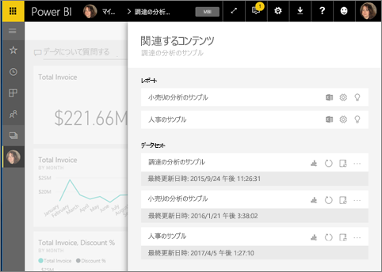
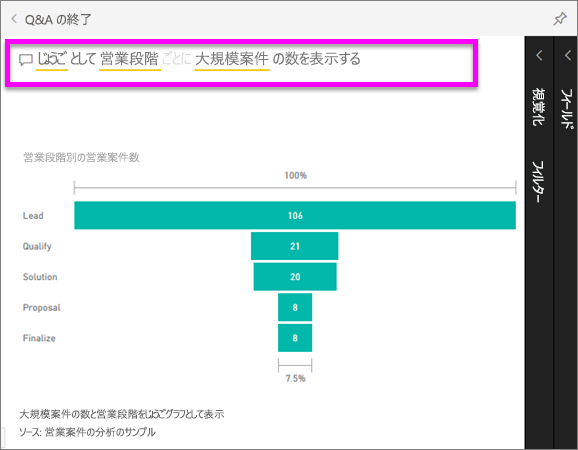
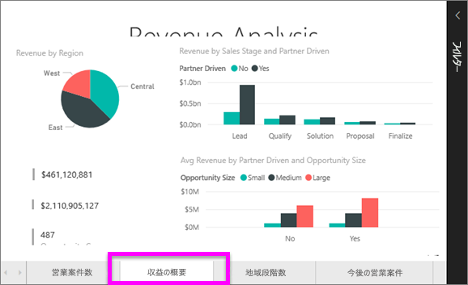
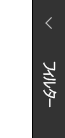
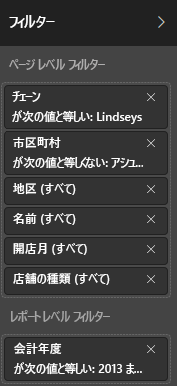
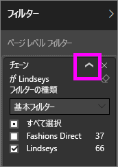
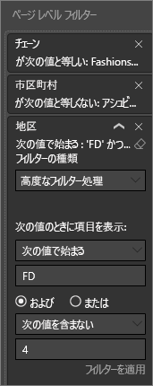
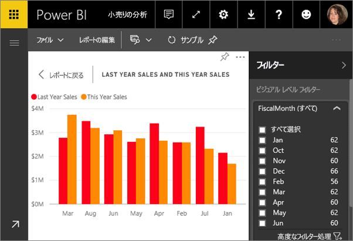
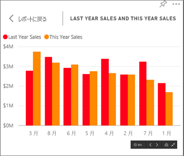

<!-- once the sample apps are live, change this so consumers can follow along -->
# クイック スタート: ***コンシューマー***向けの Power BI の機能について学習する
このクイック スタートでは、Power BI と対話してデータ駆動型のビジネスの分析情報を発見する方法について説明します。 この記事の意図は、詳細な情報を提供することではなく、Power BI の**コンシューマー**が使用できるアクションの多くを簡単に説明することです。

Power BI にサインアップしていない場合は、[無料の試用版にサインアップ](https://app.powerbi.com/signupredirect?pbi_source=web)してください。

## 前提条件
- Power BI サービス (app.powerbi.com)
<!-- app from AppSource -->

## 読み取りビュー
Power BI サービスでは、レポートの*コンシューマー*は読み取りビューを使用できます。 仕事仲間が自分とレポートを共有する場合、読み取りビューを使用してレポートを探索し、レポートと対話します。 

Power BI サービスのその他のレポート モードは[編集ビュー](../service-interact-with-a-report-in-editing-view.md)です。これはレポートの "*デザイナー*" が利用できます。  

読み取りビューは、ダッシュボードとレポートを探索するための強力で安全な方法です。 ダッシュボードと共有されたレポートを操作しても、基になるデータセットはそのまま残り、変更されません。 

読み取りビューでは、ページ上のビジュアルのクロス強調表示およびクロス フィルター処理のような操作を実行できます。  あるビジュアルで値を強調表示または選択するだけで、他のビジュアルに与える影響がすぐに表示されます。 フィルター ペインを使用して、レポート ページにフィルターを追加、フィルターを変更、または視覚エフェクトでの値の並べ替え方法を変更します。 これらは、Power BI における "*コンシューマー*" の機能のほんの一部です。  さらに読み進めて、詳しく学習しましょう。

 
### アプリを表示する
Power BI では、"*アプリ*" によって関連するダッシュボードやレポートが 1 つの場所にまとめられます。

1. **[アプリ]** ![左側のナビゲーション ウィンドウの [アプリ]](./media/end-user-apps/power-bi-apps-bar.png) >  **[アプリの取得]** の順に選択します。 
   
     ![[アプリの取得] アイコン](./media/end-user-reading-view/power-bi-get-app.png)
2. [AppSource] の **[My organization]\(自分の組織\)** で、結果を絞り込むための検索を行って、探しているアプリを見つけます。
   
     ![AppSource の [自分の所属組織]](./media/end-user-reading-view/power-bi-appsource.png)
3. **[今すぐ入手する]** を選択して、これをアプリのコンテナーに追加します。 

### ダッシュボードの表示
このアプリはダッシュボードに開かれます。 Power BI の "***ダッシュボード***" は、視覚化を使ってストーリーを伝える単一のページであり、キャンバスと呼ばれることもよくあります。 ダッシュボードは 1 ページに制限されているため、適切に設計されたダッシュボードには、そのストーリーの最も重要な要素のみが含まれます。

ダッシュボードに表示される視覚化は "*タイル*" と呼ばれ、レポートからダッシュボードに "*ピン留め*" されます。

### ダッシュボード (またはレポート) をサブスクライブする
ダッシュボードを監視するために Power BI を開く必要はありません。  代わりにサブスクライブすることで、設定したスケジュールに従って Power BI からそのダッシュボードのスナップショットが電子メールで送信されます。 

.

1. 上部のメニュー バーで **[受信登録する]** または封筒アイコン  を選びます。
   
   

3. 黄色のスライダーを使うと、サブスクリプションのオン/オフを切り替えることができます。  必要に応じて、電子メール メッセージの詳細を追加します。 

    下のスクリーンショットでは、レポートをサブスクライブすると、実際にはレポート *ページ*をサブスクライブしていることがわかります。  レポートの複数のページをサブスクライブするには、 **[Add another subscription]\(別のサブスクリプションを追加\)** を選択し、別のページを選択します。 
      
   
   
    レポート ページを更新しても、データセットは更新されません。 データセットの所有者のみが、データセットを手動で更新できます。 基になるデータセットの名前を検索するには、上部のメニューバーから **[関連の表示]** を選択します。

### 関連するコンテンツの表示
**[関連するコンテンツ]** ペインには、Power BI サービスのコンテンツ (ダッシュボード、レポート、データセット) がどのように相互接続されているかが示されます。 このペインでは、関連するコンテンツが表示されるだけでなく、コンテンツに対する操作を実行し、関連するコンテンツ間を簡単に移動することもできます。

ダッシュボードまたはレポートから、上部のメニュー バーの **[関連の表示]** を選択します。

### Q&A を使用して、自然言語で質問をする
自然言語を使用して質問するのが、データから回答を得る最も速い方法である場合があります。 Q&A の質問ボックスは、ダッシュボードの上部にあります。 たとえば、「show me count of large opportunities by sales stage as a funnel」 (大規模案件の数を営業段階ごとにじょうごとして表示する) と入力します。 

### ダッシュボードをお気に入りにする
コンテンツを "*お気に入り*" に登録すると、左側のナビゲーション バーからアクセスすることができます。 左側のナビゲーション バーは、Power BI のほぼすべての領域から表示されます。 通常、最も頻繁に利用するダッシュボード、レポート ページ、アプリをお気に入りに登録します。

1. Q&A を終了してダッシュボードに戻ります。    
2. Power BI サービスの右上にある **[お気に入り]** または星  アイコンを選びます。
   
   

### レポートおよびレポート ページを開いて表示する
レポートは、ビジュアルで構成される 1 つまたは複数のページです。 レポートは Power BI "*レポート デザイナー*" で作成され、["*コンシューマー*" と直接共有](end-user-shared-with-me.md)されます。あるいは[アプリ](end-user-apps.md)の一部として共有されます。 

レポートはダッシュボードから開くことができます。 ほとんどのダッシュボード タイルはレポートから*ピン留め*されています。 タイルを選択すると、タイルの作成に使用されたレポートが開きます。 

1. ダッシュボードからタイルを選択します。 この例では、"Revenue" という縦棒グラフ タイルを選択しています。

    

2.  関連付けられているレポートが開きます。 「収益の概要」ページにいることに注意してください。 これは、ダッシュボードから選択した縦棒グラフを含むレポート ページです。

    

### 表示サイズを調整する
レポートは、さまざまなデバイスで表示され、その画面サイズや縦横比も異なります。  既定のレンダリングでは、ご使用のデバイスの表示サイズに合わない場合があります。  

1. 調整するには、上部のメニュー バーから **[表示]** を選択します。

    ![レポートの [表示] メニュー](media/end-user-reading-view/power-bi-fit.png)

2.  表示オプションのいずれかを選択します。 この例では **[ページに合わせる]** を選択しました。

    ![レボートの [表示] の [ページに合わせる]](media/end-user-reading-view/power-bi-report-fit.png)    

### レポートのフィルター ウィンドウを使用する
レポート作成者がレポートのページにフィルターを追加していた場合、フィルターと対話して、自分の変更をレポートに保存することができます。

1. 右上隅にある **[フィルター]** アイコンを選択します。
   
     

2. ビジュアルを選んでアクティブにします。 そのビジュアルに適用されているフィルター (ビジュアル レベル フィルター)、レポート ページ全体に適用されているフィルター (ページ レベル フィルター)、レポート全体に適用されているフィルター (レポート レベル フィルター) がすべて表示されます。
   
   

3. フィルターにポインターを置き、下矢印を選択して展開します。
   
   

4. フィルターを変更し、ビジュアルがどのように影響を受けるかを確認します。  
   
     
     

### ページ上のすべてのビジュアルがどのように相互接続されているのかを表示する
ページ上の関連する視覚化をクロス強調表示およびクロス フィルター処理します。 同じ 1 つのレポート ページにある視覚化は、相互に「つながって」います。  つまり、1 つの視覚化で 1 つ以上の値を選択すると、同じ値を使う他の視覚化が自分の選択内容に基づいて変更されます。

> 
### 視覚化の詳細を表示する
視覚要素の上にポインターを置くと、詳細情報が表示されます。

### 視覚化を並べ替える
レポート ページ上のビジュアルは、並べ替えて、適用した変更と共に保存することができます。 

1. ビジュアルの上にカーソルを合わせてアクティブにします。    
2. 省略記号 (...) を選択して並べ替えのオプションを開きます。

     

###  **[選択]** ウィンドウを開く
レポート ページの視覚エフェクトの間を簡単に移動できます。 

1. [選択] ウィンドウを開くには、 **[表示] > [選択ウィンドウ]** の順に選択します。 **[選択ウィンドウ]** をオンにします。

    ![レポートの [選択] ウィンドウをオンにする](media/end-user-reading-view/power-bi-selection-pane2.png)

2. 選択ウィンドウはレポート キャンバスで開かれます。 一覧からビジュアルを選んで、アクティブにします。

    ![レポートの [選択] ウィンドウ](media/end-user-reading-view/power-bi-selection-pane-new.png)

### 個々のビジュアルにズームイン
ビジュアルをポイントし、 **[フォーカス モード]** アイコン  を選択します。 下の画像のように、フォーカス モードで視覚エフェクトを表示すると、レポート キャンバス全体を埋めるよう拡大されます。

その同じ視覚化を、メニュー バー、フィルター ウィンドウ、他の Chrome に影響を与えずに表示するには、上部メニュー バーの **[全画面表示]** アイコンを選択します ![[全画面表示アイコン]](media/end-user-reading-view/power-bi-focus-icon.png)。

### 視覚化の作成に使用されたデータを表示する
Power BI のビジュアルは、基礎データセットからのデータを使用して作成されます。 目に見えない部分を確認する場合は、ビジュアルの作成に使用されているデータを Power BI によって*表示*することができます。 **[データの表示]** を選択すると、ビジュアルの下 (または横に) データが表示されます。

1. Power BI サービスで、レポートを開き、ビジュアルを選択します。  
2. ビジュアルの背後にあるデータを表示するには、省略記号 (...) を選択し、 **[データの表示]** を選択します。
   
   ![[データの表示] の選択](./media/end-user-show-data/power-bi-explore-show-data.png)

ここまでで、**コンシューマー**が Power BI サービスを使ってできることのほんの一部について、簡単にその概要を説明してきました。  

## リソースをクリーンアップする
- アプリに接続した場合は、左側のナビゲーション バーから **[アプリ]** を選択して、アプリのコンテンツ リストを開きます。 削除するアプリにカーソルを合わせ、ごみ箱アイコンを選択します。

- Power BI のサンプル レポートをインポートしたか、それに接続した場合は、左側のナビゲーション バーから **[マイ ワークスペース]** を開きます。 上部にあるタブを使用して、ダッシュボード、レポート、およびデータセットを見つけ、それぞれにごみ箱アイコンを選択します。

## 次の手順

