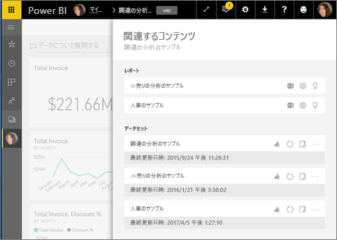
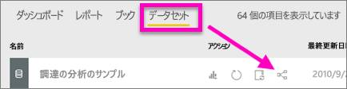

# Power BI サービスで関連するコンテンツを表示する
**[関連するコンテンツ]** ペインには、Power BI サービスのコンテンツ (ダッシュボード、レポート、データセット) がどのように相互接続されているかが示されます。 [関連するコンテンツ] ペインは、操作を実行するための起動パッドでもあります。 ここから、更新、名前変更、分析情報の生成を始めとするさまざまな操作を実行できます。 関連するレポートやダッシュボードを選ぶと、Power BI ワークスペースに表示されます。   

Power BI では、レポートはデータセットを基にして作成されていて、レポートのビジュアルはダッシュボードにピン留めされ、ダッシュボードのビジュアルはレポートにリンクしています。 しかし、マーケティング レポートのビジュアルをホストしているダッシュボードをどのようにして知りますか。 そのダッシュボードをどのようにして見つけますか。 調達ダッシュボードでは複数のデータセットからのビジュアルが使われていますか。 その場合、どのような名前が付けられていて、開いて編集するにはどうすればよいですか。 HR データセットはレポートやダッシュボードで使われていますか。 または、それはリンクを壊さずに移動できますか。 このような疑問の答えは、 **[関連するコンテンツ]** ペインでわかります。  このペインでは、関連するコンテンツが表示されるだけでなく、コンテンツに対する操作を実行し、関連するコンテンツ間を簡単に移動することもできます。

> [!NOTE]
> 関連するコンテンツの機能は、ストリーミング データセットには機能しません。
> 
> 

## ダッシュボードの関連するコンテンツを表示する
Watch ではダッシュボードの関連するコンテンツが表示されます。 その後、ビデオで説明されている手順に従って、ご自分でやってみてください。データセットは、調達の分析のサンプルをご利用ください。

<iframe width="560" height="315" src="https://www.youtube.com/embed/B2vd4MQrz4M#t=3m05s" frameborder="0" allowfullscreen></iframe>

**[関連するコンテンツ]** ペインを開くには、ダッシュボードに対する "*表示*" アクセス許可が少なくとも必要です。 この例では、[調達の分析のサンプル](../sample-procurement.md)を使います。

**方法 1**

ワークスペースで **[ダッシュボード]** タブを選び、 **[関連の表示]** アイコン ![[関連の表示] アイコン](./media/end-user-related/power-bi-view-related-icon-new.png) を選びます。

![[ダッシュボード] タブ](./media/end-user-related/power-bi-view-related-dash-newer.png)

 

**方法 2**

ダッシュボードを開き、上部のメニュー バーから   ![[関連の表示] アイコン](./media/end-user-related/power-bi-view-related-new.png) を選択します。

**[関連するコンテンツ]** ペインが開きます。 ダッシュボードに視覚化がピン留めされているすべてのレポートと、それに関連付けられているデータセットが表示されます。 このダッシュボードには 3 つの異なるレポートからピン留めされた視覚化があり、これらのレポートは 3 つの異なるデータセットが基になっています。

![[関連するコンテンツ] ウィンドウ](./media/end-user-related/power-bi-view-related-dashboard-new.png)

ここからは、関連するコンテンツに対する操作を直接実行できます。  たとえば、レポート名を選んで開きます。  表示されたレポートで、[Excel で分析](../service-analyze-in-excel.md)、[名前の変更](../service-rename.md)、[詳細情報の取得](end-user-insights.md)などのアイコンを選びます。 データセットで、[レポートの新規作成](../service-report-create-new.md)、[更新](../refresh-data.md)、名前の変更、[Excel で分析](../service-analyze-in-excel.md)、[詳細情報の取得](end-user-insights.md)、データセットの **[設定]** ウィンドウの表示などのアイコンを選びます。  

## レポートの関連するコンテンツを表示する
**[関連するコンテンツ]** ペインを開くには、レポートに対する "*表示*" アクセス許可が少なくとも必要です。 この例では、[調達の分析のサンプル](../sample-procurement.md)を使います。

**方法 1**

ワークスペースで **[レポート]** タブを選び、 **[関連の表示]** アイコン ![[関連の表示] アイコン](./media/end-user-related/power-bi-view-related-icon-new.png) を選びます。

![[レポート] タブ](./media/end-user-related/power-bi-view-related-report-newer.png)

 

**方法 2**

[[読み取りビュー]](end-user-reading-view.md) でレポートを開き、上部のメニュー バーから ![[関連の表示] アイコン](./media/end-user-related/power-bi-view-related-new.png) を選択します。

**[関連するコンテンツ]** ペインが開きます。 関連付けられたデータセットと、レポートから少なくとも 1 つのタイルがピン留めされているすべてのダッシュボードが表示されます。 この例のレポートには、2 つの異なるダッシュボードにピン留めされた視覚化があります。

![[関連するコンテンツ] ウィンドウ](./media/end-user-related/power-bi-view-related-report.png)

ここからは、関連するコンテンツに対する操作を直接実行できます。  たとえば、ダッシュボード名を選んで開きます。  一覧のダッシュボードで、[ダッシュボードを他のユーザーと共有する](../service-share-dashboards.md)アイコンや、ダッシュボードの **[設定]** ウィンドウを開くアイコンを選びます。 データセットで、[レポートの新規作成](../service-report-create-new.md)、[更新](../refresh-data.md)、名前の変更、[Excel で分析](../service-analyze-in-excel.md)、[詳細情報の取得](end-user-insights.md)、データセットの **[設定]** ウィンドウの表示などのアイコンを選びます。  

## データセットの関連するコンテンツを表示する
**[関連するコンテンツ]** ペインを開くには、データセットに対する "*表示*" アクセス許可が少なくとも必要です。 この例では、[調達の分析のサンプル](../sample-procurement.md)を使います。

ワークスペースで **[データセット]** タブを選び、 **[関連の表示]** アイコン ![[関連の表示] アイコン](./media/end-user-related/power-bi-view-related-icon-new.png) を探します。

アイコンを選び、 **[関連するコンテンツ]** ペインを開きます。

![Power BI のコンテンツ ビューの上部にある [関連するコンテンツ] ペイン](media/end-user-related/power-bi-datasets.png)

ここからは、関連するコンテンツに対する操作を直接実行できます。 たとえば、ダッシュボード名またはレポート名を選んで開きます。  一覧のダッシュボードで、[ダッシュボードを他のユーザーと共有する](../service-share-dashboards.md)アイコンや、ダッシュボードの **[設定]** ウィンドウを開くアイコンを選びます。 レポートで、[Excel での分析](../service-analyze-in-excel.md)、[名前の変更](../service-rename.md)、[詳細情報の取得](end-user-insights.md)などのアイコンを選びます。  

## 制限事項とトラブルシューティング
* "関連の表示" が表示されない場合は、代わりにそのアイコンを探します ![[関連の表示] アイコン](./media/end-user-related/power-bi-view-related-icon-new.png)。 アイコンを選び、 **[関連するコンテンツ]** ペインを開きます。
* レポートの関連するコンテンツを開くには、[[読み取りビュー]](end-user-reading-view.md) を表示している必要があります。
* 関連するコンテンツの機能は、ストリーミング データセットには機能しません。

## 次の手順
* [Power BI サービスの概要](../service-get-started.md)
* 他にわからないことがある場合は、 [Power BI コミュニティを利用してください](http://community.powerbi.com/)。

