# レポート フィルター ウィンドウの使用方法
この記事では、Power BI サービスのレポート フィルター ウィンドウについて説明します。

Power BI でデータをフィルター処理するには、さまざまな方法があります。最初に「[フィルター処理と強調表示](../power-bi-reports-filters-and-highlighting.md)」をお読みになることをおすすめします。

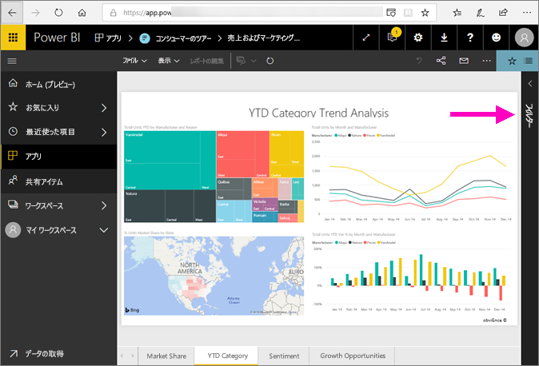

## レポート フィルター ウィンドウの操作
同僚とレポートを共有する場合は、必ず **[フィルター]** ウィンドウを探してください。 レポートの右端に沿って折りたたまれている場合があります。 それを選択して展開します。   

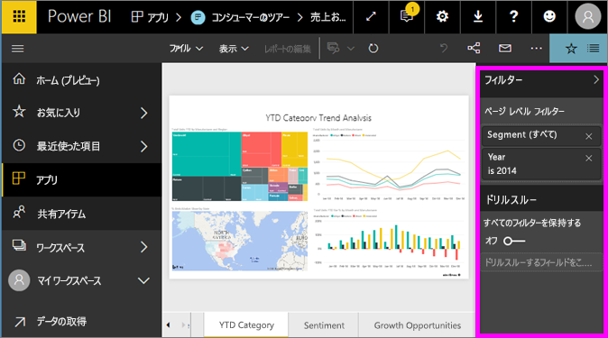

[フィルター] ウィンドウには、レポート *デザイナー*によってレポートに追加されたフィルターが含まれています。 お客様のような*コンシューマー*は、フィルターを操作し、その変更内容を保存できますが、新しいフィルターをレポートに追加することはできません。 たとえば、上のスクリーンショットでは、デザイナーによって 2 つのページ レベル フィルターが追加されています:"セグメント" と "年" です。 これらのフィルターを操作および変更することはできますが、3 番目のページ レベル フィルターを追加することはできません。

Power BI サービスでは、フィルター ウィンドウで行う変更がすべてレポートで保持され、その変更はモバイル バージョンのレポートに反映されます。 フィルター ウィンドウを設計者の既定値にリセットするには、上部のメニューバーから **[既定値にリセット]** を選択します。     

## フィルター ウィンドウを開く
レポートを開くと、レポート キャンバスの右側にフィルター ウィンドウが表示されます。 ウィンドウが表示されない場合は、右上隅にある矢印を選択すると開きます。  

この例で選択したビジュアルには 6 個のフィルターがあります。 レポート ページにもフィルターが適用されていて、**[ページ レベル フィルター]** という見出しの下に表示されています。 [ドリルスルー フィルター](../power-bi-report-add-filter.md)が 1 つあり、レポート全体にも次のフィルターがあります:"**FiscalYear** is 2013 or 2014"。

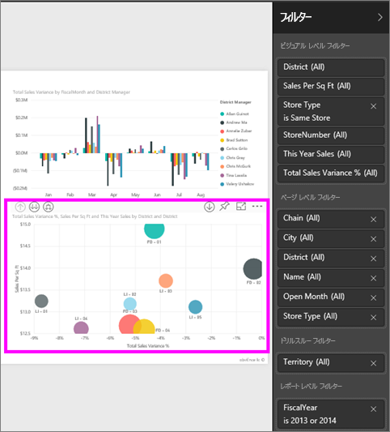

いくつかのフィルターの横に **[All]** と表示されているのは、すべての値がフィルターに含まれることを意味します。  たとえば、上のスクリーンショットの **[Chain(All)]** は、このレポート ページにすべてのストア チェーンに関するデータが含まれることを示します。  一方、レポート レベル フィルターの **[FiscalYear is 2013 or 2014]** は、レポートに 2013 年および 2014 年の会計年度のデータのみが含まれることを示します。

このレポートを表示するユーザーは、だれでもこれらのフィルターを操作できます。

- ページ、ビジュアル、レポート、ドリルスルー フィルターの各フィルターで検索することで、必要な値を見つけて選択します。 

    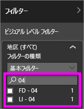

- フィルターの詳細を表示するには、フィルターの横にある矢印の上にカーソルを置いて選択します。
  
   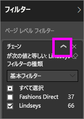
* フィルターを変更します。たとえば、**[Lindseys]** を **[Fashions Direct]** に変更します。
  
     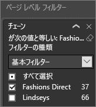

* 上部のメニューバーから **[既定値にリセット]** を選択して、フィルターを元の状態にリセットします。    
    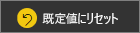
    
* フィルター名の横の **[x]** を選択してフィルターを削除します。
  
    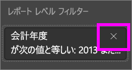

  フィルターを削除すると一覧に表示されなくなりますが、レポートからデータが削除されることはありません。  たとえば、**FiscalYear is 2013 or 2014** フィルターを削除すると、会計年度のデータはレポートにまだ残っていますが、2013 年と 2014 年だけ表示されるようにフィルター処理されることはなくなります。データに含まれるすべての会計年度が表示されます。  ただし、フィルターを削除すると、一覧から削除されるので再び変更することはできません。 もっとよい方法は、消しゴム アイコン  を選択してフィルターをクリアすることです。
  
  

## フィルターのクリア
 フィルター モードが詳細であっても基本であっても、消しゴム アイコンを選択して   フィルターをクリアします。 

## フィルターの種類: テキスト フィールド フィルター
### 一覧モード
チェックボックスをクリックすると、値の選択と選択解除を切り替えられます。 **[すべて]** チェックボックスを使用すると、すべてのチェックボックスの状態をオンまたはオフに切り替えられます。 チェックボックスは、そのフィールドの使用可能なすべての値を表します。  フィルターを調整すると、選択内容を反映して説明文が更新されます。 

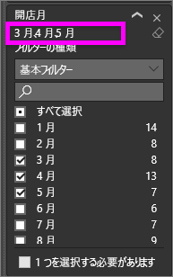

説明文が "Mar、Apr、または May です。" に変わっています。

### 詳細モード
**[詳細なフィルタリング]** を選択して、詳細モードに切り替えます。 ドロップダウン コントロールとテキスト ボックスを使用して、含めるフィールドを識別します。 **[AND]** および **[OR]** を選択すると、複雑なフィルター式を作成できます。 必要な値を設定したら、 **[フィルターの適用]** ボタンを選択します。  

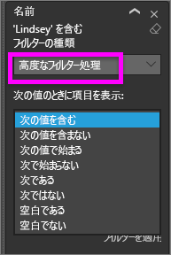

## フィルターの種類: 数値フィールド フィルター
### 一覧モード
値が有限の場合は、フィールド名を選択すると、一覧が表示されます。  チェックボックスの使用方法については、上記の「**テキスト フィールド フィルター**」の「**一覧モード**」を参照してください。   

### 詳細モード
値が無限である場合、または範囲を表している場合は、フィールド名を選択すると、詳細フィルター モードが開きます。 ドロップダウンおよびテキスト ボックスを使用して、表示する値の範囲を指定します。 

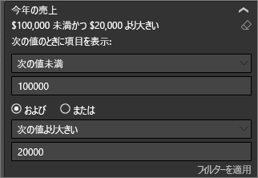

**[AND]** および **[OR]** を選択すると、複雑なフィルター式を作成できます。 必要な値を設定したら、 **[フィルターの適用]** ボタンを選択します。

## フィルターの種類: 日付と時刻
### 一覧モード
値が有限の場合は、フィールド名を選択すると、一覧が表示されます。  チェックボックスの使用方法については、上記の「**テキスト フィールド フィルター**」の「**一覧モード**」を参照してください。   

### 詳細モード
フィールドの値が日付または時刻を表している場合は、日付/時刻フィルターを使用するときに、開始/終了時刻を指定できます。  

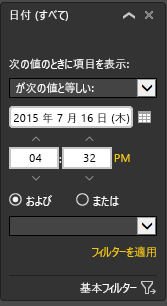

## 次の手順
[レポート ページでビジュアル相互間でクロスフィルター処理とクロス強調表示を行う方法と理由について](end-user-interactions.md)