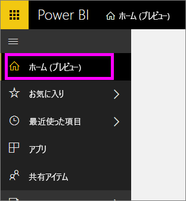
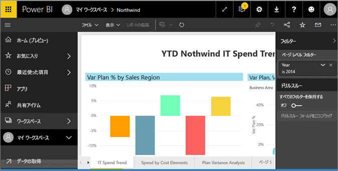
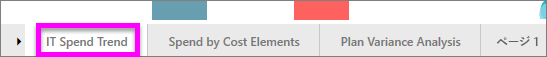
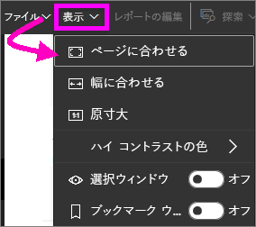
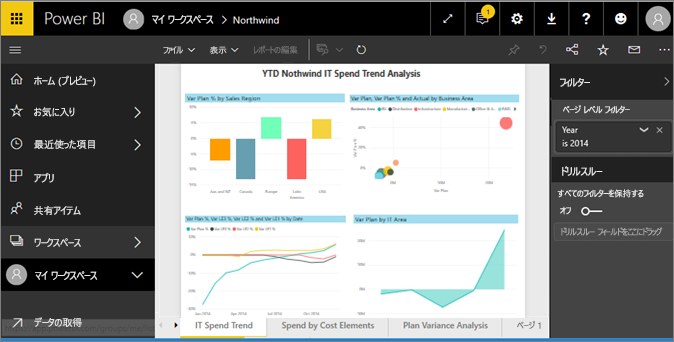
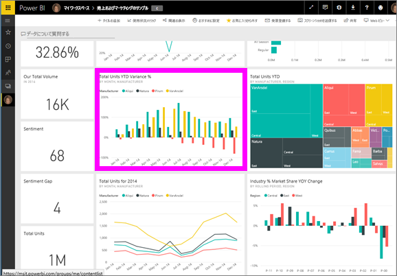
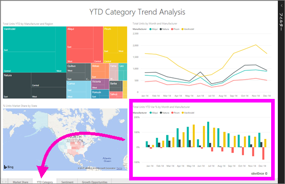

# "*コンシューマー*" 向け Power BI サービスでレポートを表示する
レポートは、ビジュアルで構成される 1 つまたは複数のページです。 レポートは Power BI "*レポート デザイナー*" によって作成され、["*コンシューマー*" と直接共有](end-user-shared-with-me.md)されます。あるいは[アプリ](end-user-apps.md)の一部として共有されます。 

レポートはさまざまな方法で開くことができます。そのうちの 2 つを紹介します。ホーム ページから開く方法とダッシュボードから開く方法です。 

<!-- add art-->

## ホーム ページからレポートを開く
それでは、ユーザーと直接共有されているレポートを開いてみましょう。その後で、アプリの一部として共有されたレポートを開いてみましょう。

   

### ユーザーと共有されているレポートを開く
Power BI *デザイナー*では、上部メニュー バーの **[共有]** ボタンをクリックすることでレポートを直接共有できます。 この方法で共有されたコンテンツは左のナビゲーション バーの **[共有アイテム]** コンテナーとホーム ページの **[共有アイテム]** セクションに表示されます。

1. Power BI サービスを開きます (app.powerbi.com)。

2. 左のナビゲーション バーから **[ホーム (プレビュー)]** を選択し、ホーム ページを開きます。  

   
   
3. **[共有アイテム]** が表示されるまで下方向にスクロールします。 レポート アイコン  を見つけます。 このスクリーンショットには 2 つのレポートがあります:*Financial* と *Northwind* です。 
   
   ![ホーム ページの [共有アイテム] セクション](./media/end-user-report-open/power-bi-shared.png)

4. レポート "*カード*" の 1 つを選択し、レポートを開きます。

   

5. 下にタブが並んでいます。 各タブはレポート *ページ*を表します。 現在、*IT Spend Trend* ページを開いています。 別のタブを選択し、そのレポート ページを開きます。 

   

6. この時点ではレポート ページの一部だけが表示されます。 ページの表示 (ズーム) を変更するには、**[表示]** > **[ページに合わせる]** の順に選択します。

   

   

### アプリの一部となっているレポートを開く
同僚や AppSource からアプリを受け取っている場合、そのアプリはホーム ページと左のナビゲーション バーの **[アプリ]** コンテナーから利用できます。 [アプリ](end-user-apps.md)はダッシュボードとレポートをまとめたものです。

1. 左のナビゲーション バーから **[ホーム (プレビュー)]** を選択し、ホーム ページに戻ります。

7. **[マイ アプリ]** が表示されるまで下方向にスクロールします。

   

8. アプリの 1 つを選択して開きます。 アプリでは、アプリ "*デザイナー*" によって設定されたオプションに基づき、ダッシュボード、レポート、またはアプリ コンテンツ リストが開きます。 アプリを選択し、
    - レポートが開いた場合、そこで操作はおしまいです。
    - ダッシュボードが開いた場合、下の「[ダッシュボードからレポートを開く](#Open-a-report-from-a-dashboard)」を参照してください。
    - アプリ コンテンツ リストが開かれた場合、**[レポート]** で、レポートを選択してそれを開きます。

## ダッシュボードからレポートを開く
レポートはダッシュボードから開くことができます。 ほとんどのダッシュボード タイルはレポートから*ピン留め*されています。 タイルを選択すると、タイルの作成に使用されたレポートが開きます。 

1. ダッシュボードからタイルを選択します。 この例では、"Total Units YTD..." という縦棒グラフ タイルを選択しています。

    

2.  関連付けられているレポートが開きます。 "YTD Category" ページが表示されていることがわかります。 これは、ダッシュボードから選択した縦棒グラフを含むレポート ページです。

    

> [!NOTE]
> 一部のタイルはレポートに関連付けられていません。 [Q&A を使用して作成](end-user-q-and-a.md)されたタイルを選択すると、Q&A 画面が開きます。 [ダッシュボードの **[タイルの追加]** ウィジェットを使用して作成](../service-dashboard-add-widget.md)されたタイルを選択すると、いくつかの異なる結果になる可能性があります。  

##  レポートを開く他の方法
Power BI サービスのナビゲーションに慣れてくると、最適なワークフローを見つけ出すことができます。 レポートにアクセスする他の方法をいくつか以下に示します。
- 左のナビゲーション ウィンドウにある **[お気に入り]** と **[最近]** を使用する    
- [[関連の表示]](end-user-related.md) を使用する    
- メールで (他のユーザーに[共有してもらう](../service-share-reports.md)場合、または自分で[アラートを設定する](end-user-alerts.md)場合)    
- [通知センター](end-user-notification-center.md)から    
- その他

## 次の手順
[レポートはさまざまな方法で操作](end-user-reading-view.md)できます。  最初に、レポート キャンバスの下部にある各タブを選択してみましょう。

