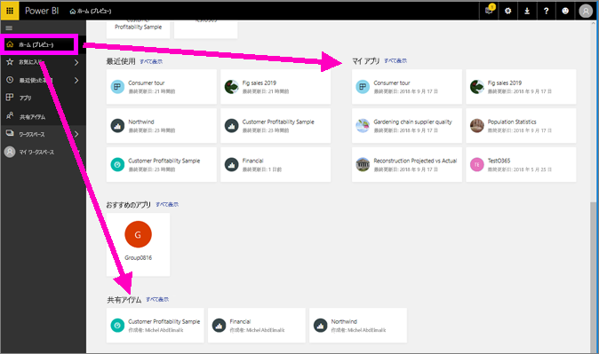
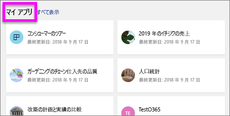

# "*コンシューマー*" 向け Power BI サービスでレポートを表示する
レポートは、ビジュアルで構成される 1 つまたは複数のページです。 レポートが Power BI によって作成された*デザイナー*と[で共有*コンシューマー*直接](end-user-shared-with-me.md)またはの一部として、[アプリ](end-user-apps.md)します。 

さまざまな方法でレポートを開き、紹介する 2 つの: ホームを開き、ダッシュ ボードから開きます。 

<!-- add art-->

## Power BI ホームからレポートを開く
それでは、ユーザーと直接共有されているレポートを開いてみましょう。その後で、アプリの一部として共有されたレポートを開いてみましょう。

   

### ユーザーと共有されているレポートを開く
Power BI*デザイナー*直接お客様と、レポートを共有することができます。 この方法で共有されるコンテンツが表示されます、**自分と共有**、ナビゲーション バーと上のコンテナー、**自分と共有**ホーム キャンバスのセクション。

1. Power BI サービス (app.powerbi.com) を開きます。

2. ナビゲーション バーから選択**ホーム**ホーム キャンバスを表示します。  

   
   
3. **[共有アイテム]** が表示されるまで下方向にスクロールします。 レポート アイコン  を見つけます。 このスクリーン ショットで 1 つのダッシュ ボードとという名前の 1 つのレポートがある*売上およびマーケティングのサンプル*します。 
   
   ![ホーム ページの [共有アイテム] セクション](./media/end-user-report-open/power-bi-shared-new.png)

4. 単にレポートを選択して*カード*レポートを開きます。

   

5. 左側にあるタブに注意してください。  各タブはレポート *ページ*を表します。 現在がある、*成長機会*ページが開きます。 選択、 *YTD カテゴリ* タブを代わりにそのレポート ページを開きます。 

   

6. ここではレポート ページ全体に表示されます。 ページの表示 (ズーム) を変更するには、右上隅からビュー ドロップダウンを選択 ( **>** ) 選択**実際のサイズ**します。

   

   

### アプリの一部となっているレポートを開く
ホームおよびからそれらのアプリがから利用可能な場合、または同僚から AppSource からアプリを受信した場合、**アプリ**ナビゲーション バー上のコンテナー。 [アプリ](end-user-apps.md)はダッシュボードとレポートをまとめたものです。

1. 選択してホームに戻る**ホーム**のナビゲーション バーから。

7. **[マイ アプリ]** が表示されるまで下方向にスクロールします。

   

8. アプリの 1 つを選択して開きます。 アプリでは、アプリ "*デザイナー*" によって設定されたオプションに基づき、ダッシュボード、レポート、またはアプリ コンテンツ リストが開きます。 アプリを選択し、
    - レポートが開いた場合、そこで操作はおしまいです。
    - ダッシュボードが開いた場合、下の「***ダッシュボードからレポートを開く***」を参照してください。
    - アプリ コンテンツ リストが開かれた場合、 **[レポート]** で、レポートを選択してそれを開きます。

## ダッシュボードからレポートを開く
レポートはダッシュボードから開くことができます。 ほとんどのダッシュボード タイルはレポートから*ピン留め*されています。 タイルを選択すると、タイルの作成に使用されたレポートが開きます。 

1. ダッシュボードからタイルを選択します。 この例では、"Total Units YTD..." という縦棒グラフ タイルを選択しています。

    

2.  関連付けられているレポートが開きます。 "YTD Category" ページが表示されていることがわかります。 これは、ダッシュボードから選択した縦棒グラフを含むレポート ページです。

    

> [!NOTE]
> 一部のタイルはレポートに関連付けられていません。 [Q&A を使用して作成](end-user-q-and-a.md)されたタイルを選択すると、Q&A 画面が開きます。 [ダッシュボードの **[タイルの追加]** ウィジェットを使用して作成](../service-dashboard-add-widget.md)されたタイルを選択すると、いくつかの異なる結果になる可能性があります。  

##  レポートを開く他の方法
Power BI サービスの移動がより快適で取得するには、最適なワークフローを算出します。 レポートにアクセスする他の方法をいくつか以下に示します。
- ナビゲーション バーから**お気に入り**と**最近使用したファイル**    
- [[関連の表示]](end-user-related.md) を使用する    
- メールで (他のユーザーに[共有してもらう](../service-share-reports.md)場合、または自分で[アラートを設定する](end-user-alerts.md)場合)    
- [通知センター](end-user-notification-center.md)から    
- その他

## 次の手順
[レポートはさまざまな方法で操作](end-user-reading-view.md)できます。  レポート キャンバスの横には、各タブを選択して探索を開始します。

