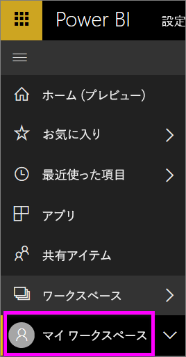
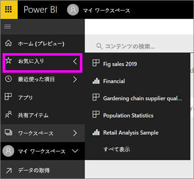

# ナビゲーション: Power BI サービスでコンテンツの検索、探索、並べ替えを行う
Power BI サービスでコンテンツ間を移動する方法はたくさんあります。 ワークスペース内のコンテンツは、種類 (ダッシュボード、レポート、ブック、データセット) ごとにまとめられています。  また、コンテンツは使用方法 (お気に入り、最近、アプリ、自分と共有、おすすめ) によっても整理されています。 ワン ストップ ナビゲーションの場合、ホーム ページにはすべてのコンテンツを 1 ページにまとめます。 コンテンツへのこれらの異なる経路により、Power BI サービス内で必要な情報をすばやく見つけることができます。  

## ワークスペース内のナビゲーション

通常、Power BI "*コンシューマー*" には 1 つのワークスペースしかありません: **[マイ ワークスペース]** です。 **[マイ ワークスペース]** には、Microsoft のサンプルをダウンロードした場合、または独自のコンテンツを作成またはダウンロードした場合にのみコンテンツが表示されます。  

**[マイ ワークスペース]** 内には、Power BI サービスでは、種類 (ダッシュボード、レポート、ブック、データセット) によってコンテンツが分かれています。 ワークスペースを選ぶと、この編成方法で表示されます。 この例で、 **[マイ ワークスペース]** には 1 つのダッシュボード、2 つのレポート、0 個のワークブック、2 つのデータセットが含まれています。

________________________________________

## 左ナビゲーションバーを使ったナビゲーション
左ナビゲーション バーでは、さらに簡単に必要なものを迅速に見つけることができる方法でコンテンツが分類されています。  

- 自分と共有されているコンテンツは、 **[自分と共有]** に表示されます。
- 最近表示したコンテンツは **[最近]** に表示されます。 
- アプリを見つけるには、 **[アプリ]** を選択します。
- **[ホーム]** は、最も重要なコンテンツ、推奨されるコンテンツ、学習ソースが掲載された単一ページ ビューです。

さらに、コンテンツに[お気に入り](end-user-favorite.md)および[おすすめ](end-user-featured.md)のタグを付けることができます。 最も頻繁に表示すると思われるダッシュボードを選び、それを*おすすめ*のダッシュボードとして設定します。 Power BI サービスを開くたびに、このおすすめのダッシュボードが最初に表示されます。 頻繁に参照するダッシュボードとアプリがたくさんありますか? それらをお気に入りに設定すると、常に左ナビゲーション バーから使うことができます。

.

## 考慮事項とトラブルシューティング
* データセットでは、所有者は **[並べ替え]** を使用できません。

## 次の手順
[Power BI - 基本的な概念](end-user-basic-concepts.md)

他にわからないことがある場合は、 [Power BI コミュニティを利用してください](http://community.powerbi.com/)。
