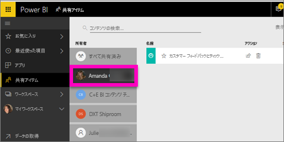

# 自分と共有されているダッシュボードとレポートを表示する
## 共有アイテム

同僚が **[共有]** ボタンを使用して自分とコンテンツを共有した場合、 **[自分と共有]** コンテナーに表示されます。 このダッシュボードまたはレポートは、 **[自分と共有]** からのみ使用でき、 **[アプリ]** からは使用できません。

![[共有] アイコン](./media/end-user-shared-with-me/power-bi-share-dash.png)

Amanda による**自分と共有**コンテンツの一覧の説明と、一覧を移動およびフィルター処理する方法のデモンストレーションをご覧ください。 その後、ビデオで説明されている手順に従って、ご自分でやってみてください。 共有されたダッシュボードを表示するには、Power BI Pro ライセンスが必要です。 詳しくは、[Power BI Premium](../service-premium-what-is.md) に関するページをご覧ください。

<iframe width="560" height="315" src="https://www.youtube.com/embed/G26dr2PsEpk" frameborder="0" allowfullscreen></iframe>

デザイナーより付与されたアクセス許可に応じて、ダッシュボードやレポートを操作するオプションがあります。 これらには、ダッシュボードのコピーの作成、レポートの[読み取りビュー](end-user-reading-view.md)での表示、他の同僚と再共有があります。

![[自分と共有] コンテナー](./media/end-user-shared-with-me/power-bi-container.png)

## **[自分と共有]** コンテナーから使用できるアクション
* 星のアイコンを選択して[ダッシュボードまたはレポートをお気に入り](end-user-favorite.md)にします。
* ダッシュボードまたはレポートを削除する  
* 一部のダッシュボードとレポートを再共有することができます。  
* また、多数ある場合、[検索フィールドと並べ替えを使用して検索することも](end-user-search-sort.md)できます。
  
  > [!NOTE]
  > EGRC の分類の詳細については、[分類] ボタンを選択するか、「[ダッシュボードのデータの分類](../service-data-classification.md)」を参照してください。
  > 
  > 
* 表示するダッシュボードの名前を選択し、確認します。 共有ダッシュボードを一度開くと、Q&A を使用して基になるデータに関する質問をしたり、開くタイルを選択して読み取りビューでレポートを対話的に処理することができます。

## 所有者で共有ダッシュボードをフィルター処理する
**[自分と共有]** 画面内のコンテンツは、コンテンツ所有者でさらにフィルター処理できます。 たとえば、 **[Amanda]** を選択した場合、Amanda が自分と共有するダッシュボードのみを表示できます。

