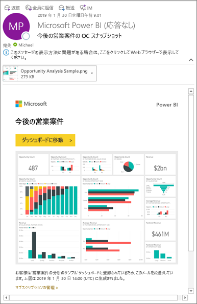
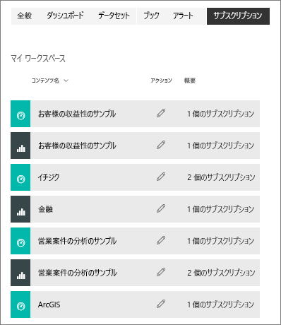

# Power BI サービスでレポートまたはダッシュボードをサブスクライブする 
最も重要なダッシュボードとレポートを簡単に最新の状態に維持できます。 レポートのページと、最も重要なダッシュ ボードを購読して、Power BI は、受信トレイへのスナップショットを電子メール送信されます。 メールを受信する頻度 (毎日、毎週、データ更新時) を Power BI に指示します。 特定の日時に Power BI でメールが送信されるように設定することも、今すぐ実行することもできます。  

メールとスナップショットでは、Power BI 設定で指定されている言語が使用されます (「[Power BI でサポートされる言語と国/地域](../supported-languages-countries-regions.md)」参照)。 言語が定義されていない場合、Power BI では現在のブラウザーのロケール設定に基づいて言語を使用します。 言語の優先順位を表示または設定するには、歯車アイコン  >  **> [設定] > [全般] > [言語]** の順に選択します。 

受信するメールには、"レポートまたはダッシュボードに移動する" ためのリンクが含まれます。 Power BI アプリがインストールされたモバイル デバイスでこのリンクを選ぶと、アプリが起動します (Power BI Web サイトでレポートまたはダッシュボードを開く既定の操作とは異なります)。

## 要件
サブスクリプションの**作成**は、Power BI Pro の機能です。   

## ダッシュボードまたはレポート ページをサブスクライブする
ダッシュボードとレポートのどちらをサブスクライブする場合でも、そのプロセスは似ています。 同じボタンで、Power BI サービスのダッシュボードとレポートをサブスクライブすることができます。
 
.

1. ダッシュボードまたはレポートを開きます。
2. 上部のメニュー バーで **[受信登録する]** または封筒アイコン ![[受信登録する] アイコン](./media/end-user-subscribe/power-bi-icon-envelope.png) を選択します。
   
   

   
    
    ダッシュボードで **[受信登録する]** を選択すると、左側の画面が表示されます。 レポート ページで **[受信登録する]** を選択すると、右側の画面が表示されます。 レポートの複数のページをサブスクライブするには、 **[Add another subscription]\(別のサブスクリプションを追加\)** を選択し、別のページを選択します。 

4. 黄色のスライダーを使うと、サブスクリプションのオン/オフを切り替えることができます。  スライダーを [オフ] にしても、サブスクリプションは削除されません。 サブスクリプションを削除するには、ごみ箱アイコンを選択します。

4. 電子メール アドレスが自動的に追加、**購読**フィールド。 組織内の他のユーザーをサブスクライブするには、もここで、電子メール アドレスを追加します。 

5. 必要に応じて、電子メール メッセージの詳細を追加します。 

5. サブスクリプションの **[頻度]** を選択します。  [毎日]、[毎週]、または [データ更新後 (毎日)] を選択できます。  特定の曜日にだけサブスクリプション メールを受け取るには、 **[毎週]** を選択して、受け取る曜日を選択します。  たとえば、平日にのみサブスクリプション メールを受け取る場合は、頻度で **[毎週]** を選択し、[土] と [日] のチェック ボックスをオフにします。   

6. メールが送信される時刻をスケジュールするには、頻度として毎日または毎週を選択し、サブスクリプションの **[スケジュールされた** **時間]** を入力します。   

7. 日付フィールドに日付を入力して、開始日と終了日をスケジュールします。 既定では、サブスクリプションの開始日はその作成日、終了日は 1 年後になります。 サブスクリプションは、終了日に達すると、再度有効にするまで停止します。  スケジュールされた終了日の前に、延長するかどうかを確認する通知が届きます。     

8. サブスクリプションを確認してテストするには、 **[今すぐ実行]** を選択します。  これにより、すぐにメールが送信されます。 

8. 何も問題がなければ、 **[保存して閉じる]** を選択してサブスクリプションを保存します。 購読している同僚と電子メールに設定したスケジュールでレポートまたはダッシュ ボードのスナップショットが表示されます。 頻度が **[データ更新後]** に設定されているすべてのサブスクリプションについては、その日にスケジュールされている最初の更新の後でのみメールが送信されます。
   
   
   
    レポート ページを更新しても、データセットは更新されません。 データセットの所有者のみが、データセットを手動で更新できます。 基になるデータセットの所有者名を検索する選択**関連ビュー**から上部のメニュー バーまたはサブスクリプションの元の電子メールを参照してください。
   
    

## サブスクリプションを管理する
のみを作成するサブスクリプションを管理することができます。 再び **[受信登録する]** を選択し、左下隅の **[すべてのサブスクリプションを管理]** を選択します (上のスクリーンショットを参照)。 

Pro ライセンスの有効期限が切れた場合、所有者がダッシュボードまたはレポートを削除した場合、またはサブスクリプションの作成に使われたユーザー アカウントが削除された場合、サブスクリプションは終了します。

## 考慮事項とトラブルシューティング
* ダッシュボードに含まれるピン留めされたタイルが 25 個より多い場合、またはピン留めされたライブ レポート ページが 4 個より多い場合は、ユーザーに送信されたサブスクリプション電子メールで完全にレンダリングされない可能性があります。 ダッシュ ボード デザイナーを問い合わせて、電子メールが正しく表示されることを確認するより小さい 4 つに 25 より小さいと、固定のライブ レポートをピン留めされたタイルを削減するように依頼して、お勧めします。  
* ダッシュボード メールのサブスクリプションについては、行レベルのセキュリティ (RLS) が適用されているタイルがある場合、そのタイルは表示されません。  レポート メールのサブスクリプションについては、データセットで RLS を使用する場合、サブスクリプションを作成することはできません。
* レポート ページのサブスクリプションは、レポート ページの名前に関連付けられています。 レポート ページにサブスクライブし、変更を取得しますが場合、は、サブスクリプションを再作成する必要があります。
* サブスクリプション機能を使用できない場合は、システム管理者に問い合わせてください。 認証などの理由から、組織としてこの機能が無効にされている可能性があります。  
* メール サブスクリプションは、ほとんどの[カスタム ビジュアル](../power-bi-custom-visuals.md)をサポートしていません。  例外は[認定](../power-bi-custom-visuals-certified.md)されているカスタム ビジュアルです。  
* メール サブスクリプションは、この時点では、R を利用したカスタム ビジュアルをサポートしていません。  
* ダッシュボードのサブスクリプションに限り、特定の種類のタイルはまだサポートされていません。  ストリーミング タイル、ビデオ タイル、カスタム Web コンテンツ タイルなどです。     
* メールのサイズ制限のため、ダッシュボードまたはレポートに非常に大きい画像が含まれると、サブスクリプションが失敗する場合があります。    
* Power BI では、2 か月より長くアクセスされていないダッシュボードおよびレポートに関連付けられているデータセットの更新は、自動的に一時停止されます。  ただし、ダッシュボードまたはレポートにサブスクリプションを追加した場合は、アクセスがなくても一時停止されません。    

## 次の手順

[コンテンツの検索と並べ替え](end-user-search-sort.md)
