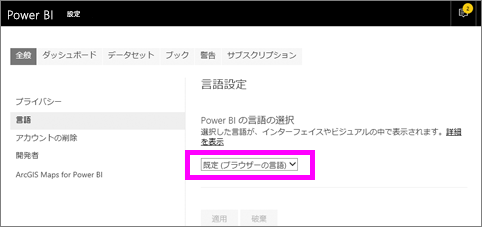
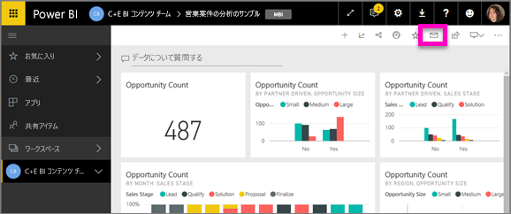
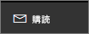
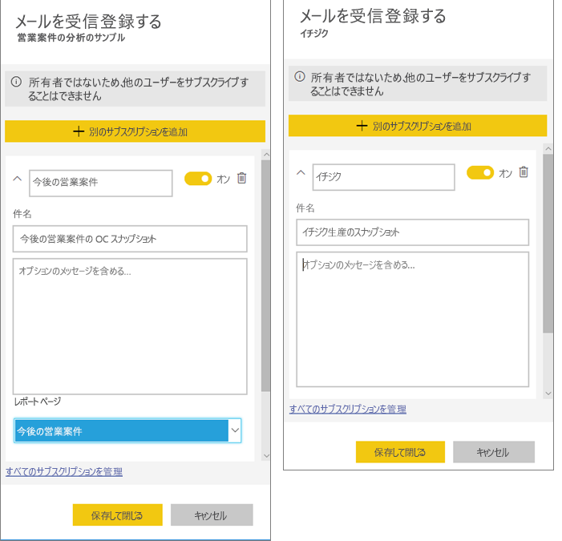
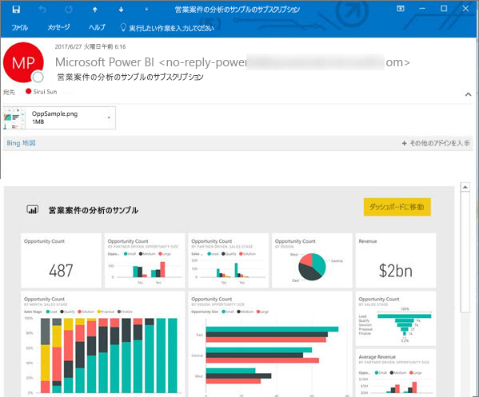
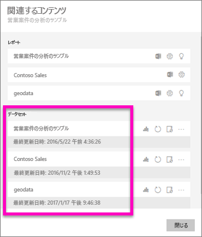
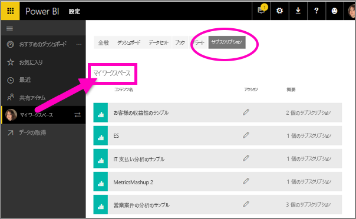

# Power BI サービスでレポートまたはダッシュボードをサブスクライブする 
最も重要なダッシュボードとレポートを簡単に最新の状態に維持できます。 最も重要なレポート ページとダッシュボードを購読すると、Power BI はスナップショットを電子メールでユーザーの受信トレイに送信します。 メールの受信頻度は日に 1 回から週に 1 回の範囲で選択できます。 

メールとスナップショットでは、Power BI 設定で指定されている言語が使用されます (「[Power BI でサポートされる言語と国/地域](../supported-languages-countries-regions.md)」参照)。 言語が定義されていない場合、Power BI では現在のブラウザーのロケール設定に基づいて言語を使用します。 言語の優先順位を表示または設定するには、歯車アイコン  >  **> [設定] > [全般] > [言語]** の順に選択します。 

受信したメールには、[レポートに移動]/[ダッシュボードに移動] リンクが含まれます。 Power BI アプリがインストールされたモバイル デバイスでこのリンクを選ぶと、アプリが起動します (Power BI Web サイトでレポートまたはダッシュボードを開く既定の操作とは異なります)。

## 要件
- サブスクリプションの**作成**は、Power BI Pro の機能です。 
- サブスクリプションの電子メールは基になるデータセットが更新されたときにのみ送信されるため、更新されないデータセットではサブスクリプションが機能しません。

## ダッシュボードまたはレポート ページをサブスクライブする
ダッシュボードとレポートのどちらをサブスクライブする場合でも、そのプロセスは非常に似ています。 同じボタンで、Power BI サービスのダッシュボードとレポートをサブスクライブすることができます。
 
.

1. ダッシュボードまたはレポートを開きます。
2. 上部のメニュー バーで **[受信登録する]** または封筒アイコン  を選びます。
   
   

3. 黄色のスライダーを使うと、サブスクリプションのオン/オフを切り替えることができます。  スライダーをオフにしても、サブスクリプションが削除されることはありません。 サブスクリプションを削除するには、ごみ箱アイコンを選択します。

4. 必要に応じて、電子メール メッセージの詳細を追加します。 

    下のスクリーンショットでは、レポートをサブスクライブすると、実際にはレポート *ページ*をサブスクライブしていることがわかります。  レポートの複数のページをサブスクライブするには、**[Add another subscription]\(別のサブスクリプションを追加\)** を選択し、別のページを選択します。 
      
   

5. サブスクリプションを保存するには、**[保存して閉じる]** を選択します。 基になるデータセットのいずれかが変わるたびに、ダッシュボードまたはレポート ページのスナップショットがメールで送信されます。 ダッシュボードまたはレポートが 1 日に複数回更新されても、メールが届くのは最初の更新後の 1 回だけです。  
   
   
   
レポート ページを更新しても、データセットは更新されません。 データセットの所有者のみが、データセットを手動で更新できます。 基になるデータセットの名前を検索するには、上部のメニューバーから **[関連の表示]** を選択します。
   

## メールのスケジュールを決定する方法
次の表では、メールを受信する頻度について説明します。 すべては、ダッシュボードまたはレポートの元になっているデータセットの接続方法 (DirectQuery、ライブ接続、Power BI へのインポート、OneDrive または SharePoint Online の Excel ファイル) および使用可能で選択されているサブスクリプション オプション (毎日、毎週、なし) によって決まります。

|  | **DirectQuery** | **ライブ接続** | **スケジュールされた更新 (インポート)** | **OneDrive/SharePoint Online の Excel ファイル** |
| --- | --- | --- | --- | --- |
| **レポート/ダッシュボードの更新頻度** |15 分ごと |Power BI は 15 分ごとにチェックし、レポートが変更されている場合はデータセットを更新します。 |ユーザーは、なし、毎日、または毎週を選びます。 毎日は、最大で 1 日に 8 回まで指定できます。 毎週は、実際にはユーザーが作成する週単位のスケジュールであり、最低 1 週間に 1 回から最高毎日までの範囲で、更新を設定します。 |1 時間ごと |
| **サブスクリプション メールのスケジュールをユーザーが制御できる範囲** |オプション: 毎日または毎週 |オプションなし: レポートが更新されるとメールが送信されます。ただし、最高 1 日 1 回です。 |更新スケジュールが毎日の場合、オプションは毎日および毎週です。  更新スケジュールが毎週の場合、オプションは毎週だけです。 |オプションなし: データセットが更新されるたびにメールが送信されます。ただし、最高 1 日 1 回です。 |

## サブスクリプションを管理する
管理できるのは自分のサブスクリプションのみです。 もう一度 **[サブスクライブする]** を選択し、**[すべてのサブスクリプションを管理]** (上記の手順 4 のスクリーンショットを参照) を選びます。 

Pro ライセンスの有効期限が切れた場合、所有者がダッシュボードまたはレポートを削除した場合、またはサブスクリプションの作成に使われたユーザー アカウントが削除された場合、サブスクリプションは終了します。

## 考慮事項とトラブルシューティング
* ダッシュボード メールのサブスクリプションについては、行レベルのセキュリティ (RLS) が適用されているタイルがある場合、そのタイルは表示されません。  レポート メールのサブスクリプションについては、データセットで RLS を使用する場合、サブスクリプションを作成することはできません。
* レポート ページのサブスクリプションは、レポート ページの名前に関連付けられています。 レポート ページにサブスクライブしたときに、その名前が変更されている場合は、サブスクリプションを再作成する必要があります
* 所属組織を Azure Active Directory で構成できる特定の設定により、Power BI でメール サブスクリプションを使用するための機能が制限される場合があります。  これには、リソースにアクセスするときの多要素認証や IP 範囲の制限が含まれますが、その限りではありません。
* ライブ接続データセットでのメール サブスクリプションの場合、データが変更されたときにだけメールを受け取ります。 したがって、更新が発生してもデータが変わらない場合は、メールは送信されません。
* メール サブスクリプションは、ほとんどの[カスタム ビジュアル](../power-bi-custom-visuals.md)をサポートしていません。  例外は[認定](../power-bi-custom-visuals-certified.md)されているカスタム ビジュアルです。  
* メール サブスクリプションは、この時点では、R を利用したカスタム ビジュアルをサポートしていません。  
* ダッシュボード タイルに行レベルのセキュリティ (RLS) が適用されている場合、そのタイルは表示されません。
* メール サブスクリプションは、レポートの既定のフィルターとスライサーの状態で送信されます。 サブスクライブした後に既定値を変更しても、メールには反映されません。    
* ダッシュボードのサブスクリプションに限り、特定の種類のタイルはまだサポートされていません。  ストリーミング タイル、ビデオ タイル、カスタム Web コンテンツ タイルなどです。     
* メールのサイズ制限のため、ダッシュボードまたはレポートに非常に大きい画像が含まれると、サブスクリプションが失敗する場合があります。    
* Power BI は、2 か月より長くアクセスされていないダッシュボードおよびレポートに関連付けられているデータセットの更新を自動的に一時停止します。  ただし、ダッシュボードまたはレポートにサブスクリプションを追加した場合は、アクセスがなくても一時停止されません。    

## 次の手順
* 他にわからないことがある場合は、 [Power BI コミュニティで質問してみてください](http://community.powerbi.com/)。    
* [ブログの投稿をお読みください](https://powerbi.microsoft.com/blog/introducing-dashboard-email-subscriptions-a-360-degree-view-of-your-business-in-your-inbox-every-day/)

