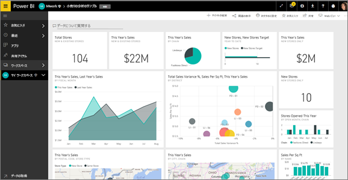
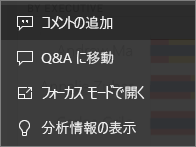
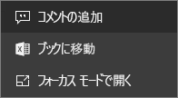
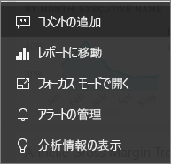

# Power BI のダッシュボードのタイル
タイルは、*デザイナー*によってダッシュボードにピン留めされた、データのスナップショットです。 タイルは、レポート、データセット、ダッシュボード、Q&A 質問ボックス、Excel、SQL Server Reporting Services (SSRS) などから作成できます。  次のスクリーンショットは、ダッシュボードにピン留めされているさまざまなタイルを示しています。

レポートからピン留めされたタイルに加え、*デザイナー*は **[タイルの追加]** を利用し、ダッシュボードに直接、スタンドアロンのタイルを追加できます。 スタンドアロン タイルには、テキスト ボックス、画像、ビデオ、ストリーミング データ、Web コンテンツが含まれます。

Power BI を構成する要素を理解するうえで助けが必要ですか?  「[Power BI - 基本的な概念](end-user-basic-concepts.md)」をご覧ください。

## ダッシュボードのタイルと対話する

1. タイルにマウス カーソルを置き、省略記号を表示します。
   
    
2. 省略記号を選んで、タイルの操作メニューを開きます。 利用できるオプションは、視覚化タイプやタイルの作成方法によって異なります。 たとえば、次のような項目が表示されます。

    - Q&A を利用して作成されたタイル
   
        

    - ブックから作成されたタイル
   
        

    - レポートから作成されたタイル
   
        
   
    ここでは、次の操作を実行できます。
   
   * [このタイルの作成に使われたレポートを開く](end-user-reports.md)   
   
   * [タイルの作成に使用した Q&A 質問を開く ](end-user-reports.md)   
   

   * [このタイルの作成に使われたブックを開く](end-user-reports.md)   
    * [フォーカス モードでタイルを表示する](end-user-focus.md)   
     * [インサイトを実行する](end-user-insights.md) 
    * [コメントを追加し、ディスカッションを開始する ](end-user-comment.md) 

3. 操作メニューを閉じるには、キャンバスの空白領域を選びます。

### タイルの選択 (クリック)
タイルを選択したときに次に生じる動作は、タイルの作成方法、および[カスタム リンク](../service-dashboard-edit-tile.md)があるかどうかによって異なります。 カスタム リンクがある場合、タイルを選択するとそのリンクに移動します。 それ以外の場合、タイルを選択すると、そのタイルを作成するために使われたレポート、Excel Online ブック、オンプレミスの SSRS レポート、Q&A の質問に移動します。

> [!NOTE]
> 例外は、**[タイルを追加]** を使ってダッシュボードに直接作成したビデオ タイルの場合です。 (この方法で作成された) ビデオ タイルを選択すると、ダッシュボード上で直接ビデオが再生されます。   
> 
> 

## 考慮事項とトラブルシューティング
* 視覚エフェクトの作成に使われたレポートが保存されなかった場合は、タイルを選択してもアクションは発生しません。
* Excel Online のブックから作成されたタイルの場合、そのブックに対して少なくとも読み取りのアクセス許可がないと、タイルを選択したときにブックが Excel Online で開かれません。
* **[タイルの追加]** を使ってダッシュボード上に直接作成されたタイルについては、カスタム ハイパーリンクが設定されている場合は、タイトル、サブタイトル、またはタイルを選択したときにその URL が開かれます。  それ以外の場合、既定では、イメージ、Web コード、またはテキスト ボックスのためにダッシュボード上に直接作成されたこれらのタイルのいずれかを選択しても、アクションは実行されません。
* SSRS 内のレポートに対する権限がない場合、SSRS から作成されたタイルを選択すると、アクセス権がないことを示すページが生成されます (rsAccessDenied)。
* SSRS サーバーが置かれたネットワークへのアクセス権がない場合、SSRS から作成されたタイルを選択すると、サーバーが見つからないことを示すページが生成されます (HTTP 404)。 レポートを表示するには、デバイスにレポート サーバーへのネットワーク アクセスが必要です。
* タイルの作成に使った元の視覚エフェクトが変更された場合、タイルは変更されません。  たとえば、*デザイナー*がレポートからの折れ線グラフをピン留めし、折れ線グラフを横棒グラフに変更した場合でも、ダッシュボード タイルは引き続き折れ線グラフを表示します。 データは更新されますが、視覚化の種類は変更されません。

## 次の手順
[データ更新](../refresh-data.md)

[Power BI - 基本的な概念](end-user-basic-concepts.md)
