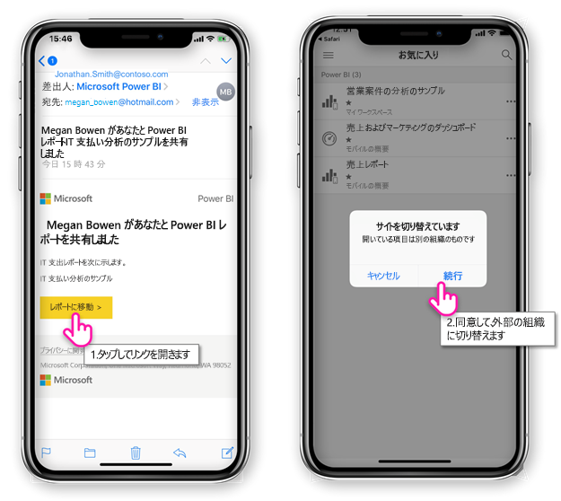
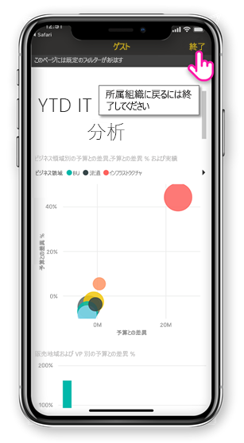
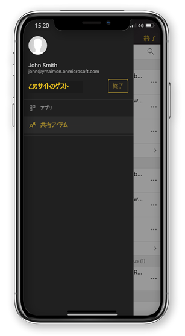

# 共有した外部組織から Power BI コンテンツの表示

Power BI は、Azure Active Directory の企業、組織外のゲスト ユーザーに Power BI コンテンツのセキュリティで保護された配布を許可する (Azure AD B2B) と統合します。 外部ゲスト ユーザーは、Power BI モバイル アプリを使用するユーザーと共有された Power BI コンテンツにアクセスすることができます。 

適用対象:

|  |  |  |  |
|:--- |:--- |:--- |:--- |
| iPhone |iPad |Android フォン |Android タブレット |

## 共有コンテンツにアクセスします。

**最初に、ユーザーと項目を共有する外部組織からが必要です。** ときにだれかが[項目と共有する](../../service-share-dashboards.md)、共有項目へのリンクを電子メールを受信した同じ組織または外部組織から、します。 モバイル デバイスでそのリンクに従うには、Power BI モバイル アプリが表示されます。 項目は、外部組織から共有されたアプリが認識している場合、アプリは、id を持つ組織に再接続します。 アプリは、その組織から共有されているすべての項目を読み込みます。

> [!NOTE]
> 最初の項目が外部ゲスト ユーザーと共有した場合は、ブラウザーで招待を要求する必要があります。 Power BI アプリで招待を要求できないことができます。

外部の組織に接続している限り、アプリに黒のヘッダーが表示されます。 このヘッダーは、ホーム組織に接続されていないことを示します。 ホーム組織に接続するには、ゲストのモードを終了します。

場合でも、アプリのスイッチと外部の組織への接続に Power BI 成果物のリンクがある必要があります (だけでなく、電子メールから開いた項目) を共有するすべての項目にアクセスできます。 外部の組織でアクセスできるすべてのアイテムを表示するアプリのメニューに移動し、選択**自分と共有**します。 **アプリ**も使用できるアプリを検索します。

## 制限事項

- Azure AD B2B では Power BI モバイルで、条件付きアクセスおよびその他の Intune ポリシーはサポートされません。 つまり、存在する場合、アプリによって、ホーム組織のポリシーのみに適用されます。
- ホーム組織のサイトのみからプッシュ通知を受信する (いる場合でも、ユーザーは、外部の組織のゲストとして)。 通知を開くと、アプリ ユーザーのホーム組織のサイトに再接続します。
- 場合は、ユーザーが、アプリを終了時に再度開くアプリがユーザーのホーム組織を自動的に接続します。
- 外部の組織に接続しているときにいくつかの操作は無効になります: お気に入り項目、データ警告は、コメントを記述して、共有します。
- オフライン データは、外部の組織に接続されているご利用いただけません。
- デバイスにインストールされているポータル サイト アプリがある場合は、デバイスを登録する必要があります。
