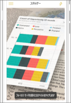
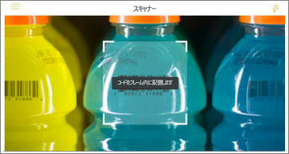

# Power BI モバイル アプリで現実世界からデータを取得する
Power BI モバイル アプリでは、現実世界を関連する BI 情報に直接接続することができます。それには複数の方法があります。 

## タイルの QR コード
ダッシュボードでタイル、またはレポートの QR コードを作成し、任意の場所にその QR コードを配置します。 同僚が iPhone、Android フォン、または Power BI for Mixed Reality アプリを使用してコードをスキャンした場合、その QR コードに関連付けられたタイルが表示されます。 iPhone の場合は、Augmented Reality にタイルが表示されます。

詳細情報:

* [Power BI でタイルの QR コードを作成する](../../service-create-qr-code-for-tile.md)
* [モバイル デバイスから Power BI QR コードをスキャンする](mobile-apps-qr-code.md)
* [Power BI for Mixed Reality アプリで QR コードをスキャンする](mobile-mixed-reality-app.md#scan-a-report-qr-code-in-holographic-view)。

## レポートの QR コード
レポートの QR コードを作成します。  同僚が iPhone を使用してコードをスキャンすると (Android フォンは近日対応予定)、その QR コードに関連付けられたレポートが表示されます。 

[Power BI でレポートの QR コードを作成する](../../service-create-qr-code-for-report.md)に関する詳細

## バーコード
あなたのレポート内のデータにタグ付けすることで、同僚は製品のバーコードをスキャンし、その製品についてフィルター処理された状態のそのレポートを直接参照できます。

詳細情報:

* [レポート内のバーコード データにタグ付けする](../../desktop-mobile-barcodes.md)
* [iPhone の Power BI アプリからバーコードをスキャンする](mobile-apps-scan-barcode-iphone.md)

## 場所によるフィルター処理
Power BI Desktop でレポート内の地理的なデータを分類します。 同僚が iOS 向け Power BI モバイル アプリでそのレポートを表示すると、Power BI は同僚がいる場所を照合する地理的なフィルターを自動的に適用します。

[場所によるフィルター処理](mobile-apps-geographic-filtering.md)に関する詳細。

## 次の手順
* [Power BI でタイルの QR コードを作成する](../../service-create-qr-code-for-tile.md)
* [Power BI でレポートの QR コードを作成する](../../service-create-qr-code-for-report.md)

