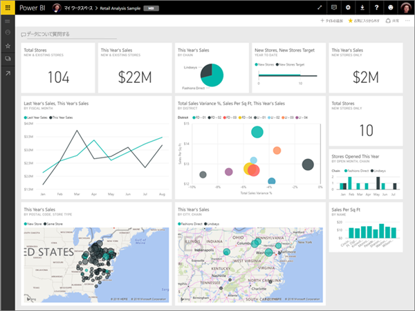
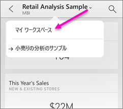
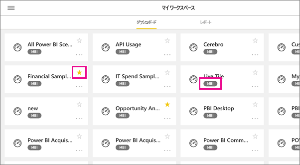
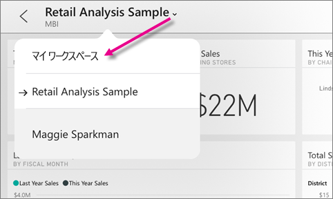
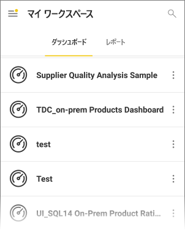
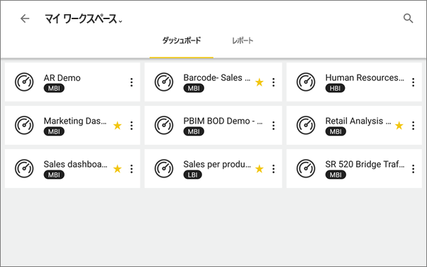
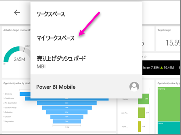
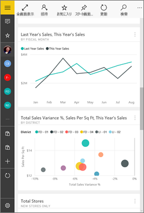
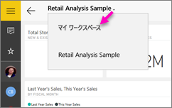
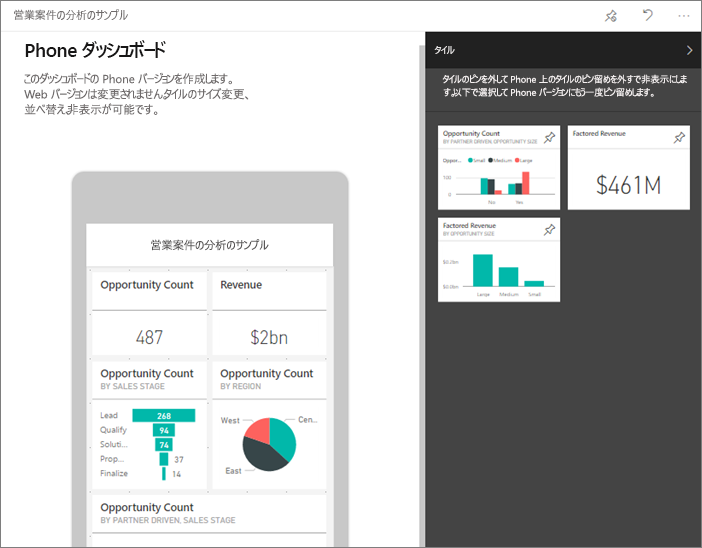

# Power BI モバイル アプリにおけるダッシュボードとレポートの表示
適用対象:

|  |  |  |  |  |
|:--- |:--- |:--- |:--- |:--- |
| [iPhone](mobile-apps-view-dashboard.md#view-dashboards-on-your-iphone) |[iPad](mobile-apps-view-dashboard.md#view-dashboards-on-your-ipad) |[Android フォン](mobile-apps-view-dashboard.md#view-dashboards-on-your-android-phone) |[Android タブレット](mobile-apps-view-dashboard.md#view-dashboards-on-your-android-tablet) |[Windows 10 デバイス](mobile-apps-view-dashboard.md#view-dashboards-on-your-windows-10-device) |

ダッシュボードは、会社のライフ サイクルとプロセスへの入口です。 ダッシュボードには、ビジネスの現在の状態を 1 つの場所から監視する概要が表示されます。

## Power BI サービス内でダッシュボードを作成する (https://powerbi.com)
**モバイル アプリでは、ダッシュボードを作成しません。** 

モバイル デバイスでダッシュボードとレポートを表示するには、Web ブラウザーでこれらを作成するか、これらに接続する必要があります。 

1. Power BI サービス ([https://www.powerbi.com](https://www.powerbi.com)) に移動し、[アカウントにサインアップします](../../service-self-service-signup-for-power-bi.md)。
2. [Microsoft Dynamics CRM](../../service-connect-to-microsoft-dynamics-crm.md) や [Adobe Analytics](../../service-connect-to-adobe-analytics.md) など、さまざまなサービス向けの [独自の Power BI ダッシュボードやレポートを作成](../../service-get-started.md)するか、既存の [Power BI アプリ](../../service-connect-to-services.md)に接続します。

ここで Power BI サービスでの Power BI ダッシュボードを示します。

## iPhone でダッシュボードを表示する
1. iPhone で Power BI アプリを開き、サインインします。
   
   Apple App Store から [iPhone アプリをダウンロードする](http://go.microsoft.com/fwlink/?LinkId=522062)必要がある場合は、
2. ダッシュボードをタップして開きます。  
   
    
   
   * 黄色の星  は、お気に入りのダッシュ ボードを表します。 
   * 各ダッシュボード名の下の表示 (この例では "MBI") は、各ダッシュボード内のデータを分類する方法を示しています。 詳細については、[Power BI でのデータの分類](../../service-data-classification.md)に関するページを参照してください。
   
   既定の Power BI ダッシュボードは、iPhone では少し異なる外観です。 すべてのタイルは同じサイズで表示され、上から下に 1 つずつ配置されます。
   
    
   
   > [!TIP]
   > ダッシュボードの所有者である場合は、Power BI サービスで、縦モードの[スマートフォン独自のダッシュボード ビューを作成](../../service-create-dashboard-mobile-phone-view.md)できます。 
   > 
   > 
   
    または、電話を横向きに変えるだけで、電話のダッシュボードは横モードで表示されます。
   
    
3. ダッシュボードのすべてのタイルを参照するには、上下にスワイプします。 次の操作を実行できます。
   
   * [タイルをタップ](mobile-tiles-in-the-mobile-apps.md)してフォーカス モードで開き、操作します。
   * 星  をタップして[お気に入りに追加](mobile-apps-favorites.md)します。
   * 自分のダッシュボードを見てもらえるよう、 **[招待]** ![[招待] アイコン](./media/mobile-apps-view-dashboard/pbi_ipad_shareiconblk.png) をタップして[仕事仲間を招待](mobile-share-dashboard-from-the-mobile-apps.md)します。
   * [ダッシュ ボードを Apple Watch と同期させる](mobile-apple-watch.md)
4. ダッシュボードの一覧に戻るには、ダッシュボードのタイトルの横にある矢印をタップし、 **[マイ ワークスペース]** をタップします。
   
   

### iPhone で横モードでダッシュボードを表示する
また、電話を横向きにするだけで、ダッシュボードを横モードで表示することができます。 ダッシュボードのレイアウトは、一連のタイルのビューから、ダッシュボード全体のビューに切り替わります。&#151;ダッシュボードのタイルは、Power BI サービスで表示されるのとまったく同じように表示されます。

"ピンチ" ジェスチャーを使ってダッシュボードのさまざまな領域をズームン/ズームアウトしたり、表示する領域を移動したりできます。 また、[タイルをタップ](mobile-tiles-in-the-mobile-apps.md)すれば、そのタイルがフォーカス モードで表示され、データを操作できるようになります。

## iPad でダッシュボードを表示する
1. Power BI アプリを開きます。
   
   必要なら、最初に Apple App Store から [iPad アプリをダウンロード](http://go.microsoft.com/fwlink/?LinkId=522062)します。
2. アプリの上部にある **[ダッシュ ボード]** をタップします。  
   
   
   
   * 黄色の星  は、お気に入りのダッシュ ボードを表します。 
   * 各ダッシュボード名の下の表示 (この例では "MBI") は、各ダッシュボード内のデータを分類する方法を示しています。 詳細については、[Power BI でのデータの分類](../../service-data-classification.md)に関するページを参照してください。
3. ワークスペースからダッシュ ボードを共有することができます。 ダッシュ ボード タイルの右下隅にある省略記号 ( **...** ) をタップし、 **[他の人を招待]** をタップします。
   
   ![[招待] アイコン](./media/mobile-apps-view-dashboard/power-bi-ipad-tile-invite-others.png)
4. ダッシュ ボードをタップして開き、そのダッシュ ボード内のタイルを表示することもできます。 ダッシュボードで、次の操作を実行できます。
   
   * [操作するタイルをタップ](mobile-tiles-in-the-mobile-apps.md)します。
   * タイルの背後にある[レポートを開く](mobile-reports-in-the-mobile-apps.md)。
   * [ダッシュボードを表示できるように他のユーザーを招待](mobile-share-dashboard-from-the-mobile-apps.md)します。
   * タイルの[スナップショットに注釈を付け、共有する](mobile-annotate-and-share-a-tile-from-the-mobile-apps.md)。
5. [マイ ワークスペース] に戻るには、左上隅のダッシュボードの名前をタップし、 **[マイ ワークスペース]** をタップします。
   
   

## Android フォンでダッシュボードを表示する
1. Android フォンで Power BI アプリを開き、サインインします。
   
   必要なら、最初に [Android アプリをダウンロード](http://go.microsoft.com/fwlink/?LinkID=544867)します。
2. ダッシュボードをタップして開きます。   
   
   

    黄色い星  は、お気に入りのダッシュ ボードを表します。 

    各ダッシュボード名の下の表示 (この例では "MBI") は、各ダッシュボード内のデータを分類する方法を示しています。 詳細については、[Power BI でのデータの分類](../../service-data-classification.md)に関するページを参照してください。

    Power BI ダッシュボードは、Android フォンでは少し異なる外観です。 すべてのタイルは同じ幅で表示され、上から下に 1 つずつ配置されます。

    

    ダッシュボードの所有者である場合は、Power BI サービスで、縦モードの[スマートフォン独自のダッシュボード ビューを作成](../../service-create-dashboard-mobile-phone-view.md)できます。 

1. ダッシュボードでは、名前の隣にある垂直線の省略記号 (...) をタップして仕事仲間の招待、更新、またはダッシュボードに関する情報を取得できます。
   
   
2. [ダッシュボードのタイル](mobile-tiles-in-the-mobile-apps.md)をすべて参照するには、上下にスワイプします。 
3. ダッシュボードのホーム ページに戻って、ダッシュボードの名前をタップして階層リンクの軌跡を開き、 **[マイ ワークスペース]** をタップします。   

## Android タブレットでダッシュボードを表示する
1. Android タブレットで Power BI アプリを開き、サインインします。
   
   必要なら、最初に [Android アプリをダウンロード](http://go.microsoft.com/fwlink/?LinkID=544867)します。
2. ダッシュボードをタップして開きます。   
   
   
   
   * 黄色の星  は、お気に入りのダッシュ ボードを表します。 
   * 各ダッシュボード名の下の表示 (この例では "MBI") は、各ダッシュボード内のデータを分類する方法を示しています。 詳細については、[Power BI でのデータの分類](../../service-data-classification.md)に関するページを参照してください。
3. ダッシュボードでは、名前の隣にある垂直線の省略記号 (...) をタップして仕事仲間の招待、更新、またはダッシュボードに関する情報を取得できます。
   
   
4. [ダッシュボードのタイル](mobile-tiles-in-the-mobile-apps.md)をすべて参照するには、上下にスワイプします。 
   
   "ピンチ" ジェスチャーを使ってダッシュボードのさまざまな領域をズームン/ズームアウトしたり、表示する領域を移動したりできます。 また、[タイルをタップ](mobile-tiles-in-the-mobile-apps.md)すれば、そのタイルがフォーカス モードで表示され、データを操作できるようになります。
5. ダッシュボードのホーム ページに戻って、ダッシュボードの名前をタップして階層リンクの軌跡を開き、 **[マイ ワークスペース]** をタップします。
   
    

    "ピンチ" ジェスチャーを使ってダッシュボードのさまざまな領域をズームン/ズームアウトしたり、表示する領域を移動したりできます。 また、[タイルをタップ](mobile-tiles-in-the-mobile-apps.md)すれば、そのタイルがフォーカス モードで表示され、データを操作できるようになります。

## Windows 10 デバイスでダッシュボードを表示する
1. Windows 10 デバイスで Power BI アプリを開き、サインインします。
   
   必要なら、最初に[アプリをダウンロード](http://go.microsoft.com/fwlink/?LinkID=526478)します。
2. ダッシュボードをタップして開きます。   
   
   
   
   * 黒い星は、お気に入りのダッシュ ボードを表します。 
   * 各ダッシュボード名の下の表示 (この例では **MBI**) は、各ダッシュボード内のデータを分類する方法を示しています。 詳細については、[Power BI でのデータの分類](../../service-data-classification.md)に関するページを参照してください。
   
   Power BI ダッシュボードは、Windows 10 Phone では外観がいくらか異なります。 すべてのタイルは同じ幅で表示され、上から下に 1 つずつ配置されます。
   
   
   
    また、電話を横向きに変えることで、電話のダッシュボードを横モードで表示することができます。
   
   > [!TIP]
   > ダッシュボードの所有者である場合は、Power BI サービスで、縦モードの[スマートフォン独自のダッシュボード ビューを作成](../../service-create-dashboard-mobile-phone-view.md)できます。 
   > 
   > 
3. ダッシュボードで、次の操作を実行できます。
   
   * [タイルをタップ](mobile-tiles-in-the-mobile-apps.md)して開き、操作します。
   * **[全画面表示]** アイコン ![[全画面表示] アイコン](./media/mobile-apps-view-dashboard/power-bi-windows-10-full-screen-icon.png) をタップすると、PowerPoint の**スライド ショー** ビューのように、境界またはメニューなしで Power BI ダッシュボードが表示されます。
   * **[招待]** アイコン ![[招待] アイコン](./media/mobile-apps-view-dashboard/pbi_andr_inviteicon.png) をタップして、仕事仲間と[ダッシュボードを共有](mobile-share-dashboard-from-the-mobile-apps.md)します。
   * 星  をタップして、[ダッシュボードをお気に入りとして設定](mobile-apps-favorites.md)します。
   * **[スタート画面にピン留め]** アイコンをタップし、[Windows のスタート画面にダッシュボードをピン留めします](mobile-pin-dashboard-start-screen-windows-10-phone-app.md)。 
4. ダッシュボードのホーム ページに戻って、ダッシュボードの名前をタップして階層リンクの軌跡を開き、 **[マイ ワークスペース]** をタップします。
   
    

### Windows 10 Phone で横モードでダッシュボードを表示する
携帯電話の向きを変えるだけで、ダッシュボードを横モードで表示することもできます。 ダッシュボードのレイアウトは、一連のタイルのビューから、ダッシュボード全体のビューに切り替わります。ダッシュボードのすべてのタイルは、Power BI サービスで表示されるのと同じレイアウトで表示されます。

"ピンチ" ジェスチャーを使ってダッシュボードのさまざまな領域をズームン/ズームアウトしたり、表示する領域を移動したりできます。 また、[タイルをタップ](mobile-tiles-in-the-mobile-apps.md)すれば、そのタイルがフォーカス モードで表示され、データを操作できるようになります。

## Power BI サービスでダッシュボードの Phone ビューを作成する
ダッシュボードの所有者である場合は、*Power BI サービスで*、スマートフォン独自の縦モードのダッシュボード ビューを作成できます。 

ダッシュボードの Phone ビューの作成の詳細については、[こちら](../../service-create-dashboard-mobile-phone-view.md)を参照してください。

## 次の手順
* Google プレイから [Android アプリをダウンロードする](http://go.microsoft.com/fwlink/?LinkID=544867)  
* [Power BI 用 Android アプリの概要](mobile-android-app-get-started.md)  
* [Power BI とは?](../../power-bi-overview.md)
* わからないことがある場合は、 [Power BI コミュニティで質問してみてください](http://community.powerbi.com/)。

