# <a name="using-oauth-to-connect-to-power-bi-report-server-and-ssrs"></a>OAuth を使用し、Power BI Report Server と SSRS に接続する

Power BI Report Server と SQL Server Reporting Services 2016 以降に接続する目的で、Power BI モバイル アプリで OAuth 認証をサポートするように環境を構成する方法について説明します。

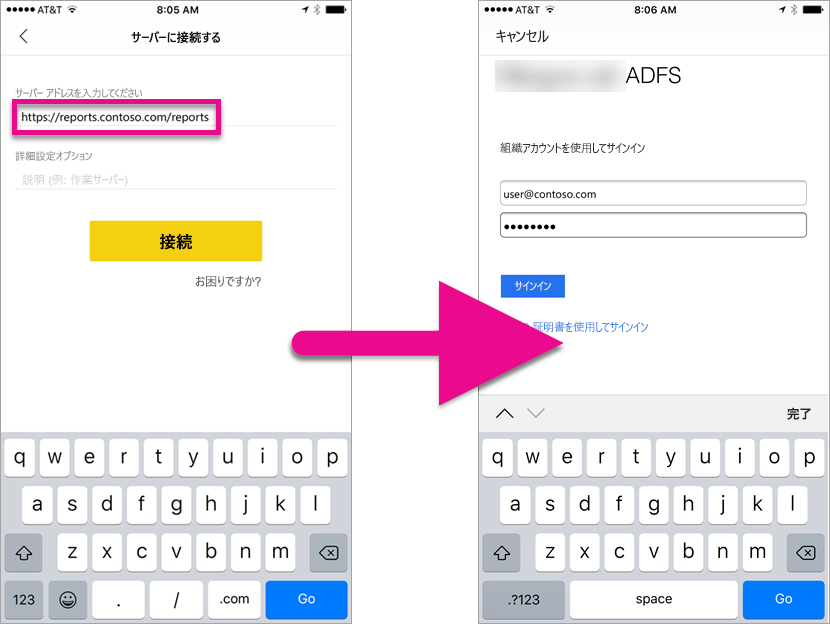

OAuth を使用して Power BI Report Server と Reporting Services に接続し、モバイル レポートまたは KPI を表示できます。 Windows Server 2016 では、この種の認証を許可するように、Web アプリケーション プロキシ (WAP) の役割が機能強化されています。

   > [!NOTE]
   > 認証のために WAP を使用して Power BI Report Server でホストされている Power BI レポートを表示することは、現時点ではサポートされていません。

## <a name="requirements"></a>要件

Web アプリケーション プロキシ (WAP) および Active Directory フェデレーション サービス (ADFS) サーバーには、Windows Server 2016 が必要です。 Windows 2016 の機能レベル ドメインは必要ありません。

## <a name="domain-name-services-dns-configuration"></a>ドメイン ネーム サービス (DNS) の構成

Power BI モバイル アプリが接続するパブリック URL を決定する必要があります。 次に例を示します。

```https
https://reports.contoso.com
```

**reports** の DNS レコードでは、Web アプリケーション プロキシ (WAP) サーバーのパブリック IP アドレスを指し示す必要があります。 また、ADFS サーバーのパブリック DNS レコードを構成する必要もあります。 たとえば、次の URL で ADFS サーバーを構成してあるものとします。

```https
https://fs.contoso.com
```

**fs** の DNS レコードでは、Web アプリケーション プロキシ (WAP) サーバーのパブリック IP アドレスを指し示す必要があります。この IP アドレスは、WAP アプリケーションの一部として発行されます。

## <a name="certificates"></a>証明書

WAP アプリケーションと ADFS サーバー両方の証明書を構成する必要があります。 これらの証明書はどちらも、モバイル デバイスが認識する有効な証明機関に含まれる必要があります。

## <a name="reporting-services-configuration"></a>Reporting Services の構成

Reporting Services についての構成はあまりありません。 適切な Kerberos 認証を実行できる有効なサービス プリンシパル名 (SPN) があること、および Reporting Services サーバーがネゴシエート認証に対して有効であることだけを、確認する必要があります。

### <a name="service-principal-name-spn"></a>サービス プリンシパル名 (SPN)

SPN は、Kerberos 認証を使うサービスの一意の識別子です。 レポート サーバーに対して適切な HTTP SPN があることを確認する必要があります。

レポート サーバーの適切なサービス プリンシパル名 (SPN) の構成方法については、「[レポート サーバーのサービス プリンシパル名 (SPN) の登録](https://msdn.microsoft.com/library/cc281382.aspx)」をご覧ください。

### <a name="enabling-negotiate-authentication"></a>ネゴシエート認証を有効にする

レポート サーバーが Kerberos 認証を使用できるようにするには、レポート サーバーの認証の種類を RSWindowsNegotiate として構成する必要があります。 これは、rsreportserver.config ファイルで行います。

```xml
<AuthenticationTypes>  
    <RSWindowsNegotiate />  
    <RSWindowsKerberos />  
    <RSWindowsNTLM />  
</AuthenticationTypes>
```

詳しくは、「[Modify a Reporting Services Configuration File](https://msdn.microsoft.com/library/bb630448.aspx)」 (Reporting Services 構成ファイルを変更する) および「[レポート サーバーで Windows 認証を構成する](https://msdn.microsoft.com/library/cc281253.aspx)」をご覧ください。

## <a name="active-directory-federation-services-adfs-configuration"></a>Active Directory フェデレーション サービス (ADFS) の構成

環境内の Windows 2016 サーバーで ADFS を構成する必要があります。 これを構成するには、サーバー マネージャーで [管理]、[役割と機能の追加] の順に選択します。 詳しくは、「[Active Directoryフェデレーション サービス](https://technet.microsoft.com/windows-server-docs/identity/active-directory-federation-services)」をご覧ください。

### <a name="create-an-application-group"></a>アプリケーション グループを作成する

AD FS 管理画面内で、Power BI モバイル アプリの情報を含む Reporting Services のアプリケーション グループを作成します。

次の手順でアプリケーション グループを作成できます。

1. AD FS 管理アプリで、**[アプリケーション グループ]** を右クリックし、**[アプリケーション グループの追加...]** を選びます。

   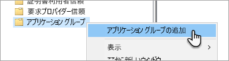

2. アプリケーション グループの追加ウィザードで、アプリケーション グループの**名前**を指定し、**Web API にアクセスするネイティブ アプリケーション**を選びます。

   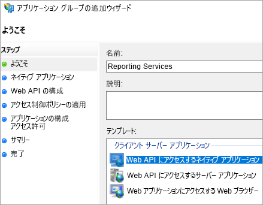

3. **[次へ]** を選びます。

4. 追加するアプリケーションの**名前**を指定します。 

5. **クライアント ID** が自動生成されるときに、iOS と Android の両方について「*484d54fc-b481-4eee-9505-0258a1913020*」と入力します。

6. 次の**リダイレクト URL** を追加します。

   **Power BI モバイルのエントリ – iOS:**  
   msauth://code/mspbi-adal://com.microsoft.powerbimobile  
   msauth://code/mspbi-adalms://com.microsoft.powerbimobilems  
   mspbi-adal://com.microsoft.powerbimobile  
   mspbi-adalms://com.microsoft.powerbimobilems

   **Android アプリに必要なのは次のものだけです。**  
   urn:ietf:wg:oauth:2.0:oob

   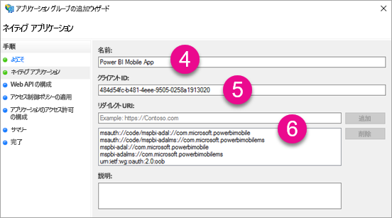
7. **[次へ]** を選びます。

8. レポート サーバーの URL を指定します。 これは、Web アプリケーション プロキシにアクセスする外部 URL です。 次の形式でなければなりません。

   > [!NOTE]
   > この URL は、大文字と小文字が区別されます。

   *https://<url to report server>/reports*

   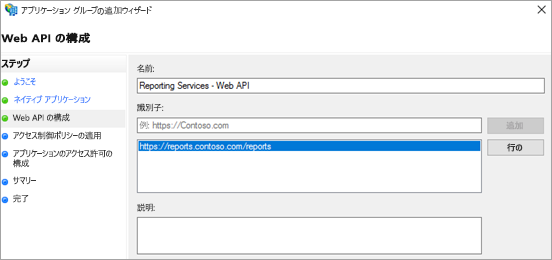
9. **[次へ]** を選びます。

10. 組織のニーズに合った **[アクセス制御ポリシー]** を選びます。

    

11. **[次へ]** を選びます。

12. **[次へ]** を選びます。

13. **[次へ]** を選びます。

14. **[閉じる]** を選びます。

完了すると、次のようなアプリケーション グループのプロパティが表示されます。

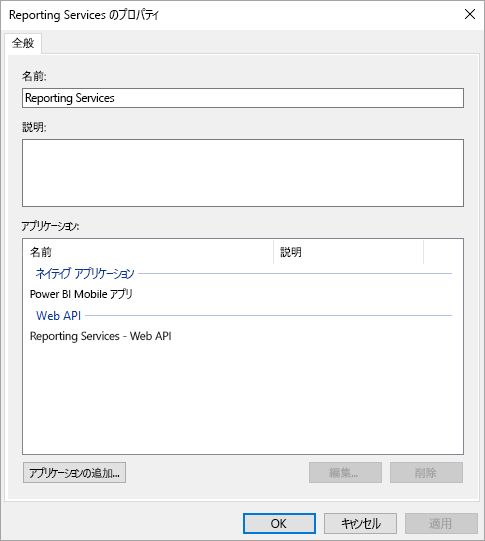

## <a name="web-application-proxy-wap-configuration"></a>Web アプリケーション プロキシ (WAP) の構成

環境内のサーバーで、Web アプリケーション プロキシ (役割) の Windows の役割を有効にします。 Windows 2016 サーバー上でなければなりません。 詳しくは、「[Web Application Proxy in Windows Server 2016](https://technet.microsoft.com/windows-server-docs/identity/web-application-proxy/web-application-proxy-windows-server)」 (Windows Server 2016 での Web アプリケーション プロキシ) および「[Publishing Applications using AD FS Preauthentication](https://technet.microsoft.com/windows-server-docs/identity/web-application-proxy/publishing-applications-using-ad-fs-preauthentication#a-namebkmk14apublish-an-application-that-uses-oauth2-such-as-a-windows-store-app)」 (AD FS の事前認証を使用したアプリケーションの公開) をご覧ください。

### <a name="constrained-delegation-configuration"></a>制約付き委任の構成

OAuth 認証から Windows 認証に切り替えるには、プロトコルの切り替えで制約付き委任を使う必要があります。 これは、Kerberos の構成の一部です。 Reporting Services の SPN は、Reporting Services の構成で既に定義してあります。

Active Directory 内の WAP サーバー コンピューター アカウントで制約付き委任を構成する必要があります。 Active Directory に対する権限を持っていない場合は、ドメイン管理者に頼む必要があります。

制約付き委任を構成するには次のようにします。

1. Active Directory ツールがインストールされているコンピューターで、**Active Directory ユーザーとコンピューター**を起動します。

2. WAP サーバーのコンピューター アカウントを検索します。 既定では、コンピューター コンテナー内にあります。

3. WAP サーバーを右クリックし、**[プロパティ]** に移動します。

4. **[委任]** タブを選びます。

5. **[指定されたサービスへの委任でのみこのコンピューターを信頼する]** と **[任意の認証プロトコルを使う]** をオンにします。

   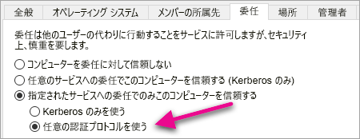

   これにより、この WAP サーバー コンピューター アカウントに制約付き委任が設定されます。 次に、このコンピューターが委任を許可されるサービスを指定する必要があります。

6. サービス ボックスで、**[追加...]** を 選びます。

   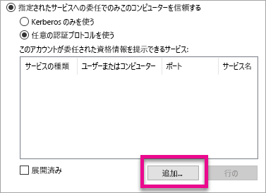

7. **[ユーザーまたはコンピューター]** を選びます。

8. Reporting Services に使っているサービス アカウントを入力します。 これは、Reporting Services の構成で SPN を追加したアカウントです。

9. Reporting Services の SPN を選び、**[OK]** を選びます。

   > [!NOTE]
   > NetBIOS の SPN だけが表示される場合があります。 NetBIOS と FQDN の両方の SPN が存在する場合は、実際に両方が選択されます。

   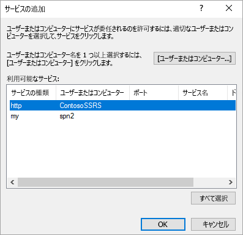

10. **[展開済み]** チェック ボックスがオンになっていると、結果は次のようになります。

    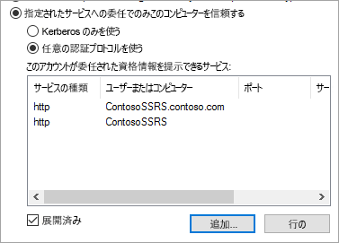

11. **[OK]** を選択します。

### <a name="add-wap-application"></a>WAP アプリケーションを追加する

レポート アクセス管理コンソールでアプリケーションを発行できますが、ここでは PowerShell でアプリケーションを作成します。 アプリケーションを追加するコマンドは次のとおりです。

```powershell
Add-WebApplicationProxyApplication -Name "Contoso Reports" -ExternalPreauthentication ADFS -ExternalUrl https://reports.contoso.com/reports/ -ExternalCertificateThumbprint "0ff79c75a725e6f67e3e2db55bdb103efc9acb12" -BackendServerUrl http://ContosoSSRS/reports/ -ADFSRelyingPartyName "Reporting Services - Web API" -BackendServerAuthenticationSPN "http/ContosoSSRS.contoso.com" -UseOAuthAuthentication
```

| パラメーター | コメント |
| --- | --- |
| **ADFSRelyingPartyName** |これは、ADFS 内のアプリケーション グループの一部として作成した Web API の名前です。 |
| **ExternalCertificateThumbprint** |これは、外部ユーザーに使う証明書です。 この証明書がモバイル デバイスで有効であり、信頼された証明機関から発行されていることが重要です。 |
| **BackendServerUrl** |これは、WAP サーバーからレポート サーバーへの URL です。 WAP サーバーが DMZ 内にある場合は、完全修飾ドメイン名を使うことが必要な場合があります。 WAP サーバー上の Web ブラウザーからこの URL にアクセスできることを確認します。 |
| **BackendServerAuthenticationSPN** |これは、Reporting Services の構成の一部として作成した SPN です。 |

### <a name="setting-integrated-authentication-for-the-wap-application"></a>WAP アプリケーションの統合認証の設定

WAP アプリケーションを追加した後は、IntegratedWindowsAuthentication を使うように BackendServerAuthenticationMode を設定する必要があります。 これを設定するには、WAP アプリケーションからの ID が必要です。

```powershell
Get-WebApplicationProxyApplication “Contoso Reports” | fl
```


次のコマンドを実行し、WAP アプリケーションの ID を使って BackendServerAuthenticationMode を設定します。

```powershell
Set-WebApplicationProxyApplication -id 30198C7F-DDE4-0D82-E654-D369A47B1EE5 -BackendServerAuthenticationMode IntegratedWindowsAuthentication
```


## <a name="connecting-with-the-power-bi-mobile-app"></a>Power BI モバイル アプリとの接続

Power BI モバイル アプリ内で、Reporting Services インスタンスに接続します。 そのためには、WAP アプリケーションの**外部 URL** を指定します。

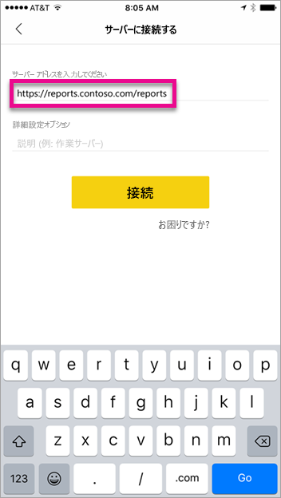

**[接続]** を選ぶと、ADFS ログイン ページに移動します。 ドメインの有効な資格情報を入力します。

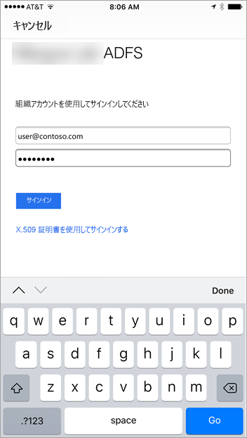

**[サインイン]** を選ぶと、Reporting Services サーバーからの要素が表示されます。


## <a name="multi-factor-authentication"></a>多要素認証

多要素認証を有効にして、環境のセキュリティを強化できます。 詳しくは、「[Configure AD FS 2016 and Azure MFA](https://technet.microsoft.com/windows-server-docs/identity/ad-fs/operations/configure-ad-fs-2016-and-azure-mfa)」 (AD FS 2016 と Azure MFA を構成する) をご覧ください。

## <a name="troubleshooting"></a>トラブルシューティング

### <a name="you-receive-the-error-failed-to-login-to-ssrs-server-please-verify-server-configuration"></a>SSRS サーバーにログインできませんでした。 サーバー構成を確認してください。

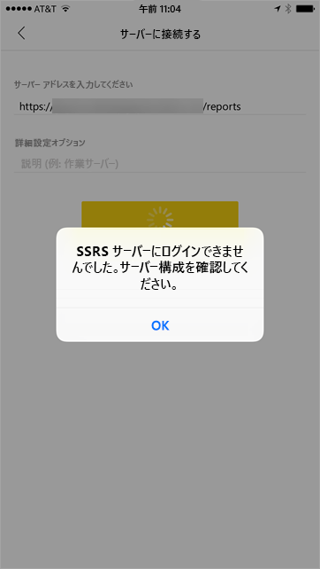

モバイル デバイスのプロキシとして動作するように [Fiddler](http://www.telerik.com/fiddler) を設定し、要求がどこまで行われているかを確認できます。 デバイスの Fiddler プロキシを有効にするには、Fiddler を実行しているコンピューターで [iOS および Android 用の CertMaker](http://www.telerik.com/fiddler/add-ons) をセットアップする必要があります。 これは、Telerik for Fiddler からのアドインです。

Fiddler を使うとサインインが正常に行われる場合は、WAP アプリケーションまたは ADFS サーバーでの証明書の問題である可能性があります。 [Microsoft メッセージ アナライザー](https://www.microsoft.com/download/details.aspx?id=44226)などのツールを使って、証明書が有効かどうかを確認できます。

## <a name="next-steps"></a>次の手順

[レポート サーバーのサービス プリンシパル名 (SPN) の登録](https://msdn.microsoft.com/library/cc281382.aspx)  
[Reporting Services 構成ファイルを変更する](https://msdn.microsoft.com/library/bb630448.aspx)  
[レポート サーバーで Windows 認証を構成する](https://msdn.microsoft.com/library/cc281253.aspx)  
[Active Directoryフェデレーション サービス](https://technet.microsoft.com/windows-server-docs/identity/active-directory-federation-services)  
[Windows Server 2016 での Web アプリケーション プロキシ](https://technet.microsoft.com/windows-server-docs/identity/web-application-proxy/web-application-proxy-windows-server)  
[AD FS の事前認証を使用したアプリケーションの公開](https://technet.microsoft.com/windows-server-docs/identity/web-application-proxy/publishing-applications-using-ad-fs-preauthentication#a-namebkmk14apublish-an-application-that-uses-oauth2-such-as-a-windows-store-app)  
[AD FS 2016 と Azure MFA を構成する](https://technet.microsoft.com/windows-server-docs/identity/ad-fs/operations/configure-ad-fs-2016-and-azure-mfa)  
他にわからないことがある場合は、 [Power BI コミュニティを利用してください](http://community.powerbi.com/)。