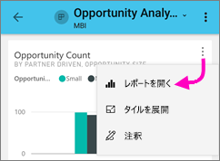

# Power BI モバイル アプリのレポートを調べる
適用対象:

|  |  |  |  |  |
|:--- |:--- |:--- |:--- |:--- |
| iPhone |iPad |Android フォン |Android タブレット |Windows 10 デバイス |

Power BI レポートは、データの対話型表示で、データから得られるさまざまな発見と洞察を表す視覚化が付いています。 Power BI モバイル アプリでは、3 段階のプロセスの 3 つ目の手順でレポートを表示できます。

1. [Power BI Desktop でレポートを作成します](../../desktop-report-view.md)。 Power BI Desktop で[スマートフォン用にレポートを最適化](mobile-apps-view-phone-report.md)することもできます。 
2. そのレポートを Power BI サービス [(https://powerbi.com)](https://powerbi.com) または [Power BI Report Server](../../report-server/get-started.md) に公開します。  
3. 次に、Power BI モバイル アプリでこれらのレポートを操作します。

## モバイル アプリで Power BI レポートを開く
Power BI レポートは、入手した場所に応じてモバイル アプリのそれぞれの場所に保存されます。 具体的には、アプリ、自分と共有、ワークスペース (マイ ワークスペースを含む)、またはレポート サーバーに保存されます。 関連するダッシュボードからレポートにアクセスしたり、一覧が表示されたりすることがあります。

リストと、メニュー、するアイコンが表示されます、レポート名の横にあるこのアイテムがレポートを理解するのに役立ちます。 

 

Power BI モバイル アプリでのレポートの 2 つのアイコンがあります。

* ![[レポート] アイコン](./media/mobile-reports-in-the-mobile-apps/report-default-icon.png) レポートをアプリで横方向に表示され、ブラウザーに表示されるとおり、同じ検索を示します。

*  持つ少なくとも 1 つの電話に最適化されたレポート ページは、縦向きで表示されるレポートを示します。 

注:ランドス ケープで電話を保持しているレポート ページに携帯電話レイアウトがある場合でも常に、ランドス ケープのレイアウトが表示されます。 

ダッシュ ボードからレポートを取得、タイルの右上隅で省略記号 (...) をタップします。 >**レポートを開く**します。
  
  
  
  タイルによっては、レポートでは開けないオプションもあります。 たとえば、Q&A ボックスに質問して作成するタイルをタップしてもレポートは開きません。 
  
## レポートと対話します。
アプリで開かれているレポートを作成したら、作業を開始できます。 レポートとそのデータで実行できる多くの点があります。 レポート フッター、レポートをタップと長いことができますも操作して、データのレポートに表示されるデータ タップを実行できるアクションが表示されます。

### 使用してをタップし、時間の長いタップ
タップ equals、マウスをクリックします。 ようにクロス データ ポイントに基づくレポートを強調表示する場合は、そのデータ ポイントをタップします。
スライサーの値をタップするは、その値を選択し、その値で、レポートの残りの部分をスライスします。 リンクをタップして、ボタンやブックマークはアクティブに作成者によって定義されているアクションに基づきます。

ビジュアルでタップすると、枠線が表示されることがわかるはずです。 上罫線の右上隅にある省略記号 (...) があります。タップしてそのビジュアルで実行できるアクションを含むメニューが表示されます。

### ツールヒントとドリル アクション

タップすると時間の長い (タップ アンド ホールド) データ ポイントでは、このデータ ポイントを表す値を表示するツールヒントが表示されます。 

レポート作成者は、データとレポートのページ間のリレーションシップで階層を定義できます。 階層は、ドリル、ドリル ダウンし、ビジュアルと値から別のレポート ページにドリルスルーします。 そのため、時間の長いだけでなく、ツール ヒントの値をタップすると、関連のドリル オプションは、フッターに表示されます。 

*ドリルスルー*では、ビジュアルの特定の部分をタップすると、タップした値にフィルター処理され、レポートの別のページに移動します。  レポートの作成者は、別のページに移動できる、1 つまたは複数のドリルスルー オプションを定義できます。 その場合は、どれをドリルスルーするかを選ぶことができます。 [戻る] ボタンに戻ることが、前のレポート ページです。

[Power BI Desktop でドリルスルーを追加する](../../desktop-drillthrough.md)方法をご確認ください。
   
   > [!IMPORTANT]
   > Power BI モバイル アプリでは、セル値のみを使用し、列と行のヘッダーではなくマトリックスとテーブルのビジュアルでドリルダウンが有効にします。
   
   
   
### レポートのフッター内のアクションを使用します。
レポート フッターは、現在のレポート ページとレポート全体の操作を行うことができますです。 フッターは、最も役に立つアクションにすばやくアクセスして、すべてのアクションは、省略記号 (...) からのアクセスであることができます。

フッターから実行できる操作は次のとおりです。
1) レポート フィルターをリセットし、その元の状態に強調表示の選択内容を通過します。
2) 表示または、このレポートにコメントを追加するメッセージ交換のウィンドウを開きます。
3) 表示およびレポートに現在適用されているフィルターを変更するには、フィルター ウィンドウを開きます。
4) このレポートのすべてのページの一覧を表示します。 ページ名をタップは読み込むし、そのページを表示します。
中央に、画面の左端からスワイプすると、レポート ページ間の移動を実行できます。
5) すべてのレポート アクションを表示します。

#### すべてのレポート アクション
をタップします.レポート フッターにオプションで、レポートに対して実行できるすべてのアクションが表示されます。 

一部の操作は、特定のレポート機能に依存しているため、無効可能性があります。
例:
1) **現在の場所でフィルター**レポート内のデータが地理的なデータを添えて作成者によってカテゴリ化される場合に有効です。 [レポートで地理的なデータを識別する方法について説明します](https://docs.microsoft.com/power-bi/desktop-mobile-geofiltering)します。
2) **レポートをバーコードでフィルター処理するためのスキャン**データセット、レポートには、バーコードとしてタグ付けされた場合にのみ有効です。 [Power BI Desktop でバーコードをタグ方法](https://docs.microsoft.com/power-bi/desktop-mobile-barcodes)します。 
3) **招待**このレポートを他のユーザーと共有するアクセス許可がある場合にのみ有効です。 レポートの所有者である場合にのみ、または所有者が共有アクセス許可が付与された場合は、アクセス許可があります。
4) **注釈付けおよび共有**無効にする場合がある場合があります、[保護ポリシーを Intune](https://docs.microsoft.com/intune/app-protection-policies) Power BI モバイル アプリから共有を禁止する組織内。 

## 次の手順
* [電話用に最適化された Power BI レポートの表示と対話](mobile-apps-view-phone-report.md)
* [電話用に最適化されたバージョンのレポートの作成](../../desktop-create-phone-report.md)
* わからないことがある場合は、 [Power BI コミュニティで質問してみてください](http://community.powerbi.com/)。

