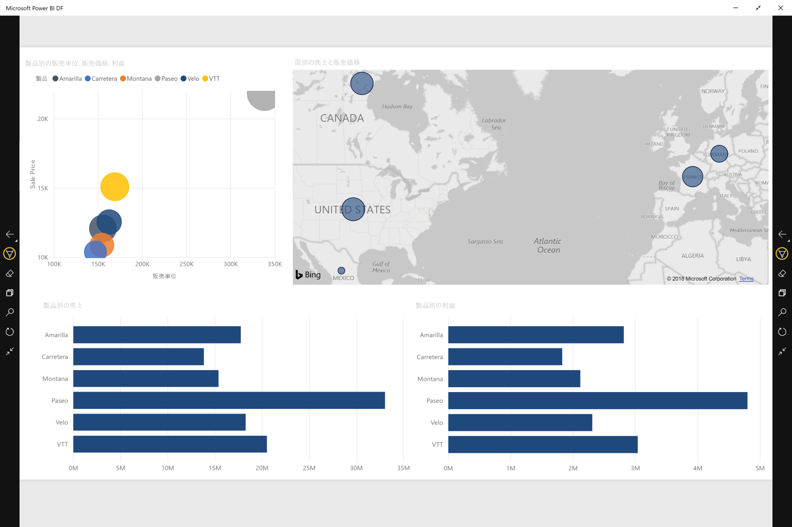
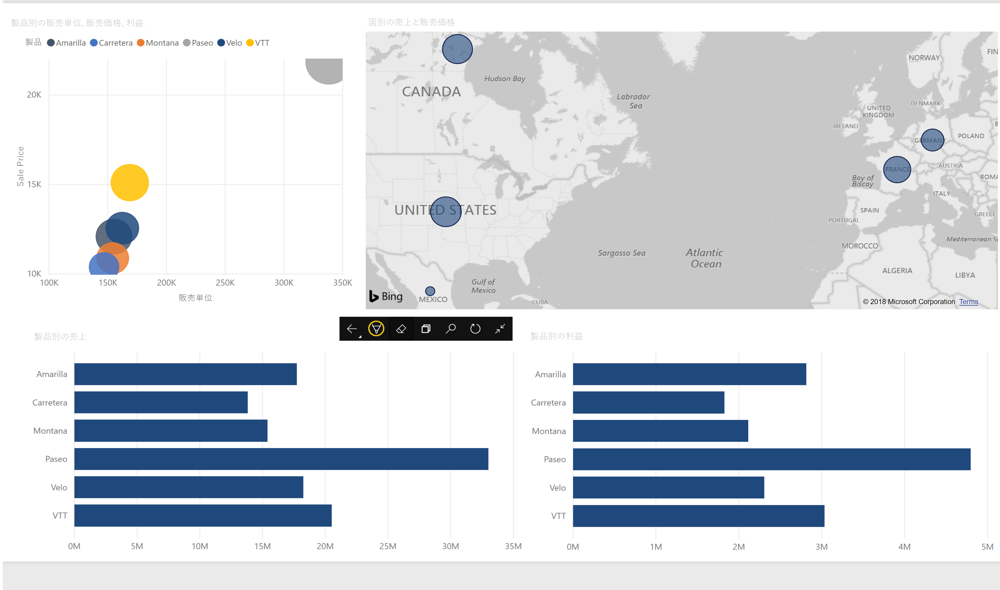

# Surface Hub と Windows 10 デバイスで、プレゼンテーション モードでレポートとダッシュボードを表示する
Windows 10 デバイスと Surface Hub で、プレゼンテーション モードを使用し、レポートとダッシュボードを全画面表示できます。 

プレゼンテーション モードは、会議やカンファレンス、またはオフィスの専用プロジェクターで Power BI を表示する場合やく、小さい画面上の領域を最大化する場合に役立ちます。 

Windows 10 向け Power BI モバイル アプリのプレゼンテーション モードでは、ナビゲーション バーやメニュー バーなど、すべての "chrome" が取り除かれ、チーム メンバーも含め、ユーザーはレポートのデータに集中できます。 アクションを含むツール バーが利用可能になり、プレゼンテーション モードで表示中、データをやりとりしたり、データで共同作業したりすることができます。

また、Web 上の [Power BI サービスから全画面表示モードでダッシュボードとレポートを表示](../end-user-focus.md)することもできます。

> [!NOTE]
> プレゼンテーション モードは、[タイルのフォーカス モード](mobile-tiles-in-the-mobile-apps.md)とは異なります。
> 
> 

## プレゼンテーション モードを使用する
Power BI モバイル アプリで **[全画面表示]** アイコンをタップすると、全画面表示モードに切り替わります。
![[全画面表示] アイコン](././media/mobile-windows-10-app-presentation-mode/power-bi-full-screen-icon.png) アプリの chrome が消え、画面の一番下か左右にツール バーが表示されます (表示場所はお使いの画面のサイズによって変わります)。

このツール バーから次の操作を実行できます。

1. [戻る] アイコンをタップすると、 ![[戻る] アイコン](./media/mobile-windows-10-app-presentation-mode/power-bi-windows-10-presentation-back-icon.png) 前のページに戻ります。 アイコンを長押しすると、階層リンク ウィンドウが表示されます。このウィンドウから、レポートまたはダッシュボードが含まれるフォルダーに移動できます。
2. [インク] アイコンをタップすると、 ![[インク] アイコン](./media/mobile-windows-10-app-presentation-mode/power-bi-windows-10-presentation-ink-icon.png) Surface ペンでレポート ページに線を引いたり、注釈を付けたりするときの色を選択できます。 
3. [ページ] アイコンを使用すると、 ![[改ページ] アイコン](./media/mobile-windows-10-app-presentation-mode/power-bi-windows-10-presentation-pages-icon.png) 現在表示しているレポート ページが別のページに代わります。
4. [検索] アイコン ![[検索] アイコン](./media/mobile-windows-10-app-presentation-mode/power-bi-windows-10-presentation-search-icon.png) をタップし、Power BI で他の成果物を検索します。
5. プレゼンテーション モードを終了するには、ツールバーにある内向きの 2 つの矢印の付いたアイコン  をタップします。

ツール バーを切り離し、画面上の任意の場所までドラッグし、そこに置くことができます。 これは大きな画面の場合に便利です。レポートの特定の領域に集中的に取り組むとき、その隣にツールを配置します。 ツール バーを指で触れ、レポート キャンバスまでスワイプします。

## 次の手順
* [Power BI サービスから全画面表示モードでダッシュボードとレポートを表示する](../end-user-focus.md)
* わからないことがある場合は、 [Power BI コミュニティで質問してみてください](http://community.powerbi.com/)。

