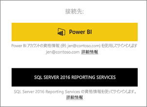
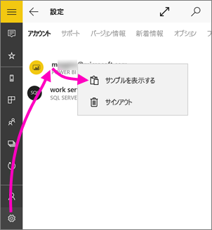
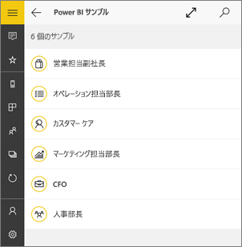
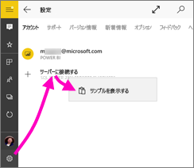
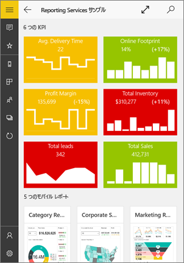
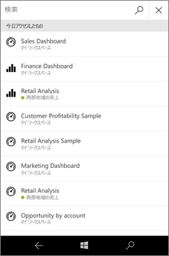
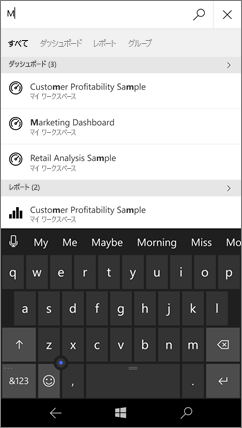
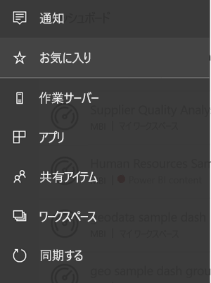
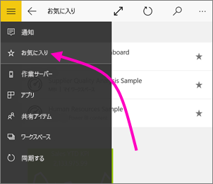
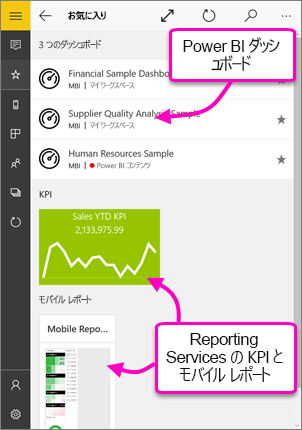

# Windows 10 用の Power BI モバイル アプリの概要
Windows 10 用 Power BI モバイル アプリを導入すると、タブレットやスマート フォンのタッチ対応画面で Power BI を使用でき、最新のビジネス情報に簡単にアクセスできるようになります。 どこにいても、[Windows のスタート画面](mobile-pin-dashboard-start-screen-windows-10-phone-app.md)から会社のダッシュボードを表示して操作できます。

自分のデータを使って、[Power BI サービスにダッシュボードやレポートを作成](../../service-get-started.md)します。 

次にダッシュボードおよびレポートを対話式に操作し、データを探索し、Windows 10 用 Power BI モバイル アプリですべてを共有します。

## 最初に行うこと
* Windows ストアから [**Windows 10 用の Power BI モバイル アプリ**](http://go.microsoft.com/fwlink/?LinkID=526478)を入手します。
  
  デバイスで Windows 10 を実行している必要があります。 このアプリは、最低 3 GB RAM と 8 GB の内部記憶域を持つデバイスで実行できます。
   
* 「[Power BI 用モバイル アプリの新機能](mobile-whats-new-in-the-mobile-apps.md)」をご覧ください。

## Web 上で Power BI サービスにサインアップする
まだサインアップしていない場合は、[Power BI サービス](http://powerbi.com/)に移動して自分のアカウントでサインアップしてください。そのアカウントで、ダッシュボードやレポートを作成および保存し、データをまとめます。 これで、Windows 10 デバイスから Power BI にサインインすれば、どこからでも自分のダッシュボードを表示できるようになります。

1. Power BI サービスで [[サインアップ]](http://go.microsoft.com/fwlink/?LinkID=513879) をタップし、Power BI アカウントを作成します。
2. [独自のダッシュボードとレポートの作成](../../service-get-started.md)を開始します。

## Power BI アプリの概要
1. Windows 10 デバイスのスタート画面から Power BI アプリを開きます。
   
   
2. Power BI ダッシュボードとレポートを表示するには、 **[Power BI]** をタップします。 Web 上の Power BI アカウントと同じ資格情報でサインインしてください。 
   
   Reporting Services のモバイル レポートと KPI を表示するには、**[SQL Server 2016 Reporting Services]** をタップします。 SQL Server Reporting Services の資格情報を使用してサインインします。
   
   
3. **[探索を開始]**  をタップして、自分のダッシュボードを表示します。

## Power BI と Reporting Services のサンプルをお試しください。
サインアップしなくても、Power BI と Reporting Services のサンプルを再生できます。 アプリをダウンロードした後、サンプルを表示するか、開始することができます。 ダッシュボード ホーム ページから、いつでも好きなときにサンプルに戻ることができます。

### Power BI サンプル
Power BI ダッシュボードのサンプルを表示し、使ってみることができますが、実行できない操作もいくつかあります。 ダッシュボードの背面でレポートを開く操作、サンプルを他のユーザーと共有する操作、またはサンプルをお気に入りに追加する操作はできません。

1. 左上隅にあるグローバル ナビゲーション ボタン  をタップします。
2. **[設定]** アイコン ![[設定] アイコン](./media/mobile-windows-10-phone-app-get-started/power-bi-win10-settings-icon.png) をタップし、名前をタップし、**[サンプルを表示]** をタップします。
   
   
3. ロールを選択して、そのロールのサンプル ダッシュボードを探索します。  
   
   

### Reporting Services のモバイル レポートのサンプル
1. 左上隅にあるグローバル ナビゲーション ボタン  をタップします。
2. **[設定]** アイコン  をタップし、**[サーバーに接続]** を右クリックするかタップして保持した後、**[サンプルを表示]** をタップします。
   
   
3. Retail Reports または Sales Reports フォルダーを開き、その KPI やモバイル レポートを調べます。
   
   

## ダッシュボード、レポート、アプリを検索する
常にアプリの上部にある検索ボックスに入力して、ダッシュ ボード、レポート、アプリをすばやく検索できます。

1. 右上隅にある検索アイコンをタップします。
   
   ![[検索] アイコン](./media/mobile-windows-10-phone-app-get-started/pbi_win10ph_searchbarbrdr.png)
   
   最近使用したダッシュボード、レポート、アプリが表示されます。
   
   
2. 入力を開始すると、関連するすべての結果が表示されます。
   
   

## Power BI モバイル アプリでコンテンツを見つける
ダッシュボードとレポートの Power BI モバイル アプリ内で保存されている場所はソースによって異なります。 モバイル アプリのコンテンツを見つける方法については[ここ](mobile-apps-quickstart-view-dashboard-report.md)をご覧ください。 また、Power BI モバイル アプリに置かれているものは常に何でも検索できます。 

## お気に入りのダッシュボード、KPI、レポートを表示する
お気に入りの Power BI ダッシュボードおよび Reporting Services KPI とモバイル レポートを、モバイル アプリの [お気に入り] ページに表示することができます。 Power BI モバイル アプリでダッシュボードを *お気に入り* にすると、ブラウザーの Power BI サービスを含むすべてのデバイスからアクセスできます。 

* **[お気に入り]** をタップします。
  
   
  
   Power BI のお気に入りおよび Reporting Services Web ポータルからのお気に入りがすべて、このページにあります。
  
   

[Power BI モバイル アプリでのお気に入り](mobile-apps-favorites.md)の詳細については、こちらをご覧ください。

## 次の手順
Windows 10 デバイス用 Power BI アプリ、Power BI のダッシュボードとレポート、Reporting Services Web ポータルの Reporting Services モバイル レポートと KPI では、他に次のことが可能です。

### Power BI のダッシュボードとレポート
* [アプリ](../../service-install-use-apps.md)を表示する。
* [ダッシュボード](mobile-apps-view-dashboard.md)を表示する。
* ライブ タイルとしてデバイスのスタート画面に [Power BI のタイルとダッシュボードをピン留め](mobile-pin-dashboard-start-screen-windows-10-phone-app.md)する。
* [タイルを共有する](mobile-windows-10-phone-app-get-started.md)。
* [ダッシュボード](mobile-share-dashboard-from-the-mobile-apps.md)を共有する。

### Reporting Services のモバイル レポートと KPI
* Windows 10 デバイス用 Power BI アプリで、[Reporting Services のモバイル レポートと KPI](mobile-app-windows-10-ssrs-kpis-mobile-reports.md) を表示する。
* [Reporting Services の Web ポータルで KPI を作成](https://msdn.microsoft.com/library/mt683632.aspx)する。
* [SQL Server Mobile Report Publisher でモバイル レポートを作成](https://msdn.microsoft.com/library/mt652547.aspx)し、Reporting Services の Web ポータルにそのレポートを公開する。

## 次の手順
* Windows ストアから [Power BI アプリ](http://go.microsoft.com/fwlink/?LinkID=526478)をダウンロードします。  
* [Power BI とは?](../../power-bi-overview.md)
* わからないことがある場合は、 [Power BI コミュニティで質問してみてください](http://community.powerbi.com/)。

