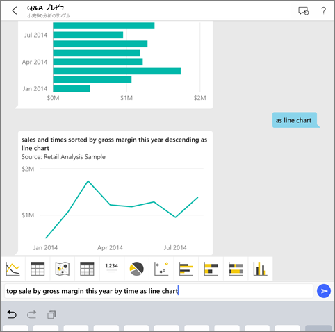
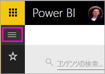
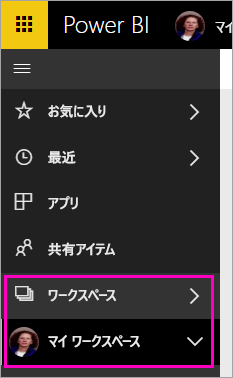
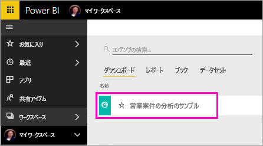
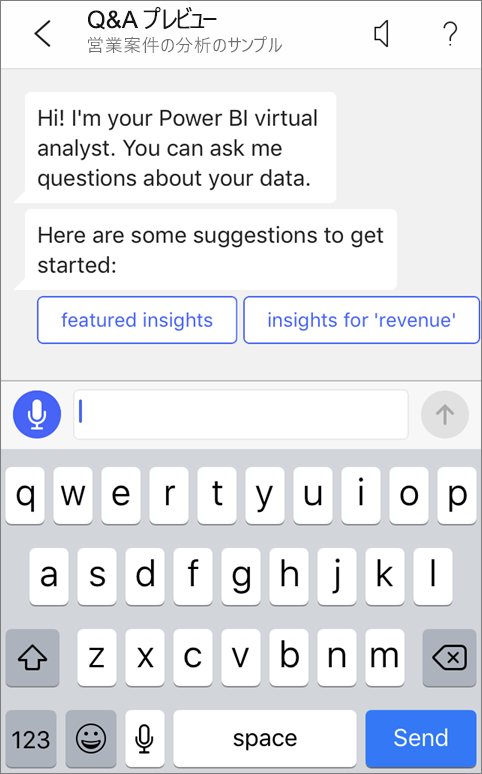
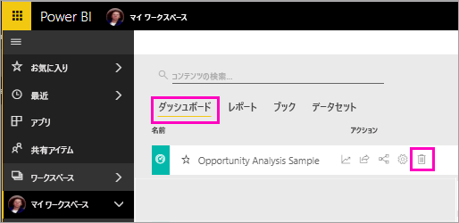

# チュートリアル:Power BI iOS アプリの Q&A 仮想アナリストでデータについて質問する

データについて学習する最も簡単な方法は、自分の言葉でデータについて質問することです。 このチュートリアルでは、iPad、iPhone、iPod Touch で Microsoft Power BI モバイル アプリの Q&A 仮想アナリストを使用して、サンプル データについて質問したり、おすすめの分析情報を見たりします。 

適用対象:

|  |  |
|:--- |:--- |
| iPhone |iPad |

Q&A 仮想アナリストは、Power BI サービスの基になる Q&A データにアクセスする対話型の BI エクスペリエンスです [(https://powerbi.com)](https://powerbi.com)。 それはデータの分析情報を示します。質問は、キー入力することも、音声入力することもできます。

このチュートリアルでは、次のことを行います。

> [!div class="checklist"]
> * iOS 用 Power BI モバイル アプリをインストールします
> * Power BI のサンプル ダッシュボードとレポートをダウンロードします
> * モバイル アプリがどのようなおすすめ分析情報を提案するかを見ます

Power BI にサインアップしていない場合は、[無料の試用版にサインアップ](https://app.powerbi.com/signupredirect?pbi_source=web)してください。

## 前提条件

### Power BI for iOS アプリをインストールする
Apple App Store から iPad、iPhone、または iPod Touch に [iOS アプリをダウンロード](http://go.microsoft.com/fwlink/?LinkId=522062 "iPhone アプリをダウンロード")します。

次のバージョンが Power BI for iOS アプリをサポートしています。
- iOS 10 以降の iPad。
- iOS 10 以降の iPhone 5 以上。 
- iOS 10 以降の iPod Touch。

### 営業案件の分析のサンプルをダウンロードする
チュートリアルの最初のステップでは、Power BI サービスの営業案件の分析サンプルをダウンロードします。

1. ブラウザーで Power BI サービスを開き (app.powerbi.com)、サインインします。

1. グローバル ナビゲーション アイコンを選んで左側のナビゲーションを開きます。

    

2. 左側のナビゲーション ウィンドウで、 **[ワークスペース]**  >  **[マイ ワークスペース]** を選びます。

    

3. 左下隅にある **[データを取得]** を選びます。
   
    

3. [データを取得] ページで、 **[サンプル]** アイコンを選びます。
   
   

4. **[営業案件の分析のサンプル]** を選びます。
 
    
 
8. **[接続]** を選択します。  
  
   
   
5. Power BI がサンプルをインポートし、新しいダッシュボード、レポート、データセットを [マイ ワークスペース] に追加します。
   
   

これで、iOS デバイスでサンプルを表示する準備ができました。

## おすすめのインサイトを試す
1. iPhone または iPad で Power BI アプリを開き、Power BI アカウントの資格情報 (ブラウザーの Power BI サービスで使ったものを同じです) を使ってサインインします。

1.  グローバル ナビゲーション ボタン  >  **[ワークスペース]**  >  **[マイ ワークスペース]** の順にタップし、営業案件の分析のサンプルのダッシュボードを開きます。

2. Q&A 仮想アナリスト アイコンをタップします。  をタップします。

     

     Power BI の Q&amp;A 仮想アナリストは、作業を開始するいくつかの候補を提供します。

     
3. **[featured insights]\(おすすめのインサイト\)** をタップします。

     Q&A 仮想アナリストがいくつかインサイトを提案します。
4. 右にスクロールして、 **[Insight 2]\(インサイト 2\)** をタップします。

    

     Q&A 仮想アナリストがインサイト 2 を表示します。

    
5. グラフをタップして、フォーカス モードで開きます。

    
6. 左上隅にある矢印をタップして、Q&A 仮想アナリスト エクスペリエンスに戻ります。

## リソースをクリーンアップする

チュートリアルが終わったら、営業案件の分析のサンプルのダッシュボード、レポート、データセットを削除してもかまいません。

1. Power BI サービス (app.powerbi.com) を開いてサインインします。

2. 左側のナビゲーション ウィンドウで、 **[ワークスペース]**  >  **[マイ ワークスペース]** を選びます。

3. **[ダッシュ ボード]** タブで、営業案件の分析のダッシュ ボードの横にあるゴミ箱の **[削除]** アイコンを選びます。

    

4. **[レポート]** タブを選び、営業案件の分析のレポートについても同じようにします。

5. **[データセット]** タブを選び、営業案件の分析のデータセットについても同じようにします。

## 次の手順

iOS 用 Power BI モバイル アプリで Q&A 仮想アナリストを試してみました。 Power BI サービスでの Q&A についてさらに学習してください。
> [!div class="nextstepaction"]
> [Power BI での Q&A](../end-user-q-and-a.md)

