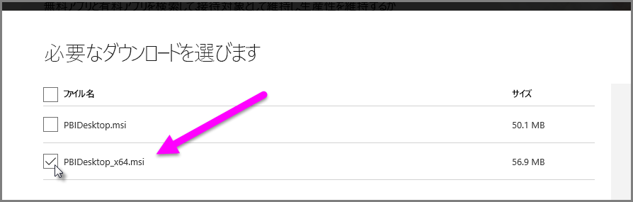

# Power BI Desktop での Access ファイルと .XLS ファイルのインポートに関する問題を解決する
**Power BI Desktop** では、**Access データベース**と初期バージョンの **Excel ブック** (Excel 97-2003 タイプの .XLS ファイル) の両方で *Access Database Engine* が使用されます。 Access データベース エンジンが正常に動作しない場合、一般的に、次の 3 つの状況が考えられます。

## 状況 1:Access Database Engine がインストールされていない
Power BI Desktop のエラー メッセージで Access Database Engine がインストールされていないことが判明した場合、お使いの Power BI Desktop バージョンに合わせ、32 ビット版か 64 ビット版の Access Database Engine をインストールする必要があります。 Access Database Engine は[ダウンロード ページ](http://www.microsoft.com/download/details.aspx?id=13255)からインストールできます。

>[!NOTE]
>インストールした Access Database Engine のビット版がお使いの Microsoft Office のビット版と異なる場合、Office アプリケーションで Access Database Engine を利用できません。

## 状況 2:Access Database Engine のビット版 (32 ビットまたは 64 ビット) がお使いの Power BI Desktop のビット版と異なる
この状況は、多くの場合、インストールした Microsoft Office のバージョンが 32 ビットで、Power BI Desktop のバージョンが 64 ビットのときに発生します。 また、反対の場合もあります。ビット版の不一致はいずれの場合にも発生します (Office 365 サブスクリプションを使っている場合は、「**状況 3**」で別の問題と解決策を参照してください)。 次のどの解決策でも、このビット版不一致エラーを解決できます。

1. お使いの Microsoft Office のビット版に合わせて Power BI Desktop のバージョンを変更します。 Power BI Desktop のビット版を変更するには、Power BI Desktop をアンインストールし、お使いの Office に一致するバージョンの Power BI Desktop をインストールします。 Power BI Desktop のバージョンを選択するには、デスクトップのダウンロード ページで、 **[ダウンロードの詳細オプション]** を選択します。
   
   
   
   [ダウンロード] ページが表示されたら、言語を選択し、 **[ダウンロード]** ボタンを選択します。 表示された画面で、32 ビット版の場合、PBIDesktop.msi の隣にあるチェックボックスを選択し、64 ビット版の場合、PBIDesktop_x64.msi の隣にあるチェックボックスを選択します。 次の画面で、64 ビット版が選択されます。
   
   
   
   >[!NOTE]
   >32 ビット版の Power BI Desktop を使用する場合、非常に大きなデータ モデルを作成すると、メモリ不足の問題が発生する可能性があります。
2. お使いの Power BI Desktop のビット版に合わせて Microsoft Office のバージョンを変更します。 Microsoft Office のビット版を変更するには、Office をアンインストールし、お使いの Power BI Desktop に一致するバージョンの Office をインストールします。
3. .XLS ファイル (Excel 97-2003 ワークブック) を開こうとしてエラーが発生した場合、Excel で .XLS ファイルを開き、XLSX ファイルとして保存することで Access Database Engine の使用を回避できます。
4. 以上の 3 つの解決策が実施できない場合、両方のバージョンの Access Database Engine をインストールできますが、それは推奨される回避策では *ありません* 。 両方のバージョンをインストールことで、Power Query for Excel と Power BI Desktop のこの問題が解消されますが、先にインストールされたビット版の Access Database Engine がアプリケーションで (既定で) 自動的に使用される場合、エラーや問題が発生します。 両方のビット版の Access Database Engine をインストールするには、両方のバージョンを[ダウンロード](http://www.microsoft.com/download/details.aspx?id=13255)し、各バージョンを */passive* スイッチで実行します。 例:
   
       c:\users\joe\downloads\AccessDatabaseEngine.exe /passive
   
       c:\users\joe\downloads\AccessDatabaseEngine_x64.exe /passive

## 状況 3:Office 365 サブスクリプションで Access または .XLS ファイルを使うことによる問題
Office 365 サブスクリプション (**Office 2013** または **Office 2016**) を使っている場合、Access データベース エンジン プロバイダーは、Office プロセス*だけ*がアクセスできる仮想レジストリの場所に登録されます。 その結果、Office プロセスではない Mashup エンジン (Office 365 ではない Excel および Power BI Desktop を実行します) は、Access データベース エンジン プロバイダーを使うことができません。

このような状況を解決するには、Power BI Desktop のインストールのビット版と一致する [Access データベース エンジン再頒布可能パッケージをダウンロードしてインストール](http://www.microsoft.com/download/details.aspx?id=13255)します (ビット版について詳しくは、前のセクションをご覧ください)。

## インポートの問題が発生するその他の状況
Access または .XLS ファイルで発生するできる限り多くの問題に対応するように作業しています。 この記事で説明されていない問題が発生した場合は、問題に関する質問を [Power BI サポート](https://powerbi.microsoft.com/support/)にお送りください。 多くのお客様に影響を与える可能性がある問題を常に注視し、記事にしています。

