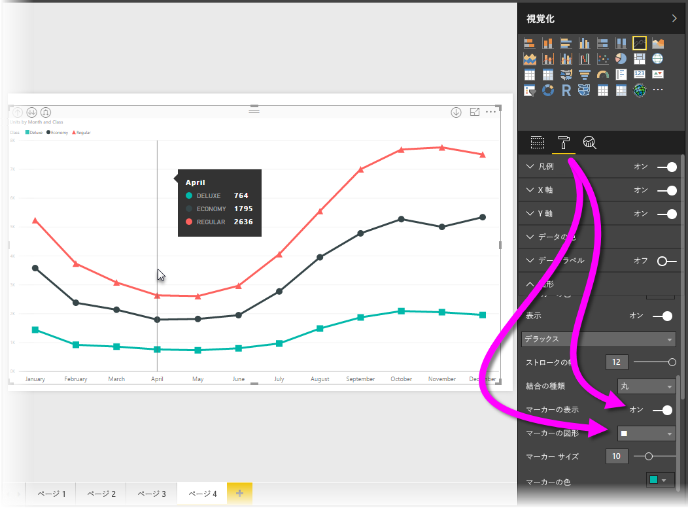
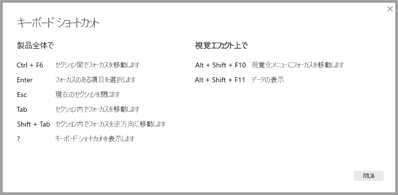

# Power BI Desktop レポートのアクセシビリティ
Power BI には、障碍のある方がより簡単に Power BI レポートを使用し、レポートと対話できる機能があります。 これらは、レポートでキーボードやスクリーンリーダーを使用したり、ページ上のさまざまなオブジェクトにフォーカスをタブ移動したり、マーカーを使用して気の利いた視覚化を実行するための機能です。

## キーボードまたはスクリーン リーダーでの Power BI Desktop レポートの使用
2017 年 9 月リリースの **Power BI Desktop** より、**?** キーを押すと、 **Power BI Desktop** で利用できるアクセシビリティ キーボード ショートカットについて説明するウィンドウが開くようになりました。

アクセシビリティ機能の強化により、次の方法で、Power BI レポートをキーボードまたはスクリーン リーダーで使用できるようになりました。

レポートを表示するときには、通常スキャン モードをオフにする必要があります。

**Ctrl + F6** キーを使用して、特定のレポート ページ上のレポート ページ タブまたはオブジェクトのフォーカスを切り替えることが可能です。

* フォーカスが*レポート ページ タブ*上にある場合、*Tab* または*矢印*キーを使用して、1 つのレポート ページから次のレポート ページへフォーカスを移動します。 レポート ページのタイトルおよびそれが現在選択されているかどうかがスクリーン リーダーによって読み上げられます。 現在フォーカスがあたっているレポート ページを読み込むには、*Enter* キーまたは*スペース* キーを使用します。
* フォーカスが読み込まれている*レポート ページ*にある場合、*Tab* キーを使用してページのすべてのテキスト ボックス、画像、図形、およびグラフなどの各オブジェクトにフォーカスを移動します。 スクリーン リーダーでは、オブジェクトの種類、オブジェクトのタイトルがある場合はそのオブジェクトの種類とタイトル、オブジェクトの説明がレポート作成者によって指定されている場合はその説明が読み上げられます。 

ビジュアル間を移動するときに、さらにビジュアルと対話する場合は、**Alt + Shift + F10** キーを押して、ビジュアル ヘッダーにフォーカスを移動することができます。このヘッダーには、グラフの背後にあるデータの並べ替え、エクスポート、およびフォーカス モードなどのさまざまなオプションが含まれます。 

**Alt + Shift + F11** キーを押すと、*[データの表示]* ウィンドウがアクセシビリティ バージョンで表示されます。 これにより、通常はスクリーン リーダーで使用するのと同じキーボード ショートカットを使って、HTML テーブルで、ビジュアルで使用されるデータを調べることができます。 

![Power BI Desktop で Alt+Shift+F11 を押し、ビジュアルに対して [データの確認] ウィンドウをアクセシビリティ バージョンで表示する](media/desktop-accessibility/accessibility_04.png)

> [!NOTE]
> [データの表示] 機能にアクセスできるのは、このキーボード ショートカットからスクリーン リーダーを使用する場合のみです。 ビジュアル ヘッダーのオプションを使用して [データの表示] を開いた場合、スクリーン リーダーからはアクセスできません。 [データの表示] を使用するときには、スクリーン リーダーで提示されるホット キーをすべて活用するためにスキャン モードをオンにしてください。

**Power BI Desktop** の 2018 年 7 月のリリースから、スライサーにはアクセシビリティ機能も組み込まれています。 スライサーを選択するときにスライサーの値を調整するには、Ctrl + 右矢印キー (Ctrl キーを押しながら右矢印キー) を押してスライサー内のさまざまなコントロール間を移動します。 たとえば、最初に Ctrl + 右矢印キーを押すと、フォーカスは消しゴムに移動します。Space キーを押すと、消しゴムボタンをクリックしたときと同様に、スライサー上のすべての値が削除されます。 

Tab キーを押すと、スライサー内のコントロール間を移動できます。 消しゴムにフォーカスがあるときに Tab キーを押すと、ドロップダウン ボタンに移動します。もう一度 Tab キーを押すと、最初のスライサー値に移動します (範囲など、スライサーに複数の値がある場合)。 

これらの追加のアクセシビリティは、ユーザーがスクリーン リーダーとキーボード ナビゲーションを使って Power BI レポートを十分に活用できるように作成されました。

## アクセスしやすいレポートを作成するためのヒント
次のヒントを使用すると、よりアクセスしやすい **Power BI Desktop** レポートを作成できます。

### アクセスしやすいレポートに関する一般的なヒント

* **[線]**、**[面]**、**[複合]**、**[散布]**、**[バブル]** の各ビジュアルでは、マーカーをオンにし、線ごとに異なる *[マーカーの図形]* を使用できます。
  
  * *[マーカー]* をオンにするには、**[視覚エフェクト]** ウィンドウで **[書式]** セクションを選択し、**[図形]** セクションを展開して、スクロール ダウンして **[マーカー]** トグルを探し、それを *[オン]* にします。
  * 次に、各線の名前 (または **[領域]** グラフを使用している場合は領域) をその **[図形]** セクションのドロップダウン ボックスから選択します。 ドロップダウン リストの下では、選択した線に使用されるマーカーの形状、色、サイズなどの多くの側面を調整できます。
  
  
  
  * 各線に別の*マーカーの図形*を使用すると、レポートの使用者は個々の線 (または領域) を区別するのが容易になります。
* 前の項目に加えて、色を使って情報を伝達してはいけません。 折れ線グラフと散布図グラフでの図形の使用に加えて、条件付き書式を使って、テーブルやマトリックスで洞察を提供してはいけません。 
* レポートのビジュアルごとに意図的な並べ替え順序を選択します。 スクリーン リーダー ユーザーがグラフの背後にあるデータを移動するときに、ビジュアルと同じ並べ替え順序が選択されます。
* テーマ ギャラリーからコントラストの高い、色覚に障碍があるユーザーにとって見やすい*テーマ*を選択し、[**[テーマ]** プレビュー機能](desktop-report-themes.md)を使用してそれをインポートします。
* レポートのすべてのオブジェクトに、*[代替テキスト]* を用意します。 これを行うと、レポートのコンシューマーは、ビジュアル、画像、図形またはテキストボックスを見ることができなくても、ビジュアルが何を伝えるものであるか理解できるようになります。 **Power BI Desktop** レポートのすべてのオブジェクトには、(ビジュアルや図形などの) オブジェクトを選択して、**[視覚エフェクト]** ウィンドウで **[書式]** セクションを選択し、**[全般]** を展開し、一番下までスクロールし、**[代替テキスト]** テキスト ボックスに入力を行い、*代替テキスト*を入力することができます。
  
  ![レポートのすべてのオブジェクトには、[視覚エフェクト]、[形式]、[全般]、[代替テキスト ボックス] から代替テキストを追加できます。](media/desktop-accessibility/accessibility_02.png)
* レポートのテキストと背景色の間に十分なコントラストがあることを確認します。 [Colour Contrast Analyser](https://developer.paciellogroup.com/resources/contrastanalyser/) など、レポートの色を確認するために使用できるツールがいくつかあります。 
* 読みやすいテキストのサイズとフォントを使います。 小さいテキスト サイズや読みにくいフォントは、アクセシビリティを損ないます。
* すべてのビジュアルにタイトル、軸ラベル、データ ラベルを含めます。
* すべてのレポート ページにわかりやすいタイトルを使用します。
* できれば、レポートでの装飾用の図形やイメージの使用は避けてください。これらはレポートのタブの順序で含まれます。 レポートに装飾用のオブジェクトを含める必要がある場合は、オブジェクトの代替テキストを更新し、装飾用であることをスクリーン リーダー ユーザーが認識できるようにしてください。

### フィールド バケットでの項目の整理
2018 年 10 月リリース以降の **Power BI Desktop** では、**[フィールド]** ウェルをキーボードを使って移動し、スクリーン リーダーを操作することができます。 

スクリーン リーダーでのレポートの作成プロセスを向上させるために、コンテキスト メニューを利用できます。これにより、**[フィールド]** リストでウェル内のフィールドを上下に移動したり、**[凡例]** や **[値]** などの他のウェルにフィールドを移動したりすることができます。

![[フィールド] ウェルのコンテキスト メニューを使って、フィールドの上下移動や他の領域への移動を行うことができます](media/desktop-accessibility/accessibility_09.png)

## レポートに対するハイ コントラストのサポート

Windows でハイ コントラスト モードを使用する場合、選択したその設定とパレットは **Power BI Desktop** のレポートにも適用されます。 

**Power BI Desktop** では、Windows で使用されているハイ コントラストのテーマを自動的に検出し、その設定をレポートに適用します。 Power BI サービスやその他の場所に発行する場合、ハイ コントラストの色はそのレポートに従います。

Power BI サービスでも、Windows 用に選択されているハイ コントラストの設定を検出しようとしますが、検出の効率と正確さは Power BI サービスに使用されているブラウザーによって異なります。 Power BI サービスでテーマを手動で設定する場合は、**[表示]、[ハイ コントラストの色]** の順に選択して、レポートに適用するテーマを選択します。

**Power BI Desktop** を使用しているときに、**[視覚化]** と **[フィールド]** フィールドなどの一部のエリアには、Windows のハイ コントラスト配色の選択が反映されません。

## 考慮事項と制限事項
アクセシビリティ機能には、次の一覧に示すように既知の問題と制限があります。

* **Power BI Desktop** でスクリーン リーダーを使用すれば、Power BI Desktop でファイルを開く前に任意のスクリーン リーダーを開く場合に最良のエクスペリエンスが得られます。
* ナレーターを使用する場合、HTML テーブルとしての [データの表示] の移動に関する制限がいくつあります。

## Keyboard Shortcuts
キーボード ショートカットは、キーボードを使用して Power BI レポートの中を移動するのに役立ちます。 Power BI レポート内で使用できるショートカットについて、次の表で説明します。 Power BI Desktop でのこれらのキーボード ショートカットの使用に加えて、各ショートカットは次のエクスペリエンスでも同様に機能します。

* [Q&A Explorer] ダイアログ
* [作業の開始] ダイアログ
* [ファイル] メニューおよび [バージョン情報] ダイアログ
* [警告] バー
* [ファイルの復元] ダイアログ
* [Frowns]\(問題点\) ダイアログ

Microsoft はアクセシビリティを改善する取り組みを続けています。前の一覧のエクスペリエンスでは、スクリーン リーダーやハイ コントラスト設定もサポートされています。

### 頻繁に使用されるショートカット
| 操作の内容           | 押すキー                |
| :------------------- | :------------------- |
| セクション間でフォーカスを移動します  | Ctrl + F6 |
| セクション内でフォーカスを移動します | Tab         |
| セクション内でフォーカスを逆方向に移動します | Shift + Tab |
| オブジェクトを選択または選択解除します | Enter または Space |
| オブジェクトを複数選択します | Ctrl + Space |

### 視覚エフェクト上で
| 操作の内容           | 押すキー                |
| :------------------- | :------------------- |
| 視覚化メニューにフォーカスを移動します | Alt + Shift + F10 |
| データの表示 | Alt + Shift + F11  |

### ウィンドウのナビゲーション
| 操作の内容           | 押すキー                |
| :------------------- | :------------------- |
| コンテキスト メニューを開く | <ul><li>Windows のキーボード: Windows コンテキスト キー + F10。  Windows コンテキスト キーは左側の Alt キーと左側の矢印キーの間にあります</li><li>その他のキーボード: Shift + F10</li></ul> |

### スライサー
| 操作の内容           | 押すキー                |
| :------------------- | :------------------- |
| スライサーを操作する | Ctrl + 右矢印キー |

### 選択ウィンドウ
| 操作の内容           | 押すキー                |
| :------------------- | :------------------- |
| 選択ウィンドウをアクティブ化する | F6 |
| 階層内の上のオブジェクトに移動する | Ctrl + Shift + F |
| 階層内の下のオブジェクトに移動する | Ctrl + Shift + B |
| オブジェクトの表示/非表示を切り替える | Ctrl + Shift + S |

### DAX エディター
| 操作の内容           | 押すキー                |
| :------------------- | :------------------- |
| 行を上/下に移動 | Alt + 上矢印キー/下矢印キー |
| 行を上/下にコピー | Shift + Alt + 上矢印キー/下矢印キー |
| 行を下に挿入 | Ctrl + Enter |
| 行を上に挿入 | Ctrl + Shift + Enter |
| 対応するかっこにジャンプ | Ctrl + Shift + \ |
| 行のインデント/インデント解除 | Ctrl + ] / [ |
| カーソルの挿入 | Alt キーを押しながらクリック |
| 現在の行の選択 | Ctrl + I |
| 現在の選択範囲のすべての出現箇所を選択 | Ctrl + Shift + L |
| 現在の単語のすべての出現箇所を選択 | Ctrl + F2 |

## 次の手順
* [Power BI Desktop でレポートのテーマを使用する (プレビュー)](desktop-report-themes.md)

