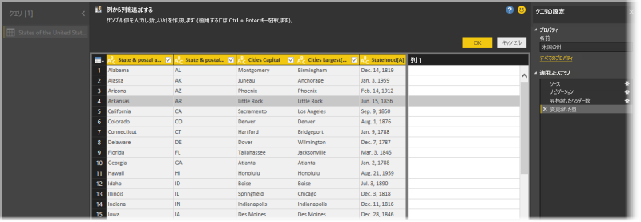
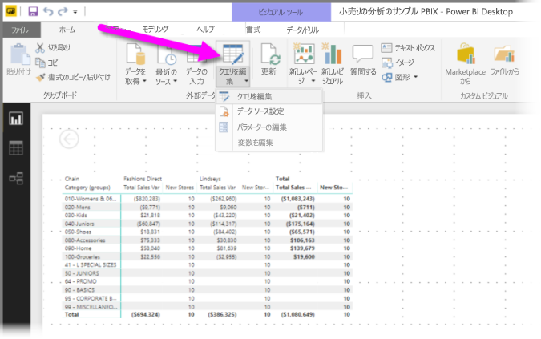
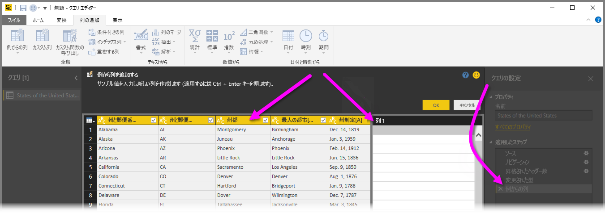
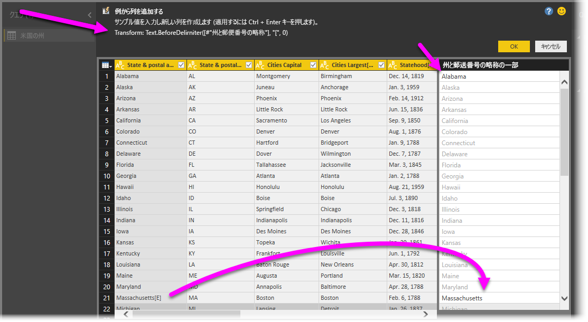

# Power BI Desktop で例から列を追加する
2017 年 4 月リリース以降の **Power BI Desktop** では、**クエリ エディター**を使い、新しい列のサンプル値を指定するだけで、モデルに新しいデータ列を追加できます。 現在選択されているものから、または特定のテーブルのすべての (または選択されている) 列に基づいて入力を提供することで、新しい列の例を作成できます。

この方法を使うと、新しい列をすばやく簡単に作成でき、次のような場合に最適です。

* 新しい列に設定するデータの結果はわかっているものの、それを実現する変換 (または変換のコレクション) がわからない。
* 必要な変換は既にわかっているものの、それを実行するために UI のどこをクリックまたは選択すればよいかわからない。
* **M** の "*カスタム列*" 式を使って行う必要がある変換についてはすべてわかっているものの、そのような式の 1 つ (または複数) を UI でクリックまたは追加できない。

**例からの列の追加**機能の使い方は簡単です。 以下ではそれについて説明します。

## クエリ エディターを使って例から新しい列を追加する
例から新しい列を作成するには、**クエリ エディター**を起動します。 それには、**Power BI Desktop** の **[ホーム]** リボンで **[クエリを編集]** を選びます。

Web ページからデータを取得するには、 **[ホーム]** タブに移動し、 **[データの取得] > [Web]** をクリックして、表示されるダイアログに URL を貼り付けます。 この記事では、Wikipedia の記事からのデータを使います。 次のリンクをクリックして、自分のデータを取得して使用できます。

* [**米国の州と地域の一覧**](https://wikipedia.org/wiki/List_of_states_and_territories_of_the_United_States)

**クエリ エディター**を起動してデータを読み込んだ後は、例からの列の追加を始めることができます。 新しい列を追加するには、**クエリ エディター**でリボンの **[列の追加]** タブを選び、 **[例からの列]** を選びます。 ドロップダウンを選んだ場合は、 **[すべての列から]** (ドロップダウンではなくボタンを選んだ場合の既定値) または **[選択範囲から]** を選ぶことができます。 ここでは、 **[すべての列から]** を選んだ場合について説明します。

## [例から列を追加する] ペイン
例から新しい列を追加する選択を行うと、現在のテーブルの列が新しいウィンドウに表示されます (すべてを表示するにはスクロールが必要な場合があります)。 新しい **[列 1]** も右側に表示されます。**Power BI Desktop** は例を基にしてこの列を作成します。 新しい **[列 1]** ヘッダーの下には空白のセルがあります。ここに例を入力すると、Power BI はそれを使って例と一致するようにルールと変換を作成します。

これは **[クエリの設定]** ペインの **[適用したステップ]** であることに注意してください。 **クエリ エディター**は変換ステップを記録し、それを順番にクエリに適用します。

これは **[例から列を追加する]** という名前のペインで、4 つの主要な領域で構成されます。

1. **コマンド バー**には、機能または変換の簡単な説明が表示されます。
2. **[フィードバックの送信]** オプションは、この機能の向上に役立ちます。
3. **[OK]** ボタンを選ぶと変換がコミットされて列に追加され、 **[キャンセル]** ボタンを選ぶとキャンセルできます。
4. 新しい列領域では、任意の行にサンプル値を入力し (Power BI に例を提供します)、その行の他の列に関連付けます。

新しい列に例を入力すると、Power BI は検出された変換に基づいて、作成している列のプレビューを表示します。 たとえば、テーブルの最初の列の *Alabama* という値に対応する「*Alabama*」を最初の行に入力します。 *Enter* キーを押すとすぐに、Power BI はその値に基づいて列を設定します。

しかし、*Massachusetts[E]* を含む行に移動し、最後の *[E]* を削除します (必要ないため)。 Power BI は変更を検出し、例を使って変換を作成します。 上の中央のペインに表示される変換の説明に注意してください。

例の提供を続けると、**クエリ エディター**はそれを変換に追加します。 問題がなければ、 **[OK]** を選んで変更をコミットできます。

## [例から列を追加する] の動作を確認する
この動作を確認したい場合は、 この例で前に提供したデータ ソースを使って行われるこの機能の処理を、次のビデオで見ることができます。 これを参考にして、自分でやってみてください。

<iframe width="560" height="315" src="https://www.youtube.com/embed/-ykbVW9wQfw" frameborder="0" allowfullscreen></iframe>

## 考慮事項と制限事項
**[例から列を追加する]** では多くの変換を使うことができますが、すべてではありません。 次の一覧では、サポートされているすべての変換を示します。

* **参照**
  
  * 特定の列の参照 (トリム、クリーン、および大文字小文字の変換を含みます)

* **Text 変換**
  
  * 結合 (リテラル文字列と列全体の値の組み合わせをサポートしています)
  * 置換
  * 長さ
  * 抽出   
    * 最初の文字
    * 最後の文字
    * 範囲
    * 区切り記号の前のテキスト
    * 区切り記号の後のテキスト
    * 区切り記号の間のテキスト
    * 長さ

* 次のサポート対象の **Text 変換**は、2017 年 11 月リリース以降の **Power BI Desktop** で使用できます。
    
  * 文字の削除
  * 文字の保持

> [!NOTE]
> すべての *Text* 変換では、列の値のトリミング、クリーン、または大文字小文字変換の適用の必要性が考慮されます。
> 
> 

* **Date 変換**
  
  * 日
  * 週の通算日
  * 曜日の名前
  * 年の通算日
  * 月
  * 月の名前
  * 年の四半期
  * 月の通算週
  * 年の通算週
  * 年
  * 期間
  * 年の開始日
  * 年の最終日
  * 月の開始日
  * 月の最終日
  * 四半期の開始日
  * 月内の日数
  * 四半期の最終日
  * 週の開始日
  * 週の最終日
  * 月の日付
  * 一日の開始時刻
  * 最終日

* **Time 変換**
  
  * 時
  * 分
  * 秒  
  * 現地時刻への変換

> [!NOTE]
> すべての *Date* および *Time* 変換では、列の値を *Date*、*Time*、または *DateTime* に変換する必要性が考慮されます。
> 
> 

* **Number 変換** 

  * 絶対値
  * アークコサイン
  * アークサイン
  * アークタンジェント
  * Number への変換
  * コサイン
  * キューブ
  * 除算
  * 指数
  * 階乗
  * 整数除算
  * 偶数
  * 奇数
  * Ln
  * 底が 10 の対数
  * 剰余
  * 乗算
  * 切り捨て
  * 切り上げ
  * 符号
  * Sin
  * 平方根
  * 2 乗
  * 減算
  * 合計
  * タンジェント

* 次のサポート対象の **Number 変換**は、2017 年 11 月リリース以降の **Power BI Desktop** で使用できます。

  * バケット/範囲

* **全般**
  
  * 条件付きの列