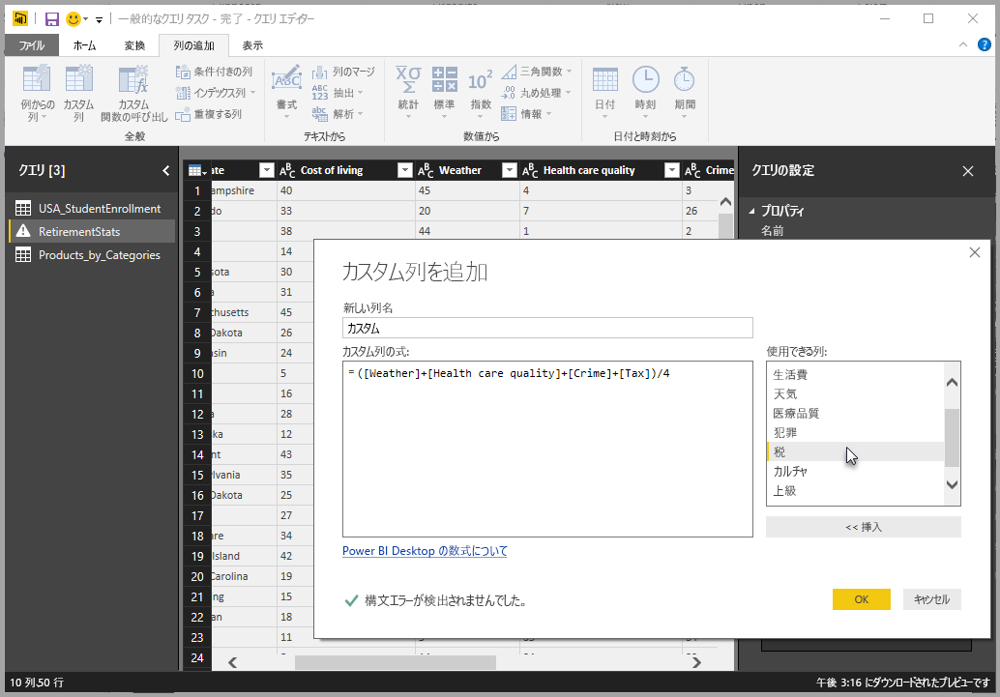
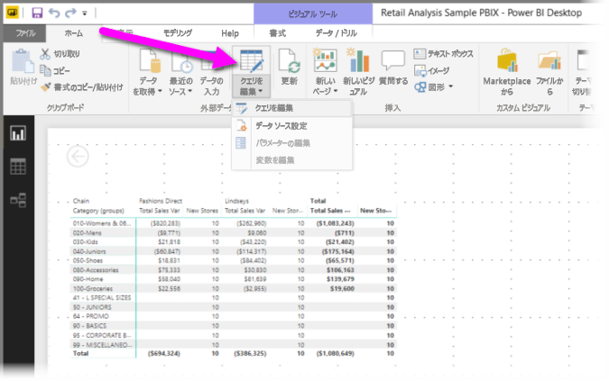
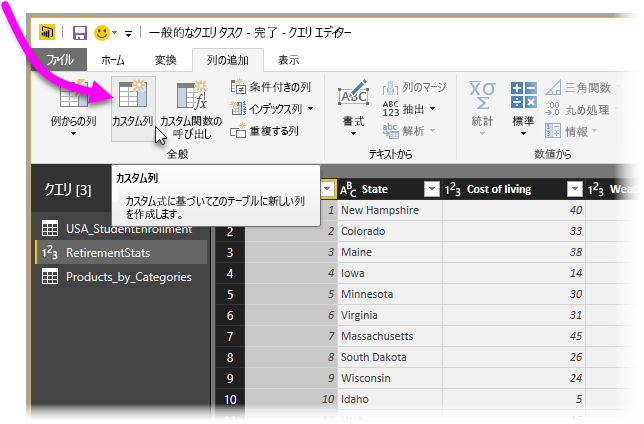
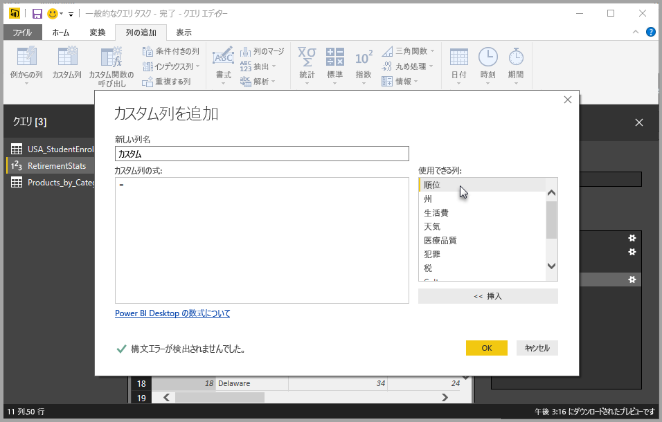
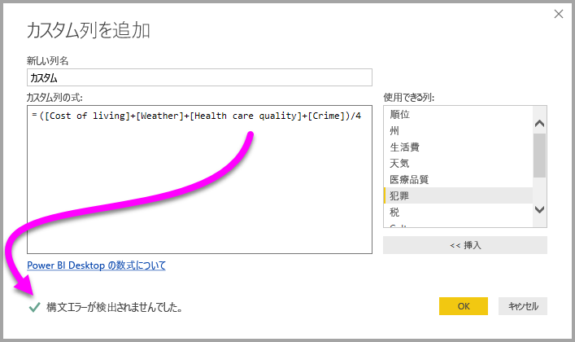
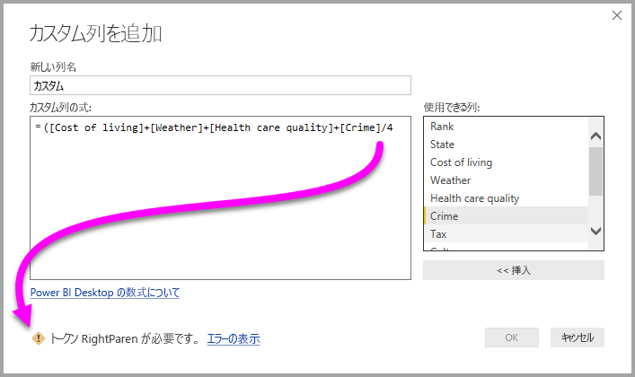
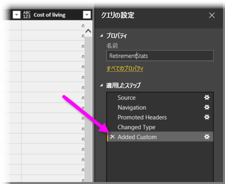

# Power BI Desktop でカスタム列を追加する
**Power BI Desktop** の**クエリ エディター**を使って、データの新しいカスタム列をモデルに簡単に追加することができます。 ボタンを使ってカスタム列を定義する [M 式](https://msdn.microsoft.com/library/mt270235.aspx)を簡単に作成し、カスタム列を作成したり、カスタム列の名前を変更したりできます。 M 式には、[包括的な関数参照コンテンツ セット](https://msdn.microsoft.com/library/mt779182.aspx)があります。 

カスタム列の作成は、**クエリ エディター**で作成するクエリに対するもう 1 つの**適用したステップ**です。つまり、変更したり、前後に移動したり、いつでも修正したりできます。

## クエリ エディターを使って新しいカスタム列を追加する
新しいカスタム列を作成するには、**クエリ エディター**を起動します。 それには、**Power BI Desktop** の **[ホーム]** リボンで **[クエリを編集]** を選びます。

**クエリ エディター**を起動してデータを読み込んだ後は、リボンで **[列の追加]** タブを選び、**[カスタム列]** を選ぶことによって、カスタム列を追加できます。

次のセクションで説明する **[カスタム列の追加]** ウィンドウが表示されます。

## [カスタム列の追加] ウィンドウ
**[カスタム列の追加]** ウィンドウでは、右側のウィンドウには利用可能なフィールドの一覧が、上部にはカスタム列の名前が表示されます (そのテキスト ボックスに新しい名前を入力するだけで名前を変更できます)。また、右からのフィールドの挿入、演算子の追加、その他の方法で作成 (記述) する、新しいカスタム列を定義する [**M** 式](https://msdn.microsoft.com/library/mt779182.aspx)が表示されます。 

## カスタムの列の式を作成する
右側の **[使用できる列]** の一覧でフィールドを選び、**[<< 挿入]** を選んでカスタム列の式に追加します。 単に一覧の列をダブルクリックして追加することもできます。

式を入力して列を作成すると、ウィンドウの下部に、構文エラーがあるかどうかが (入力と同時に) リアルタイムで表示されます。 問題がなければ、緑色のチェックマークが表示されます。

構文になんらかのエラーがある場合は、黄色の警告アイコン、検出されたエラー、エラーが検出された (式内の) 場所にカーソルを移動するリンクが表示されます。

**[OK]** を選ぶと、カスタム列がモデルに追加されて、**[追加されたカスタム]** がクエリの **[適用したステップ]** に追加されます。

**[適用したステップ]** ウィンドウで **[追加されたカスタム]** ステップをダブルクリックすると、**[カスタム列の追加]** ウィンドウが再び開きます。そのウィンドウでは作成したカスタム列が既に読み込まれており、必要に応じて変更できます。

## カスタム列用の詳細エディターの使用
**詳細エディター**を使って、カスタム列を作成 (およびクエリのステップを変更) することもできます。 **クエリ エディター**で **[表示]** タブを選び、**[詳細エディター]** を選んで**詳細エディター**を表示します。

**詳細エディター**では、クエリを完全に制御できます。

## 次の手順
**クエリ エディター**に提供した例に基づく列の作成など、カスタム列を作成するには他の方法もあります。 例からのカスタム列の作成の詳細については、次の記事をご覧ください。

* [Power BI Desktop で例から列を追加する](desktop-add-column-from-example.md)
* [M 式言語の概要](https://msdn.microsoft.com/library/mt270235.aspx)
* [M 関数リファレンス](https://msdn.microsoft.com/library/mt779182.aspx)  

