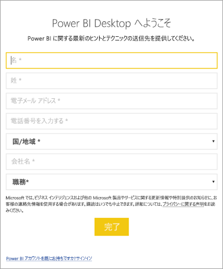

# <a name="how-administrators-can-manage-the-power-bi-desktop-sign-in-form"></a>管理者が Power BI Desktop のサインイン フォームを管理する方法
Power BI Desktop を初めて起動したときは、サインイン フォームが表示されます。 情報を入力するか、Power BI にサインインして続行できます。 管理者は、レジストリ キーを使ってこのフォームを管理できます。 



管理者は、次のレジストリ キーを使って、サインイン フォームを無効にすることができます。 グローバル ポリシーを使って、これを組織全体に適用することもできます。

```
Key: HKEY_LOCAL_MACHINE\SOFTWARE\Policies\Microsoft\Power BI Desktop
valueName: ShowLeadGenDialog
```

値を 0 にすると、ダイアログ ボックスは無効になります。

他にわからないことがある場合は、 [Power BI コミュニティで質問してみてください](http://community.powerbi.com/)。

