# Power BI Desktop での集計 (プレビュー)

Power BI で**集計** を使用すると、以前は不可能だった方法でビッグ データに対して対話型の分析が可能になります。 **集計**によって、意思決定のために大規模なデータセットをロック解除するコストを大幅に削減できます。

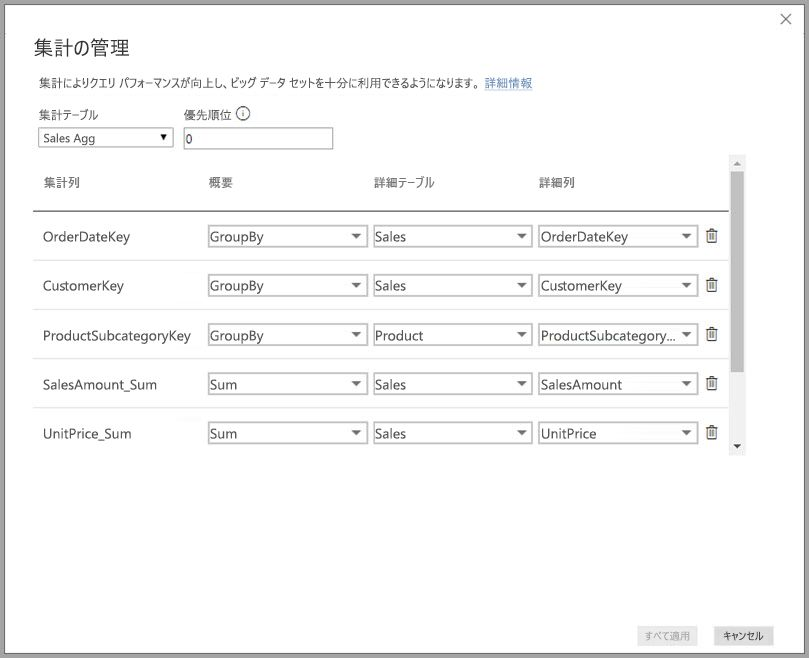

**集計**を使用することの利点を次に示します。

* **大規模なデータセットに対するクエリのパフォーマンス**: ユーザーが Power BI レポートのビジュアルを操作するときに、DAX クエリがデータセットに送信されます。 詳細レベルで必要なリソースの一部を使用して、集計レベルでデータをキャッシュすることでクエリ速度が向上します。 それ以外の方法では不可能な方法でビッグ データのロックを解除します。
* **データ更新の最適化**: 集計レベルでデータをキャッシュすることで、キャッシュ サイズを削減し、更新時間を短縮します。 データがユーザーに使用可能になるまでの時間を短縮します。
* **分散アーキテクチャを実現**: Power BI のメモリ内キャッシュで集計クエリの処理を可能にすることで、効果的に処理します。 DirectQuery モードでデータ ソースに送信されるクエリを制限して、同時実行の制限内に収まるようにします。 到着するクエリは、データ ウェアハウスとビッグ データ システムが通常に処理できる、フィルター処理された、トランザクション レベルのクエリになります。

### テーブルレベルのストレージ
テーブルレベルのストレージは通常、集計機能で使用されます。 詳細については、「[Power BI Desktop (プレビュー) でのストレージ モード](desktop-storage-mode.md)」を参照してください。

### データ ソースの種類
集計は、データ ウェアハウスおよびデータ マートなどのディメンション モデルを表すデータ ソースと、Hadoop ベースのビッグ データ ソースで使用されます。 この記事では、Power BI での一般的なモデリングの相違点を、データ ソースの種類ごとに説明します。

Power BI のインポート (非多次元) と DirectQuery のすべてのソースが集計で機能します。

## 集計のプレビュー機能を有効にする

**集計**機能はプレビュー段階であり、**Power BI Desktop** で有効にする必要があります。 **集計**を有効にするには、**[ファイル] > [オプションと設定] > [オプション] > [プレビュー機能]** の順に選択し、**[複合モデル]** と **[集計の管理]** のチェックボックスをオンにします。 

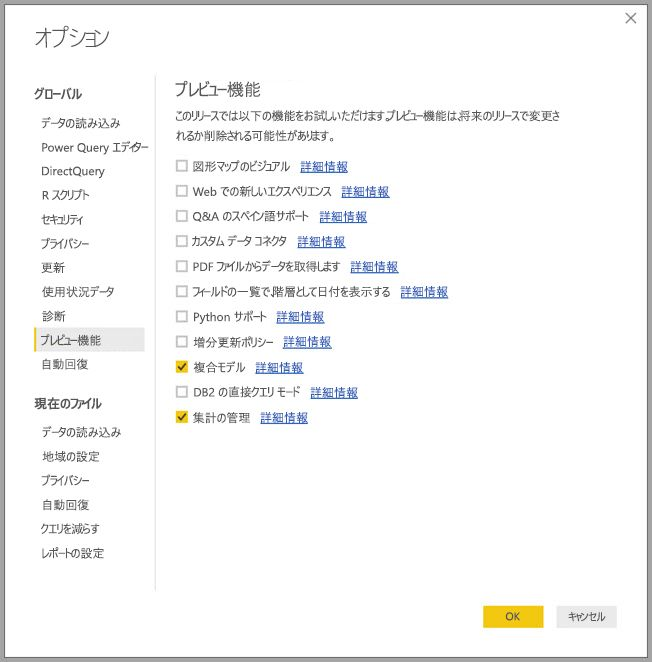

この機能を有効にするには、**Power BI Desktop** を再起動する必要があります。

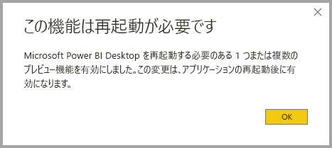

## リレーションシップに基づく集計

リレーションシップに基づく**集計**は通常、ディメンション モデルで使用されます。 データ ウェアハウスおよびデータ マートをソースとする Power BI データセットは、ディメンション テーブルとファクト テーブル間のリレーションシップを持つスター/スノーフレーク スキーマと似ています。

1 つのデータ ソースからの次のモデルを検討してください。 すべてのテーブルが最初に DirectQuery を使用しているとします。 **Sales** ファクト テーブルには、数十億の行が含まれています。 **Sales** のストレージ モードをキャッシュの **[インポート]** に設定すると、かなりの量のメモリを消費し、多額の管理オーバーヘッドがかかる可能性があります。

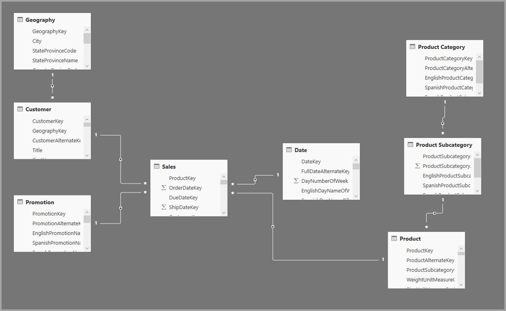

代わりに、集計テーブルとして **Sales Agg** テーブルを作成します。 これは、**Sales** よりも高い粒度のため、含まれる行は大幅に少なくなります。 行数は、**CustomerKey**、**DateKey**、および **ProductSubcategoryKey** でグループ化された **SalesAmount** の合計と等しくなるはずです。 数十億行ではなく、数百万行になり、はるかに管理しやすくなります。

次のディメンション テーブルは、高いビジネス価値を持つクエリに最もよく使用されるとします。 これらのテーブルは、*一対多* (または*多対一*) リレーションシップを使用して、**Sales Agg** をフィルター処理できます。 *多対多*や*複数のソース*など、その他のリレーションシップの種類は、集計とは見なされません。

* Geography
* Customer (顧客)
* 日付
* Product Subcategory (製品サブカテゴリ)
* Product Category (製品カテゴリ)

次の図に、このモデルを示します。

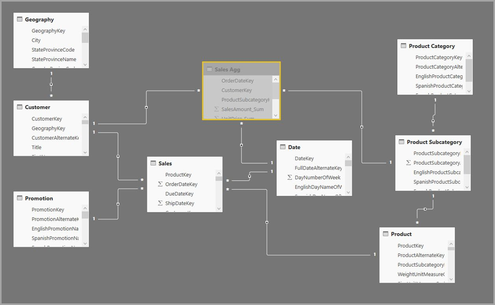

> [!NOTE]
> **Sales Agg** テーブルはよくあるテーブルなので、さまざまな方法で読み込める柔軟性があります。 たとえば、集計は、ソース データベースで ETL/ELT プロセスを使用して実行することも、テーブルの [M 式](https://msdn.microsoft.com/query-bi/m/power-query-m-reference)で実行することもできます。 集計では、[Power BI Premium での増分更新](service-premium-incremental-refresh.md)の有無にかかわらず、インポート ストレージ モードを使用できます。または DirectQuery にして[列ストア インデックス](https://docs.microsoft.com/sql/relational-databases/indexes/columnstore-indexes-overview)を使用して高速クエリ用に最適化することもできます。 この柔軟性により、ボトルネックを避けるためにクエリ負荷を分散する分散アーキテクチャが可能になります。

### ストレージ モード 
使用している例を使って続けましょう。 クエリを高速化するため、**Sales Agg** のストレージ モードを **[インポート]** に設定します。

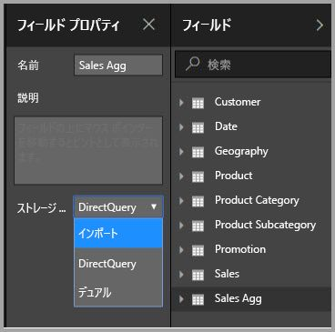

これを行うと、関連するディメンション テーブルが **[デュアル]** ストレージ モードに設定されることを知らせる次のダイアログが表示されます。 

![[ストレージ モード] ダイアログ](media/desktop-aggregations/aggregations_05.jpg)

これらを **[デュアル]** に設定すると、関連するディメンション テーブルを、サブクエリに応じてインポートまたは DirectQuery として機能させることができます。

* **Sales Agg** テーブル (インポート) からメトリックを集計するクエリと、関連するデュアル テーブルからの groupby 属性は、メモリ内キャッシュから返すことができます。
* **Sales** テーブル (DirectQuery) 内でメトリックを集計するクエリと、関連するデュアル テーブルからの groupby 属性は、DirectQuery モードで返すことができます。 グループ化操作を含むクエリ ロジックが、ソース データベースに渡されます。

**デュアル** ストレージ モードに関する詳細については、[ストレージ モード](desktop-storage-mode.md)に関する記事を参照してください。

> 注: **Sales Agg** テーブルは非表示になっています。 集計テーブルは、データセットのコンシューマーからは非表示にする必要があります。 コンシューマーとクエリは、集計テーブルではなく、詳細テーブルを参照するため、集計テーブルの存在を知る必要はありません。

### [集計の管理] ダイアログ
次に、集計を定義します。 **Sales Agg** テーブルを右クリックして、**[集計の管理]** コンテキスト メニューを選択します。

![[集計の管理] メニューの選択](media/desktop-aggregations/aggregations_06.jpg)

**[集計の管理]** ダイアログが表示されます。 **Sales Agg** テーブル内の各列の 1 行が表示され、ここで集計動作を指定できます。 **Sales** テーブルを参照する Power BI データセットに送信されたクエリは、**Sales Agg** テーブルへ内部的にリダイレクトされます。 データセットのコンシューマーが、**Sales Agg** テーブルの存在を知る必要はありません。

![[集計の管理] ダイアログ](media/desktop-aggregations/aggregations_07.jpg)

次のテーブルは、**Sales Agg** テーブルの集計を示しています。

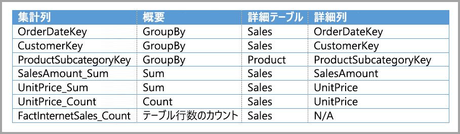

#### 概要作成関数

[概要作成] のドロップダウンでは、選択肢として次の値が提供されます。
* カウント
* GroupBy
* 最大
* 最小
* 合計
* テーブル行数のカウント

#### 検証

ダイアログによって次の重要な検証が適用されます。

* 選択された詳細列には、カウントとテーブル行数のカウントの概要作成関数を除き、集計列と同じデータ型がある必要があります。 カウントとテーブル行数のカウントには、整数の集計列のみが提供されます。一致するデータ型は必要ありません。
* 3 つ以上のテーブルをカバーするチェーン集計は許可されていません。 たとえば、**テーブル C** を参照する集計を持つ**テーブル B** を参照する**テーブル A** に集計を設定することはできません。
* 2 つのエントリが同じ概要作成関数を使用し、同じ詳細テーブル/列を参照する重複した集計は許可されません。

**集計**のこのパブリック プレビューの期間中は、次の検証も適用されます。 これらの検証は、一般公開のリリース時に削除される予定です。

* 集計は、行レベル セキュリティ (RLS) では使用できません。 *パブリック プレビューの制限。*
* 詳細テーブルは、インポートではなく、DirectQuery にする必要があります。 *パブリック プレビューの制限。*

このような検証のほとんどは、次の図のように、ドロップダウンの値を無効にして、ツールヒントの説明テキストを表示することで適用されます。

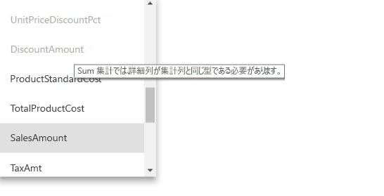

### グループ化列

この例では、3 つの GroupBy エントリは省略可能です。これらは集計動作には影響しません (この後の画像に示されている、DISTINCTCOUNT サンプル クエリを除く)。 これらは主に読みやすくする目的のために含まれています。 これらの GroupBy エントリがなくても、集計はリレーションシップに基づいてヒットされます。 これは、この記事で後述するビッグ データの例で説明する、リレーションシップなしで集計を使用した場合の動作とは異なります。

### 集計がクエリでヒットまたはミスされるかどうかを検出する

クエリがメモリ内キャッシュ (ストレージ エンジン)、または SQL Profiler を使用して (データ ソースにプッシュされる) DirectQuery から返されるかどうかを検出する方法については、[ストレージ モード](desktop-storage-mode.md)に関する記事を参照してください。 このプロセスは、集計がヒットされるかどうかを検出するためにも使用することができます。

さらに、SQL Profiler では、次の拡張イベントも提供されます。

    Query Processing\Aggregate Table Rewrite Query

次の JSON スニペットでは、集計が使用されている場合のイベントの出力例を示しています。

* **matchingResult** は、集計がサブクエリに使用されたことを示します。
* **dataRequest** は、サブクエリで使用されたグループ化列と集計列を示します。
* **mapping** は、マップ先の集計テーブル内の列を示します。

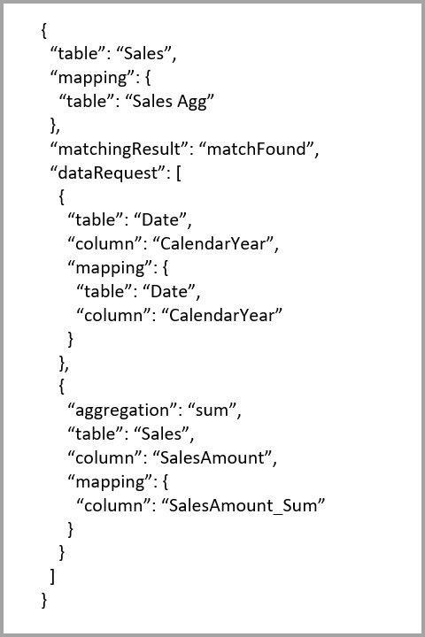

### クエリ例
次のクエリでは、*Date* テーブル内の列が集計をヒットできる粒度であるため、集計がヒットされます。 **SalesAmount** には、**Sum** 集計が使用されます。

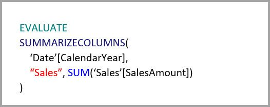

次のクエリでは、集計はヒットされません。 **SalesAmount**の合計の要求に関係なく、**Product** テーブル内の列に対してグループ化操作を実行します。このテーブルは集計をヒットできる粒度ではありません。 モデル内のリレーションシップを観察すると、1 つの製品サブカテゴリが複数の **Product** (製品) 行を持っている場合があり、クエリでは、集計する製品が判断できません。 このケースでは、クエリによって DirectQuery に戻され、データ ソースに SQL クエリが送信されます。

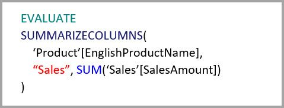

集計は簡単な合計を実行するシンプルな計算だけではありません。 複雑な計算にも役立ちます。 概念的には、複雑な計算は SUM、MIN、MAX、COUNT のそれぞれのサブクエリに分割され、各サブクエリは集計がヒットするかどうかを判断するために評価されます。 クエリ プランの最適化のため、このロジックはすべてには当てはまりませんが、大抵のものには当てはまります。 次の例では、集計がヒットします。

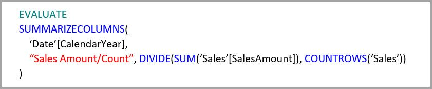

COUNTROWS 関数は集計を利用できます。 次のクエリでは、**Sales** テーブルに定義されたテーブル行数の**カウント** があるため、集計がヒットします。

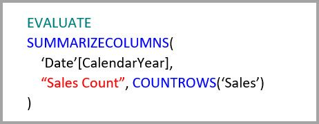

AVERAGE 関数は集計を利用できます。 次のクエリでは、AVERAGE が COUNT で除算される SUM に内部的に折りたたまれるため、集計がヒットします。 **UnitPrice** 列には SUM と COUNT の両方に対して定義された集計があるため、集計がヒットします。

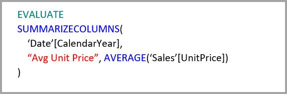

場合によっては、DISTINCTCOUNT 関数は集計を利用できます。 **CustomerKey** に集計テーブルで **CustomerKey** の差異を維持する GroupBy エントリがあるため、次のクエリでは集計がヒットします。 この手法も、約 200 万から 500 万を超える個別値がクエリのパフォーマンスに影響する可能性があるパフォーマンスしきい値の対象となります。 ただしこれは、詳細テーブル内に何十億もの行があり、列内に 200 万から 500 万の個別値があるようなシナリオで役に立ちます。 このケースでは、何十億もの行を含むテーブルをスキャンするよりも、たとえテーブルがメモリ内にキャッシュされている場合でも、個別のカウントの方が速く実行できます。

## グループ化列に基づく集計 

Hadoop ベースのビッグ データ モデルには、ディメンション モデルとは異なる特性があります。 このモデルは、大規模なテーブル間の結合を避けるため、リレーションシップに依存することはほとんどありません。 代わりに、ディメンション属性がファクト テーブルに非正規化されることがよくあります。 このようなビッグ データ モデルは、グループ化列に基づく**集計**を使用して、対話型の分析のためにロックを解除することができます。

次のテーブルには、集計対象の **Movement**  の数値列が含まれています。 その他のすべての列は、グループ化への属性です。 このテーブルには、IoT データと多数の行が含まれています。 ストレージ モードは、DirectQuery です。 データセット全体を集計するデータ ソースに対するクエリは、その膨大な量により低速になります。

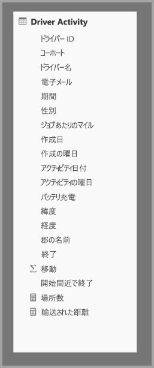

このデータセットで対話型の分析を有効にするため、経度と緯度などの高いカーディナリティ属性を除くほとんどの属性をグループ化する集計テーブルを追加します。 これにより行数が大幅に削減され、メモリ内キャッシュに余裕で収まるサイズに縮小されます。 **Driver Activity Agg** のストレージ モードはインポートです。

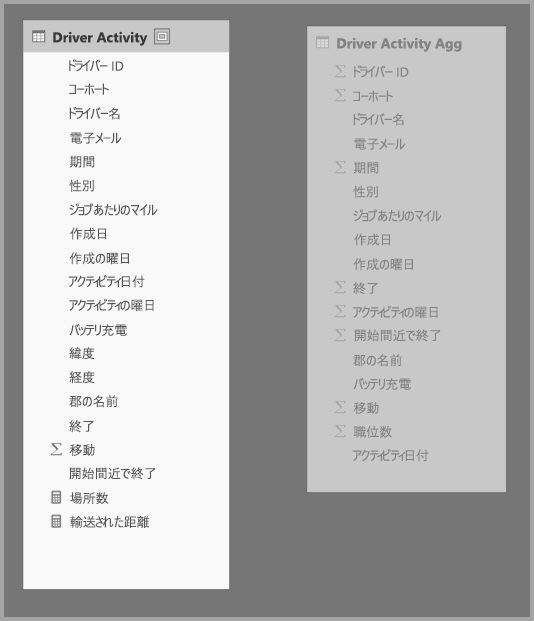

次に、**[集計の管理]** ダイアログで、集計マッピングを定義します。 このダイアログには、**Driver Activity Agg** テーブル内の各列の 1 行が表示され、ここで集計動作を指定できます。

![Driver Activity Agg テーブルの [集計の管理] ダイアログ](media/desktop-aggregations/aggregations_11.jpg)

次のテーブルは、**Sales Agg** テーブルの集計を示しています。

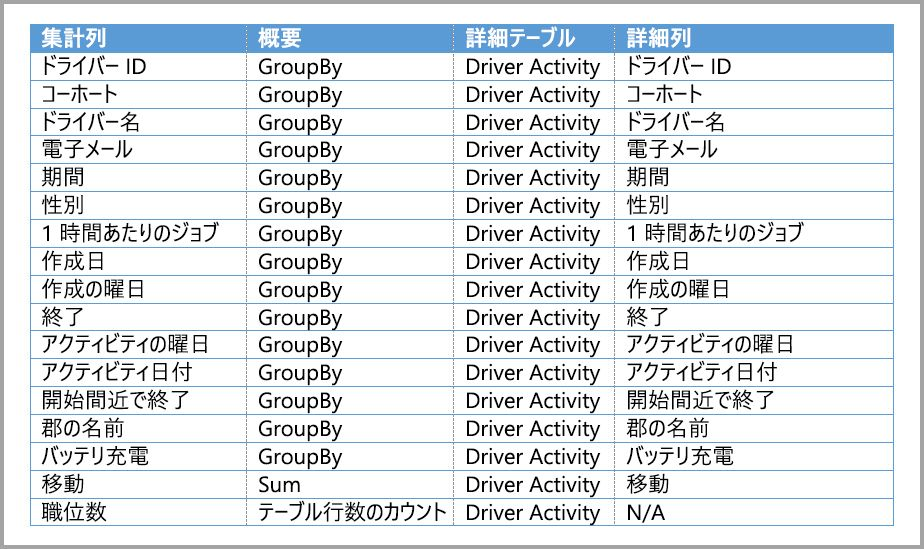

### グループ化列

この例では、**GroupBy** エントリは**省略できません**。これがないと、集計がヒットしません。 これは、この記事で前述したディメンション モデルの例で説明した、リレーションシップに基づいて集計を使用するのとは異なる動作です。

### クエリ例

次のクエリでは、**Activity Date** 列が集計テーブルでカバーされているため、集計がヒットします。 テーブル行数のカウントの集計は、COUNTROWS 関数によって使用されます。

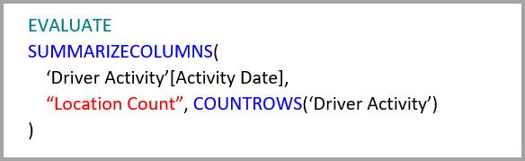

ファクト テーブルにフィルター属性が含まれているモデルには特に、テーブル行数のカウントの集計を使用することをお勧めします。 Power BI では、ユーザーによって明示的に要求されていない場合に、COUNTROWS を使用してデータセットにクエリを送信することができます。 たとえば、[フィルター] ダイアログには、各値の行数が表示されます。

![[フィルター] ダイアログ](media/desktop-aggregations/aggregations_12.jpg)

## 集計の優先順位

集計の優先順位により、1 つのサブクエリで複数の集計テーブルを対象にすることができます。

次の例を考えてみましょう。 これは、複数の DirectQuery ソースが含まれている[複合モデル](desktop-composite-models.md)です。

* **Driver Activity Agg2** インポート テーブルは、group-by 属性が少なくカーディナリティが低いため、粒度が高くなっています。 行数は、メモリ内キャッシュに余裕で収まるように、数千程度に抑えることができます。 これらの属性は、幹部のダッシュボードで使用されることがあるため、それらを参照するクエリはできるだけ高速にする必要があります。
* **Driver Activity Agg** テーブルは、DirectQuery モードの中間の集計テーブルです。 これには 10 億を超える行が含まれており、列ストア インデックスを使用してソースで最適化されています。
* **Driver Activity** テーブルは DirectQuery で、ビッグ データ システムをソースとする IoT データの数兆を超える行が含まれています。 これは、制御されたフィルター コンテキストで IoT の個別の読み取りを表示するドリルスルー クエリを提供します。

このモデルのメモリ占有領域は比較的小さいものの、大きなデータセットのロックを解除します。 これはクエリの負荷を、それを使用するアーキテクチャのコンポーネントの長所に基づいて分散するため、分散アーキテクチャを表します。

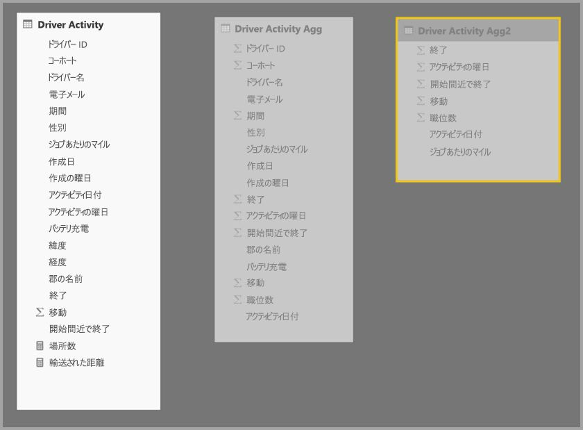

**Driver Activity Agg2** の **[集計の管理]** ダイアログの *[優先順位]* フィールドには、**Driver Activity Agg** よりも高い 10 が示されています。これは、集計を使用するクエリで最初に考慮されることを意味します。 **Driver Activity Agg2** で対応できる粒度ではないサブクエリでは、代わりに **Driver Activity Agg** が考慮されます。 いずれの集計テーブルでも対応できない詳細クエリは、**Driver Activity** に向けられます。

チェーン集計が許可されていないため (この記事で前述した「[検証](#validations)」を参照)、**[詳細テーブル]** 列には、**Driver Activity Agg** ではなく **Driver Activity** テーブルが指定されています。

![[集計の管理] ダイアログ](media/desktop-aggregations/aggregations_14.jpg)

次のテーブルは、**Sales Agg** テーブルの集計を示しています。

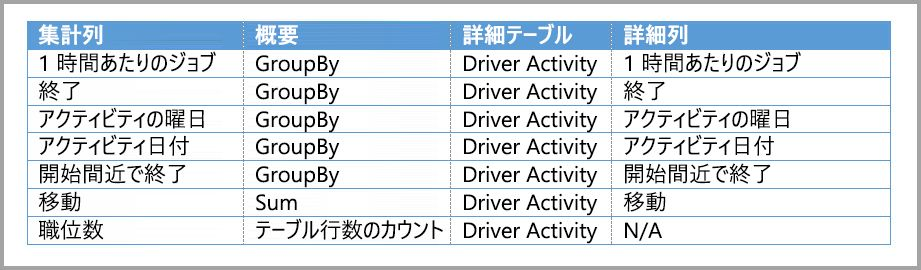

## リレーションシップと結合したグループ化列に基づく集計

この記事で既に説明したように、集計の 2 つの手法を組み合わせることもできます。 リレーションシップに基づく**集計**では、非正規化されたディメンション テーブルを複数のテーブルに分割する必要がある場合があります。 これがコストがかかる場合または特定のディメンション テーブルでは実行が難しい場合は、他に使用されている特定のディメンションとリレーションシップのために集計テーブル内で必要な属性をレプリケートすることができます。

次のモデルでは、**Sales Agg** テーブル内の *Month* (月)、*Quarter* (四半期)、*Semester* (半期)、*Year* (年) をレプリケートします。 **Sales Agg** テーブルと **Date** テーブル間にはリレーションシップはありません。 **Customer** と **Product Subcategory** へのリレーションシップはあります。 **Sales Agg** のストレージ モードはインポートです。

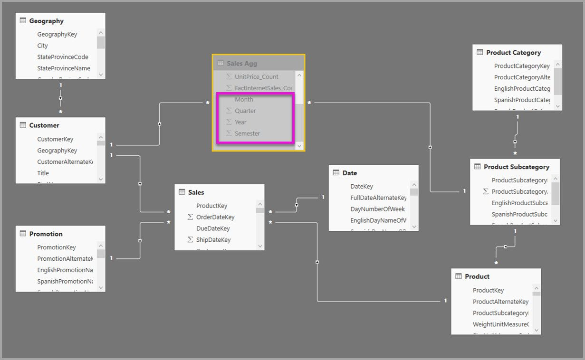

次のテーブルは、**Sales Agg** テーブルの **[集計の管理]** ダイアログ内のエントリ セットを示しています。 **Date** が詳細テーブルの GroupBy エントリは、Date 属性でグループ化するクエリで集計をヒットするために必須です。 前の例と同じく、リレーションシップが存在するため、CustomerKey と ProductSubcategoryKey の GroupBy エントリは集計のヒットには影響しません (これも DISTINCTCOUNT の例外によるものです)。

> 注: このモデルでは、**Date** テーブルが詳細テーブルのため、[管理の集計] ダイアログを入力するためには、このテーブルが DirectQuery モードである必要があります。 これは、プレビューの制限で、一般公開では削除される予定です。

### クエリ例

次のクエリでは、CalendarMonth が集計テーブルでカバーされ、CategoryName は一対多のリレーションシップを使用してアクセスできるため、集計がヒットします。 **SalesAmount** には、Sum 集計が使用されています。

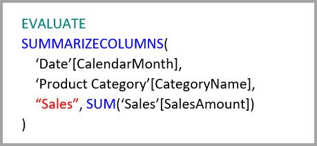

次のクエリでは、CalendarDay が集計テーブルでカバーされていないため、集計がヒットしません。

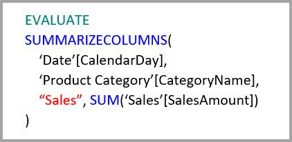

次のタイム インテリジェンス クエリでは、集計がヒットしません。これは、DATESYTD 関数によって集計テーブルではカバーされない CalendarDay 値のテーブルが生成されるためです。

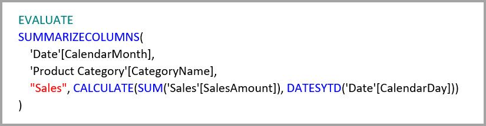

## キャッシュの同期状態を保つ

DirectQuery とインポートおよびデュアルのいずれかまたは両方のストレージ モードを組み合わせる**集計**では、メモリ内キャッシュとソース データとの同期が保持されない場合、異なるデータが返される場合があります。 たとえば、キャッシュされた値と一致するように DirectQuery の結果をフィルター処理するなど、クエリを実行しても、データの問題は非表示になりません。 これらの機能は、パフォーマンスの最適化で、ビジネス要件に対応する能力を損なわない方法でのみ使用する必要があります。 お客様がご自身のデータ フローを把握し、それに応じて設計してください。 必要に応じて、ソースでそのような問題を処理する手法が確立されています。

## 次の手順

以下の記事では、複合モデルと DirectQuery について詳しく説明しています。

* [Power BI Desktop の複合モデル (プレビュー)](desktop-composite-models.md)
* [Power BI Desktop (プレビュー) での多対多のリレーションシップ](desktop-many-to-many-relationships.md)
* [Power BI Desktop のストレージ モード (プレビュー)](desktop-storage-mode.md)

DirectQuery に関する記事:

* [Power BI で DirectQuery を使用する](desktop-directquery-about.md)
* [Power BI の DirectQuery でサポートされるデータ ソース](desktop-directquery-data-sources.md)

