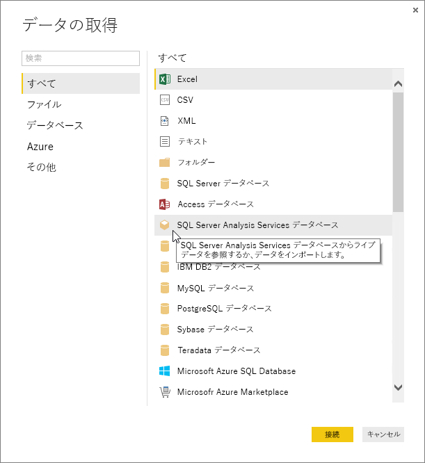
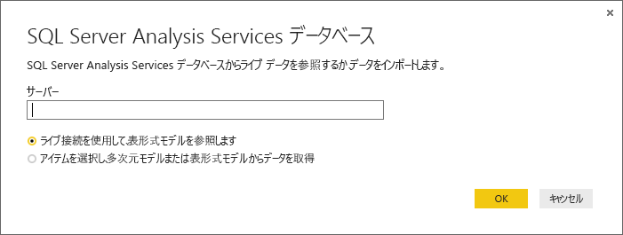
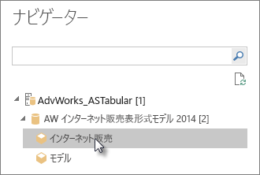
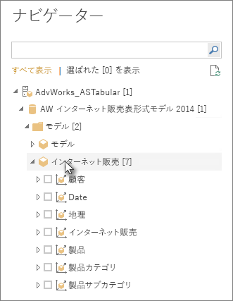
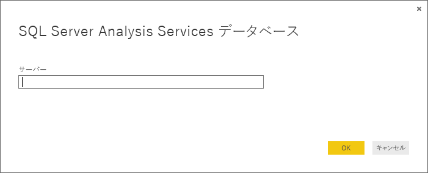

# Power BI Desktop で Analysis Services の表形式データを使用する
Power BI Desktop では、2 つの方法で SQL Server Analysis Services 表形式モデルに接続し、データを取得することができます。ライブ接続を使用して探索するか、項目を選択して Power BI Desktop にインポートします。

詳しく見てみましょう。

**ライブ接続を使用して探索** – ライブ接続を使用している場合、テーブル、列、メジャーなどの表形式モデルやパースペクティブは、Power BI Desktop の [フィールド] 一覧に表示されます。 Power BI Desktop の高度な視覚化とレポート ツールを使用して、新しい高度な対話型方式で表形式モデルを探索することができます。

ライブ接続しているときは、表形式モデルのデータが Power BI Desktop にインポートされることはありません。 視覚化と対話するたびに、Power BI Desktop は表形式モデルのクエリを実行し、表示結果を計算します。 常に最新のデータが表示されます。 表形式モデルは高度なセキュリティを備えています。 Power BI Desktop に表示される項目は、接続している表形式モデルに対してあなたが持っているアクセス許可によって異なります。

Power BI Desktop で動的なレポートを作成したら、Power BI サイトに発行してレポートを共有することができます。 表形式モデルにライブ接続している状態で Power BI Desktop ファイルを Power BI サイトに発行するときは、管理者によってオンプレミス データ ゲートウェイがインストールされ、構成されている必要があります。 詳細については、「[オンプレミス データ ゲートウェイ](service-gateway-onprem.md)」をご覧ください。

**項目を選択して Power BI Desktop にインポートする** – このオプションで接続すると、表形式モデルまたはパースペクティブのテーブル、列、メジャーなどの項目を選択して、Power BI Desktop モデルに読み込ませることができます。 Power BI Desktop の高度なクエリ エディターを使用して、必要な整形を施すことができます。 Power BI Desktop のモデリング機能を使用して、データをさらにモデル化することができます。 Power BI Desktop と表形式モデルの間のライブ接続は維持されません。 Power BI Desktop のモデルをオフラインで探索したり、Power BI サイトに発行したりできます。

## 表形式モデルに接続するには
1. Power BI Desktop の **[ホーム]** タブで、 **[データの取得]**をクリックします。
   
   
2. **[SQL Server Analysis Services データベース]**をクリックして、 **[接続]**をクリックします。
   
   
3. サーバー名を入力し、接続モードを選択します。 
   
   
4. この手順は、選択した接続モードによって異なります。

* ライブ接続している場合は、ナビゲーターで表形式モデルまたはパースペクティブを選択します。
  
  
* 項目を選択してデータを取得する場合は、ナビゲーターで表形式モデルまたはパースペクティブを選択します。 さらに、特定のテーブルまたは列だけを読み込むよう選択できます。 読み込み前にデータを整形するには、[編集] をクリックしてクエリ エディターを開きます。 準備ができたら、[読み込み] をクリックして、Power BI Desktop にデータをインポートします。

  

## よく寄せられる質問
**質問:** オンプレミス データ ゲートウェイが必要ですか?

**回答:** 場合によって異なります。 Power BI Desktop を使用して表形式モデルにライブ接続していても、Power BI サイトに発行するつもりがないなら、ゲートウェイは必要ありません。 一方、Power BI サイトに発行する予定がある場合、Power BI サービスとオンプレミスの Analysis Services サーバー間の安全な通信を確保するために、データ ゲートウェイが必要です。 データ ゲートウェイをインストールする前に、必ず Analysis Services サーバー管理者に相談してください。

項目を選択してデータを取得する場合は、Power BI Desktop ファイルに表形式モデルのデータをそのままインポートしているので、ゲートウェイは必要ありません。

**質問:** Power BI サービスから表形式モデルにライブ接続するのと、Power BI Desktop からライブ接続するのは、何が違うのですか?

**回答:** 表形式モデルへのライブ接続が、Power BI サービスのサイトから組織のオンプレミスの Analysis Services データベースに対して行われる場合、安全な通信を確立するためにオンプレミス データ ゲートウェイが必要です。 Power BI Desktop から表形式モデルにライブ接続する場合、Power BI Desktop と接続先の Analysis Services サーバーは、どちらも組織内でオンプレミスで動作しているため、ゲートウェイは必要ありません。 ただし、Power BI Desktop ファイルを Power BI サイトに発行する場合、ゲートウェイが必要です。

**質問:** ライブ接続を作成したら、同じ Power BI Desktop ファイル内の別のデータ ソースに接続できますか?

**回答:** いいえ。 ライブ データを探索したり、同じファイルの別の種類のデータ ソースに接続したりすることはできません。 既にデータをインポートしている場合、または Power BI Desktop ファイル内の別のデータ ソースに接続している場合は、新しいファイルを作成してライブ探索する必要があります。

**質問:** ライブ接続を作成したら、Power BI Desktop でモデルやクエリを編集できますか?

**回答:** Power BI Desktop でレポート レベル メジャーを作成できますが、その他のクエリおよびモデル化機能はすべて、ライブ データの探索中は無効になっています。

**質問:** ライブ接続を作成しましたが、セキュリティで保護されていますか。

**回答:** はい。 現在の Windows 資格情報が、Analysis Services サーバーへの接続に使用されます。 ライブ探索時は、Power BI サービスでも Power BI Desktop でも基本認証または保存された資格情報を使用することはできません。

**質問:** ナビゲーターに、モデルとパースペクティブが表示されています。 違いは何ですか?

**回答**: パースペクティブは、表形式モデルの特定のビューです。 固有のデータ分析のニーズに応じて、特定のテーブル、列、またはメジャーのみが含まれています。 表形式モデルには、常に 1 つ以上のパースペクティブがあります。それに、モデル内のすべてが含まれています。 どちらを選択すればよいか分からない場合は、管理者に確認してください。

## 初回接続後にサーバー名を変更するには
ライブ接続探索で Power BI Desktop ファイルを作成した後に、別のサーバーに接続を切り替えたくなる場合があるかもしれません。 たとえば、開発サーバーに接続して Power BI Desktop ファイルを作成した後に、接続を実稼働サーバーに切り替えてから Power BI サービスに発行したい場合などです。

1. リボン バーから **[クエリを編集]** を選択します。
   
   
2. 新しいサーバー名を入力します。
   
   

