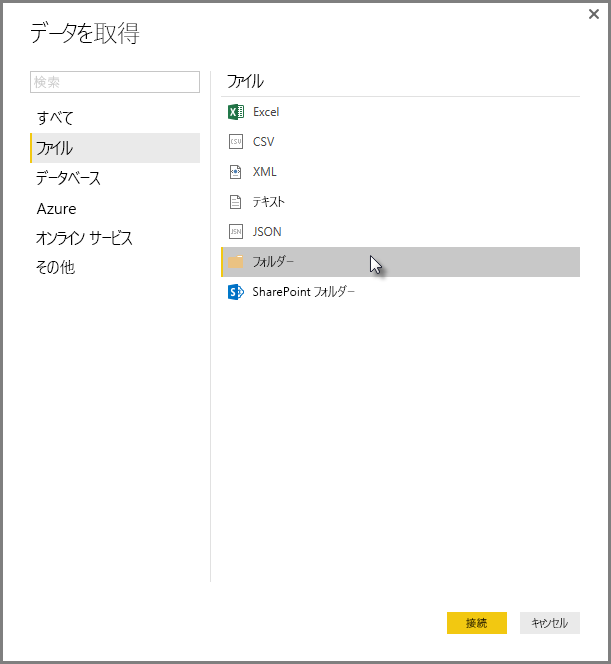
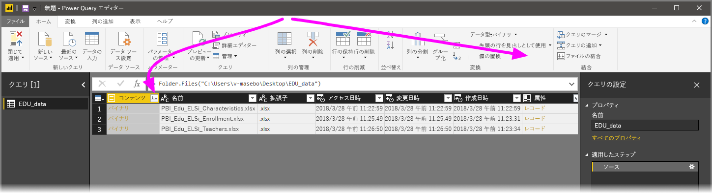
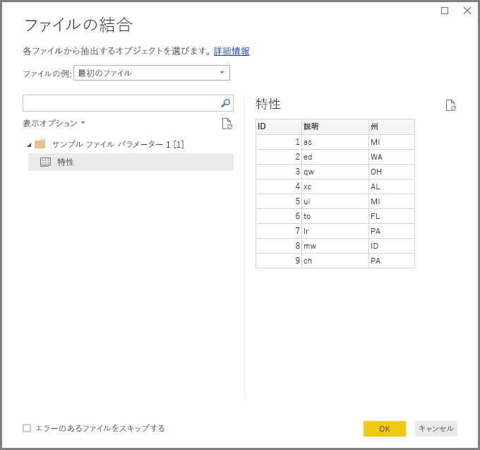
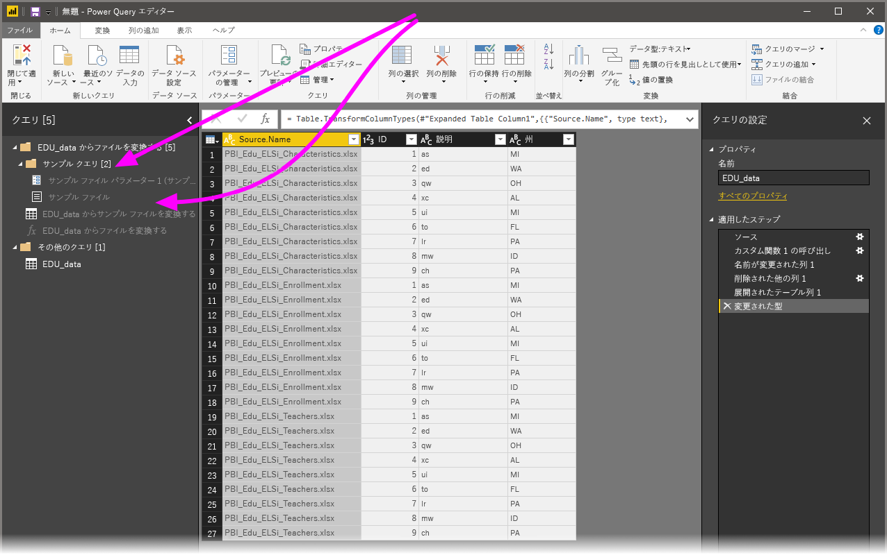

# Power BI Desktop でバイナリを結合する
**Power BI Desktop** にデータをインポートする強力な方法の 1 つは、スキーマが一致している複数のファイルを単一の論理テーブルに組み合わせることです。 この記事で説明するように、**Power BI Desktop** の 2016 年 11 月以降のリリースでは、この便利で人気のある方法がいっそう強化され、拡張されています。

同じフォルダーのバイナリを結合するプロセスを始めるには、**[データの取得] > [ファイル] > [フォルダー]** の順に選択します。

## 以前のバイナリ結合動作
**Power BI Desktop** の 2016 年 11 月より前のリリースでは、**バイナリの結合**変換で特定の種類のファイルを組み合わせることができましたが、制限がありました。

* ファイルが 1 つのテーブルに結合される前の、個々のファイルについての変換は考慮されませんでした。 そのため、多くの場合、ファイルを結合した後、編集プロセスの一環として行をフィルター処理することで、*ヘッダー値*を除外する必要がありました。
* **バイナリの結合**変換は、*テキスト*または *CSV* ファイルに対してのみ使用でき、Excel ブックや JSON ファイルなどの他のサポートされるファイル形式には使用できませんでした。

ユーザーから**バイナリの結合**の操作をよりわかりやすくして欲しいという要望があったため、変換機能が強化されました。

## 現在のバイナリ結合動作
**Power BI Desktop** の**バイナリの結合**の処理が、これまでより効率的になりました。 **バイナリの結合**を開始するには、**[クエリ エディター]** の **[ホーム]** リボン タブから、または列自体から選択します。

新しくなった**バイナリの結合**変換は次のように動作します。

* **バイナリの結合**変換は、各入力ファイルを分析し、使用する適切なファイル形式を決定します (*テキスト* ファイル、*Excel ブック* ファイル、*JSON* ファイルなど)。
* 変換では、最初のファイルから特定のオブジェクト (*Excel ブック*など) を選択して抽出できます。
  
  
* その後、**バイナリの結合**は以下のことを自動的に行います。
  
  * 単一のファイルで必要なすべての抽出手順を実行するクエリの例を作成します。
  * ファイル/バイナリ入力を*見本クエリ*にパラメーター化する*関数クエリ*を作成します。 見本クエリと関数クエリはリンクされており、見本クエリを変更すると関数クエリに反映されます。
  * 入力バイナリを持つ元のクエリ (たとえば、*フォルダー* クエリ) に*関数クエリ*を適用して各行のバイナリ入力に関数クエリを適用した後、結果のデータ抽出を最上位の列として展開します。
    
    

**バイナリの結合**の新しい動作では、ファイルの種類と構造が同じであれば (同じ列のように)、特定のフォルダー内のすべてのバイナリを簡単に結合できます。

さらに、自動的に作成される*見本クエリ*を修正することで、適用される変換および抽出の手順を簡単に変更できます。*関数クエリ*の手順を変更したり追加作成したりする必要はありません。*見本クエリ*に対するすべての変更は、リンクされた*関数クエリ*に自動的に生成されます。

## 次の手順
Power BI Desktop を使用して接続できるデータの種類は他にもあります。 データ ソースの詳細については、次のリソースを参照してください。

* [Power BI Desktop の概要](desktop-getting-started.md)
* [Power BI Desktop のデータ ソース](desktop-data-sources.md)
* [Power BI Desktop でのデータの整形と結合](desktop-shape-and-combine-data.md)
* [Power BI Desktop で CSV ファイルに接続する](desktop-connect-csv.md)   
* [Power BI Desktop にデータを直接入力する](desktop-enter-data-directly-into-desktop.md)   

