# Power BI Desktop での一般的なクエリ タスク
Power BI Desktop の **クエリ エディター** ウィンドウで作業するとき、一般的に使用される多数のタスクがあります。 このドキュメントでは、それらの一般的なタスクについて説明し、追加情報へのリンクを示します。 

ここでは、以下の一般的なクエリ タスクについて説明します。

* データへの接続
* データの整形と結合
* 行のグループ化
* 列のピボット
* カスタム列の作成
* 数式のクエリ

これらのタスクを完了するために、いくつかのデータ接続を使用します。 これらのタスクの手順をユーザー自身で実行することもできるように、データはダウンロードや接続が可能になっています。

最初のデータ接続は Excel ブックです。これは[このリンク](http://download.microsoft.com/download/5/7/0/5701F78F-C3C2-450C-BCCE-AAB60C31051D/PBI_Edu_ELSi_Enrollment_v2.xlsx)からダウンロードできます。 もう 1 つは Web リソースで (これは他の Power BI Desktop のヘルプ コンテンツにも使用されます)、以下の場所からアクセスできます。

[*http://www.bankrate.com/finance/retirement/best-places-retire-how-state-ranks.aspx*](http://www.bankrate.com/finance/retirement/best-places-retire-how-state-ranks.aspx)

一般的なクエリ タスクは、それら両方のデータ ソースへの接続に必要な手順によって開始します。

## データへの接続
Power BI Desktop のデータに接続するには、リボンの **[ホーム]** タブで **[データの取得]** ボタンを選択します。 Power BI Desktop は、最も一般的なデータ ソースのメニューを表示します。 Power BI Desktop が接続できるデータ ソースの完全な一覧を表示するには、メニューの下部にある **[その他]** ボタンを選択します。 詳しくは、「[Power BI Desktop のデータ ソース](https://docs.microsoft.com/power-bi/desktop-data-sources)」をご覧ください。

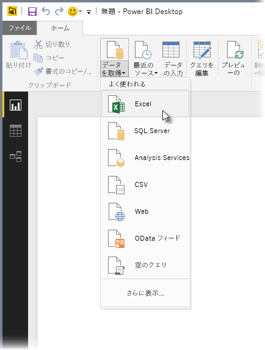

最初に、 **[Excel]** を選択してブックに移動し、それを選択します。 クエリはブックを検査して、検出したデータを **[ナビゲーター]** ウィンドウに表示します。

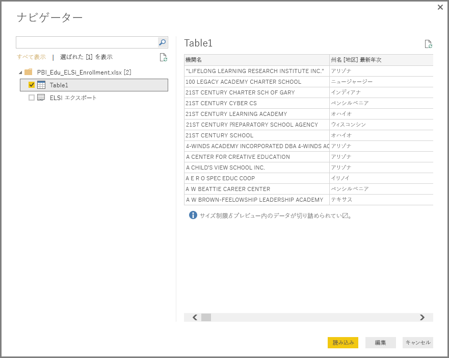

データを Power BI Desktop に読み込む前に、 **[編集]** をクリックしてデータを調整したり、 *整形* したりできます。 読み込みの前にクエリを編集することは、読み込む前にサイズを縮小する予定の大規模なデータ セットを使用する際に特に役立ちます。 これを行うため、 **[編集]** を選択します。

さまざまな種類のデータに接続することは、とても簡単です。 また、Web リソースに接続することもできます。 **[データの取得] \> [その他]** の順に選んでから、**[その他] \> [Web]** の順に選びます。

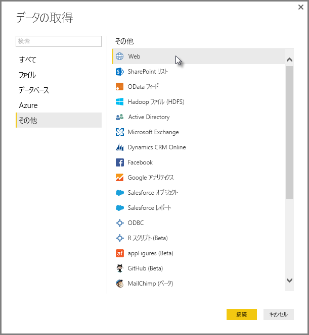

**\[From Web\]\(取得元の Web\)** ウィンドウが表示され、ここに Web ページの URL を入力できます。

**[OK]** を選択すると、以前と同様に、Power BI Desktop はブックを検査して検出されたデータを **[ナビゲーター]** ウィンドウに表示します。

その他のデータ接続も類似しています。 データ接続に認証が必要な場合、Power BI Desktop は適切なユーザーが資格情報を入力するように求めるダイアログを表示します。

Power BI Desktop 内のデータに接続する方法を示すステップごとの実例については、「[Power BI Desktop におけるデータへの接続](https://docs.microsoft.com/power-bi/desktop-connect-to-data)」をご覧ください。

## データの整形と結合
クエリ エディターを使用すると、データの整形と結合を簡単に行うことができます。 このセクションでは、データを整形する方法を示すいくつかの例を示します。 データを整形および結合する方法を示す、より詳しい実例は、「**[Power BI Desktop でのデータの整形と結合](https://docs.microsoft.com/power-bi/desktop-shape-and-combine-data)**」をご覧ください。

前のセクションでは、Excel ブックと Web リソースという 2 組のデータに接続しました。 クエリ エディターに読み込まれると、選択した Web ページから ([クエリ エディター] ウィンドウの左側の **[クエリ]** ウィンドウにある使用可能なクエリの一覧から)、クエリに関して以下が表示されます。

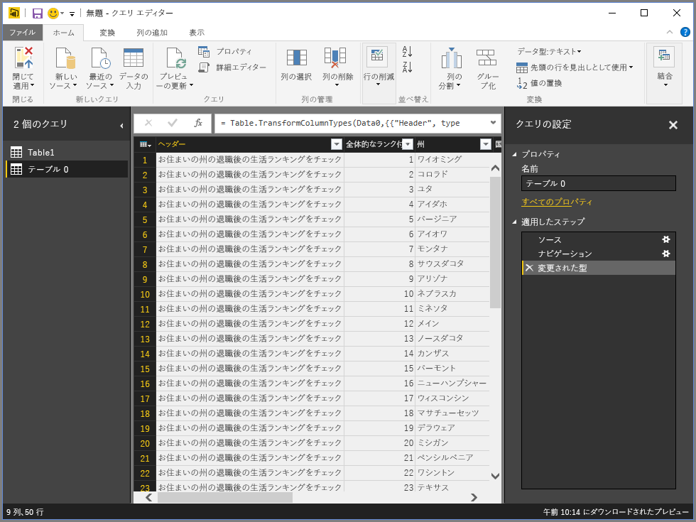

データを整形するときには、データ ソースの形式と書式をユーザーの必要に合わせて変換します。 このケースでは、「 *ヘッダー* 」というタイトルの最初の列が不要であるため、削除します。

**クエリ エディター**では、多くのコマンドがリボン内と状況依存の右クリック メニュー内にあります。 たとえば、*[ヘッダー]* 列を右クリックすると、表示されるメニューによって列を削除できます。 また、列を選択してから、リボンの **[列の削除]** ボタンを選択することもできます。

このクエリでは、他のさまざまな方法によってもデータを整形できます。上または下から任意の数の行を削除したり、列の追加、列の分割、値の置換、その他の整形タスクを実行したりして、ユーザーの必要とする方法でクエリ エディターがデータを取得するようにすることができます。

## 行のグループ化
クエリ エディターでは、複数の行の値をグループ化して単一の値にすることができます。 これは、提供される製品の数、総売り上げ高、生徒の数などを集計する際に便利です。

この例では、教育登録データ セット内の複数の行をグループ化します。 データは、Excel ブックからのもので、必要な列だけを取得するようにクエリ エディターで整形され、テーブルの名前が変更され、他のいくつかの変換が実行されています。

各州に存在する政府機関 (学区や地域サービス区などの他の教育機関を含む) の数を検索することにします。 *[州の略名]* 列を選択して、リボンの **[変換]** タブまたは **[ホーム]** タブで **[Group By]** ボタンを選択します (**[Group By]** はどちらのタブにもあります)。

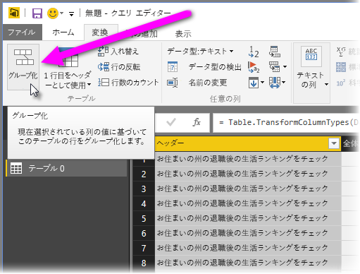

**[グループ化…]** ウィンドウが表示されます。 クエリ エディターが行をグループ化すると、 **Group By** の結果が格納される新しい列が作成されます。 **Group By** 操作は、次の方法で調整できます。

1. *グループ化* – グループ化する列。選択済みの列がクエリ エディターによって選ばれますが、このウィンドウでテーブル内の任意の列に変更できます。
2. *新しい列名* – クエリ エディターによって新しい列に、グループ化される列に適用する操作に基づいた名前の候補が示されますが、新しい列には任意の名前を指定できます。
3. *操作* – ここで、クエリ エディターが適用される操作を指定します。
4. *[グループの追加]* と *[集計の追加]* – これらのオプションは、**[詳細]** オプションを選択した後に表示されます。 複数の列でグループ化操作 (**[グループ化]** 操作) の実行や、複数の集計操作の実行を、すべて **[グループ化]** ウィンドウ内で、すべて 1 つの操作で行うことができます。 クエリ エディターは、複数の列に対する処理を行う 1 つの新しい列を (このウィンドウでの選択に基づいて) 作成します。 

**[グループの追加]** または **[集計の追加]** ボタンを選択すると、**[グループ化]** 操作にグループ化または集計を追加できます。 **[...]** アイコンを選択し、**[削除]** を選択すると、列または集計を除去することができます。実際に試行して、結果を確認してみてください。
   
   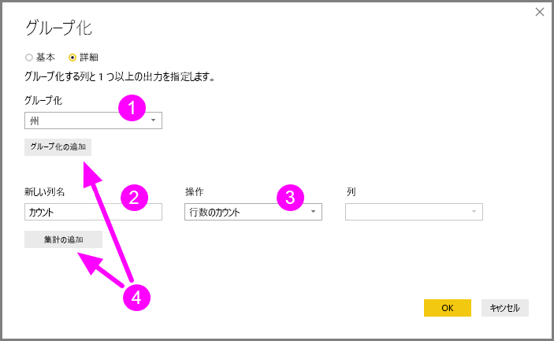

**[OK]** を選ぶと、クエリは **Group By** 操作を実行して結果を返します。 驚きの結果です。オハイオ州、テキサス州、イリノイ州、カリフォルニア州には、それぞれ 1000 を超える数の機関があります。

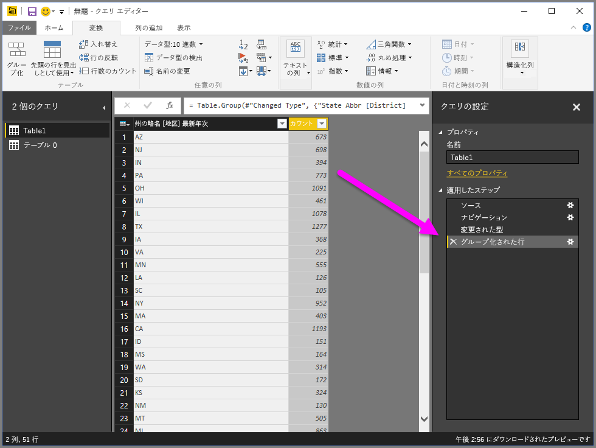

また、クエリ エディターでは、直前に完了したステップの横にある **[X]** を選ぶと、最後の整形操作をいつでも取り消すことができます。 それで、試行してみてください。結果に満足できない場合は、クエリ エディターによってデータの適切な整形が行われるまで、ステップを再実行します。

## 列のピボット
Power BI Desktop では、列をピボットして、列内の一意の値ごとの集計値を含むテーブルを作成できます。 たとえば、各製品カテゴリに含まれる異なる製品の数を知る必要がある場合、そのとおりの処理を行うテーブルを素早く作成することができます。

例を見てみましょう。 次の「 **製品** 」テーブルは、一意の各製品 (その名前) と、その製品が分類されるカテゴリだけを示すように整形されています。 ( *CategoryName* 列に基づいて) 各カテゴリの製品数を示す新しいテーブルを作成するには、列を選択してから、リボンの **[変換]** タブにある **[列のピボット]** を選択します。

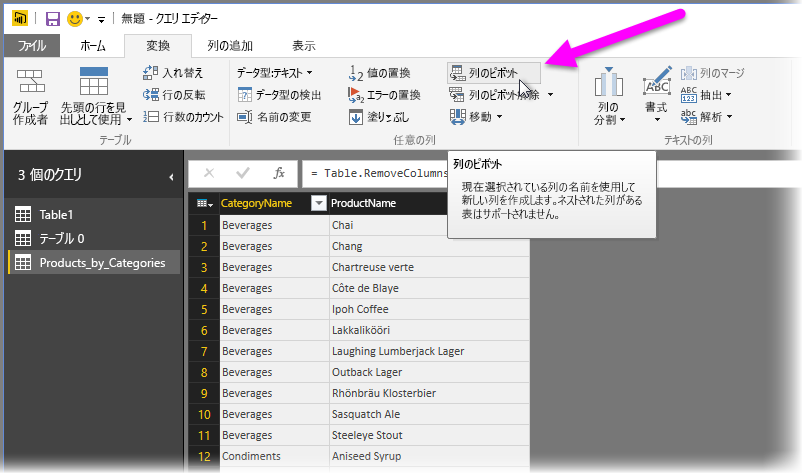

**[列のピボット]** ウィンドウが表示されて、新しい列の作成に使用される列の値が示され (1)、**[詳細オプション]** を展開すると (2)、集計値に適用される関数を選択することができます (3)。

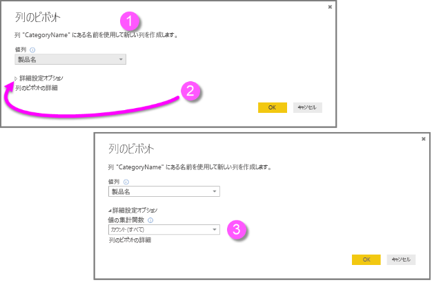

**[OK]** を選択すると、クエリは **[列のピボット]** ウィンドウで指定された変換の指示に従ってテーブルを表示します。

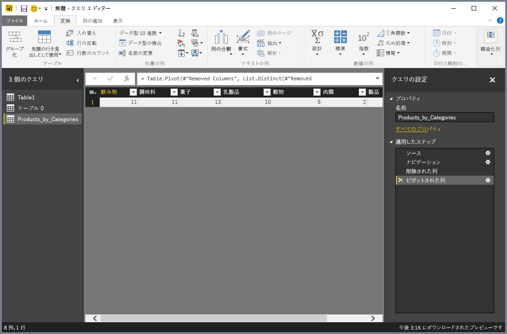

## カスタム列の作成
クエリ エディターでは、テーブル内の複数の列で実行されるカスタムの数式を作成して、それらの数式の結果を新しい (カスタムの) 列に入れることができます。 クエリ エディターを使用すると、簡単にカスタム列を作成できます。

クエリ エディターで、リボンの **[列の追加]** タブから **[カスタム列]** を選択します。

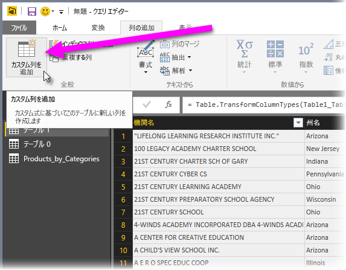

次のウィンドウが表示されます。 次の例では、英語学習者 (ELL) である合計生徒数のパーセンテージを計算する、「 *Percent ELL* 」という名前のカスタム列を作成します。

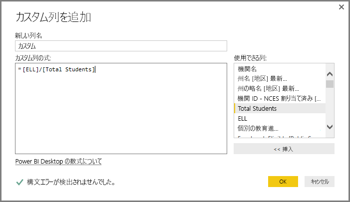

クエリ エディター内の他のすべての適用ステップと同様に、必要なデータが新しいカスタム列に存在しない場合は、 **\[Added Custom\]\(追加されたカスタム\)** ステップの横にある **[X]** を選択するだけで、 **[クエリの設定]** ウィンドウの **[適用される手順]** セクションからステップを削除できます。

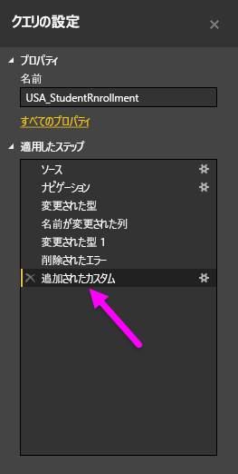

## 数式のクエリ
クエリ エディターによる生成手順を編集して、データの接続と整形を正確に制御するカスタムの数式を作成できます。 クエリ エディターがデータに対してアクションを実行するたびに、アクションに関連付けられた数式が **数式バー**に表示されます。 **数式バー**を表示するには、リボンの **[ビュー]** タブにある **数式バー** の横のチェックボックスを選択します。

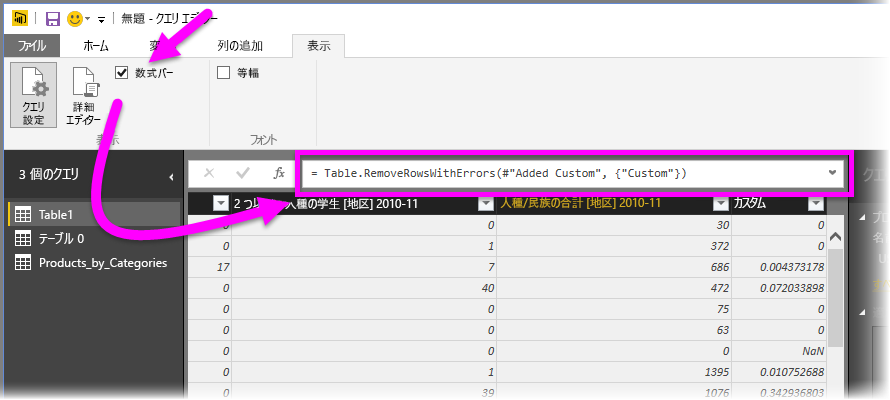

クエリ エディターは、各クエリに適用されているすべてのステップを、表示や変更が可能なテキストとして保持します。 クエリのテキストは、リボンの **[ビュー]** タブで **[詳細設定エディター]** を選択すると表示される、 **詳細設定エディター** を使用して表示または変更できます。

**USA\_StudentEnrollment** クエリに関連付けられたクエリ手順が表示されている、**詳細設定エディター**をここに示します。 これらの手順は、しばしば「**M**」と呼ばれる Power Query 数式言語で作成されています。詳しくは、「[Power Query 数式の詳細について](https://support.office.com/article/Learn-about-Power-Query-formulas-6bc50988-022b-4799-a709-f8aafdee2b2f)」をご覧ください。 言語仕様そのものを確認するには、「[Microsoft Power Query for Excel の数式言語仕様](http://go.microsoft.com/fwlink/?linkid=320633)」を参照してください。

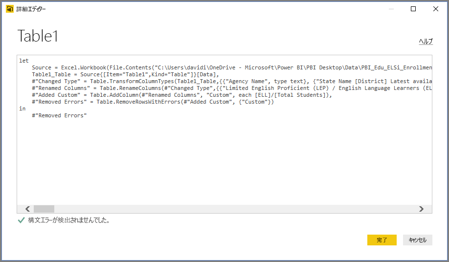

Power BI Desktop には、数式カテゴリの幅広いセットが備わっています。 詳細について、およびクエリ エディターの数式すべての完全なリファレンスは、「[Power Query 数式のカテゴリ](https://support.office.com/article/Power-Query-formula-categories-125024ec-873c-47b9-bdfd-b437f8716819)」をご覧ください。

クエリ エディターの数式のカテゴリを次に示します。

* 数
  * 定数
  * 情報
  * 変換および書式設定
  * 書式
  * 丸め処理
  * 操作
  * ランダム
  * 三角関数
  * バイト
* テキスト
  * 情報
  * テキストの比較
  * 抽出
  * 変更
  * メンバーシップ
  * 変換
* 論理
* 日付
* 時刻
* DateTime
* DateTimeZone
* 期間
* レコード
  * 情報
  * 変換
  * 選択
  * シリアル化
* 一覧
  * 情報
  * 選択
  * 変換
  * メンバーシップ
  * 操作の設定
  * 順序付け
  * 平均値
  * 追加
  * 数値
  * ジェネレータ
* テーブル
  * テーブルの構築
  * コンバージョン
  * 情報
  * 行の操作
  * 列の操作
  * メンバーシップ
* 値
* 算術演算
* パラメーターの型
* メタデータ
* データへのアクセス
* URI
* バイナリ形式
  * 数値の読み取り
* バイナリ
* 行
* 式
* 関数
* エラー
* 比較演算子
* スプリッター
* コンバイナ
* 置換関数
* 種類

## 次の手順
Power BI Desktop を使用すると、さまざまなことを行えます。 そのような機能について詳しくは、次のリソースをご覧ください。

* [Power BI Desktop とは何ですか?](desktop-what-is-desktop.md)
* [Power BI Desktop でのクエリの概要](desktop-query-overview.md)
* [Power BI Desktop のデータ ソース](desktop-data-sources.md)
* [Power BI Desktop におけるデータへの接続](desktop-connect-to-data.md)
* [Power BI Desktop でのデータの整形と結合](desktop-shape-and-combine-data.md)

