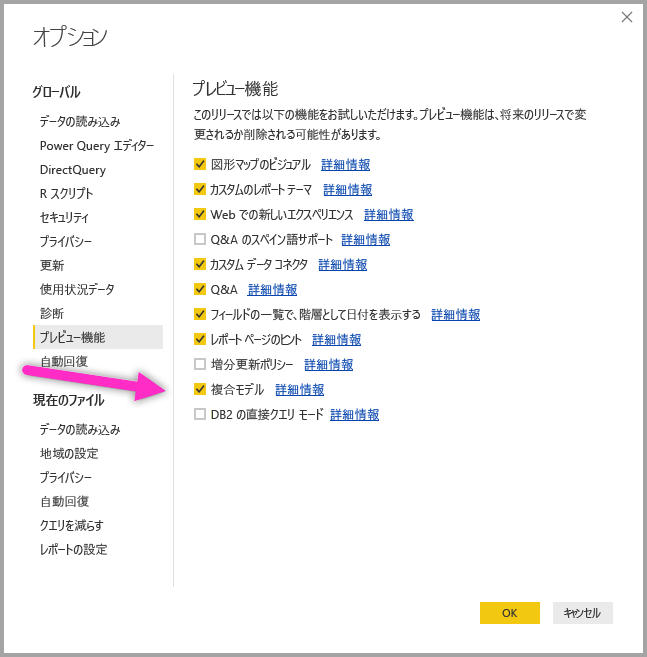

# Power BI Desktop (プレビュー) での複合モデル

**Power BI Desktop** 以前のバージョンでは、レポートに DirectQuery を使用した場合、そのレポートで DirectQuery またはインポートが許可されているかどうかにかかわらず、他のデータ接続は使用できませんでした。 **複合モデル**では制限がなくなり、複数の DirectQuery またはインポート データ接続からのデータ接続を任意の組み合わせでシームレスにレポートに含めることができるようになりました。

**Power BI Desktop** の**複合モデル**機能は、3 つの関連する機能で構成されています。

* **複合モデル**: 複数のデータ接続 (DirectQuery 接続やインポートなど) を任意の組み合わせでレポートに含めることができます。
* **多対多のリレーションシップ**: **複合モデル**を使用すると、テーブル間に**多対多のリレーションシップ**を確立できます。これにより、テーブル内の一意の値に関する要件と、リレーションシップを確立するためだけに新しいテーブルを導入するなどの以前の回避策が不要になります。 
* **ストレージ モード**: DirectQuery に基づく場合でも、バックエンド データ ソースに対するクエリが必要で、インポートが不要なビジュアルを指定できるようになりました。その結果、パフォーマンスが向上し、バックエンドの負荷が軽減されます。 以前は、スライサーのような単純なビジュアルでも、バックエンド ソースに対してクエリの送信が開始されました。 

**複合モデル**のこの 3 つの関連機能群については、それぞれ別々の記事で説明されています。

* **複合モデル**については、この記事で詳しく説明します。
* **多対多のリレーションシップ**については、「[Power BI Desktop の多対多のリレーションシップ (プレビュー)](desktop-many-to-many-relationships.md)」を参照してください。
* **ストレージ モード**については、「[Power BI Desktop のストレージ モード (プレビュー)](desktop-storage-mode.md)」を参照してください。

## 複合モデルのプレビュー機能を有効にする

**複合モデル**機能はプレビュー段階であり、**Power BI Desktop** で有効にする必要があります。 **複合モデル**を有効にするには、**[ファイル] > [オプションと設定] > [オプション] > [プレビュー機能]** の順に選択し、**[複合モデル]** チェックボックスをオンにします。 

この機能を有効にするには、**Power BI Desktop** を再起動する必要があります。

## 複合モデルを使用する

**複合モデル**を使用すると、**Power BI Desktop** または **Power BI サービス**を使用して、あらゆる種類のデータ ソースに、さまざまな方法で接続できます。 Power BI へのデータのインポートは、最もよく使われるデータ取得方法です。また、DirectQuery を使用して元のソース リポジトリ内のデータに直接接続することもできます。 DirectQuery の詳細については、[Power BI で DirectQuery を使用する方法](desktop-directquery-about.md)に関する記事を参照してください。

DirectQuery を使用するときに、**複合モデル**を使用すると、以下のいずれか、または両方を実行する Power BI モデル (単一の .pbix Power BI Desktop ファイルなど) を作成できます。

* 1 つ以上の DirectQuery ソースのデータを結合する
* DirectQuery ソースのデータとインポート データを結合する

たとえば、**複合モデル**を使用すると、エンタープライズ データ ウェアハウスの売上データ、部門の SQL Server データベース内にある売上目標のデータ、およびスプレッドシートからインポートした一部のデータを組み合わせたモデルを構築することができます。 複数の DirectQuery ソースのデータを結合したモデル、または DirectQuery とインポートされたデータを結合したモデルは、*複合モデル*と呼ばれます。

> [!NOTE]
> 複合モデルがプレビュー段階の間は、複合モデルを Power BI サービスに発行することはできません。 

異なるソースのテーブルであっても、テーブル間にリレーションシップを作成できます。ただし、異なるソース間のリレーションシップは、実際のカーディナリティにかかわらず、**多対多**のカーディナリティを持つと定義する必要がある、という制限事項があります。 このようなリレーションシップの動作は、[Power BI Desktop の多対多のリレーションシップ (プレビュー)](desktop-many-to-many-relationships.md) に関する記事で説明されているように、通常の**多対多**のリレーションシップの場合と同じです。 複合モデルのコンテキスト内では、実際にインポートされる基のデータ ソースにかかわらず、すべてのインポートされるテーブルは実質的に単一のソースである点に注意してください。   

## 複合モデルの使用例

**複合モデル**の例として、DirectQuery を使用して会社のデータ ウェアハウス (SQL Server 内) に接続するレポートについて考えて見ましょう。このデータ ウェアハウスには、次の図のように、*Sales by Country* (国別売上)、*Quarter* (四半期)、*Bike (Product)* (自転車 (製品)) のデータが含まれています。

この段階では、このソースのフィールドを使用して簡単なビジュアルを作成できます。 たとえば、次のビジュアルは、選択した四半期の合計売上高を *ProductName* (製品名) 別に表示しています。 

ただし、各製品に割り当てられたプロダクト マネージャーに関する情報と、マーケティングの優先順位があり、そのデータが Excel スプレッドシートで管理されている場合はどうすればよいでしょうか。 *Product Manager* (プロダクト マネージャー) 別の *Sales Amount* (売上高) を確認したいところですが、このローカル データを会社のデータ ウェアハウスに追加することはほぼ実現不可能で、うまく行っても数か月かかります。 (DirectQuery を使用する代わりに) データ ウェアハウスからその売上データをインポートし、そのときにスプレッドシートからインポートされたデータと結合することはできますが、基のソースに適用されるセキュリティ ルールの組み合わせ、最新のデータを確認できる必要性、膨大な量のデータなど、DirectQuery を使用するそもそもの理由を考慮すると、この方法は合理的ではありません。 

このような場合に**複合モデル**が役立ちます。 複合モデルなら、DirectQuery を使用してデータ ウェアハウスに接続してから、追加のソースに対して GetData を使用することもできます。 この場合、会社のデータ ウェアハウスに対して DirectQuery 接続を確立し、GetData を使用して Excel を選択し、ローカル データを含むスプレッドシートに移動し、*ProductNames* (製品名)、割り当てられた *SalesManager* (セールス マネージャー)、および *Priority* (優先度) を含むシートをインポートできます。  

![[ナビゲーター] ウィンドウ](media/desktop-composite-models/composite-models_06.png)

**[フィールド]** リストには、元の *Bike* テーブル (SQL Server) と新しい *Product Managers* テーブル (Excel からインポートされたデータを含む) が表示されます。 

同様に、**Power BI Desktop** で**リレーションシップ ビュー**を見ると、*Product Managers* という追加のテーブルが表示されます。 

通常どおりに *Bike* テーブル (SQL Server) と *Product Manager* テーブル (インポートされたテーブル) 間のリレーションシップ (*Bike[ProductName]* と *ProductManagers[ProductName]* 間など) を作成することで、モデルの他のテーブルに関連付ける必要があります。 この記事で前述したように、ソースを横断するすべてのリレーションシップは、**多対多**のカーディナリティを選択する必要があるので、既定のカーディナリティが選択されています。 

![[リレーションシップの作成] ダイアログ](media/desktop-composite-models/composite-models_09.png)

このリレーションシップが作成されると、リレーションシップは想定どおりに **Power BI Desktop** の**リレーションシップ ビュー**に表示されます。

このようなテーブル リレーションシップが確立したら、**[フィールド]** リストのすべてのフィールドを使用し、複数のソースのデータをシームレスに混在させてビジュアルを作成できます。 たとえば、次のビジュアルは、各 *Product Manager* (プロダクト マネージャー) 別の *Sales Amount* (売上高) の合計を示しています。 

![[フィールド] ウィンドウが表示されたビジュアル](media/desktop-composite-models/composite-models_11.png)

この例は、*Product* (製品) や *Customer* (顧客) などの*ディメンション* テーブルをどこか別の場所からインポートされた追加データを使用して拡張する一般的なケースを示しています。テーブルで DirectQuery 接続を使用して異なるソースに接続することもできます。 この例をさらに広げて、*Country* (国) 別と *Period* (期間) 別の *SalesTargets* (売り上げ目標) が個別の部門データベースに格納されているとします。 次の図のように、通常どおりに **GetData** を使用してそのデータに接続できます。 

![[ナビゲーター] ダイアログ](media/desktop-composite-models/composite-models_12.png)

そうすると、この例の前の手順と同様に、新しいテーブルとモデル内の他のテーブルの間にリレーションシップを作成し、それらのデータを結合するビジュアルを作成することができます。 **リレーションシップ ビュー**をもう一度見てみましょう。拡張された例のシナリオで新しいリレーションシップが確立されています。

次の図のように、作成した新しいデータとリレーションシップに基づいて、左下のビジュアルには、合計の *Sales Amount* (売上合計) と *Target* (目標) と、その差を示す差異の計算が表示されます。この *Sales Amount* (売上合計) と *Target* (目標) は 2 つの異なる SQL Server データベースのデータです。 

## ストレージ モードの設定

**複合モデル**の各テーブルには、テーブルが DirectQuery とインポートのどちらに基づいているかを示す**ストレージ モード**があります。 **ストレージ モード**は、**[プロパティ]** ウィンドウで表示および変更できます。 [プロパティ] ウィンドウに移動するには、**[フィールド]** リストの右クリック コンテキスト メニューから **[プロパティ]** を選択します。 次の図は、**ストレージ モード** を示しています (ウィンドウの幅のために、この図では **[ストレージ ...]** と省略されています)。

**ストレージ モード**は、各テーブルのツールヒントでも確認できます。

いくつかの DirectQuery のテーブルといくつかのインポート テーブルが含まれる **Power BI Desktop** ファイル (.pbix ファイル) の場合、ステータス バーには **[混合]** という**ストレージ モード**が表示されます。 ステータス バーのその単語をクリックすると、すべてのテーブルをインポートするように簡単に切り替えることができます。

**ストレージ モード**の詳細については、「[Power BI Desktop のストレージ モード (プレビュー)](desktop-storage-mode.md)」を参照してください。  

## 計算テーブル

計算テーブルは、DirectQuery を使用するモデルに追加することができます。また、計算テーブルを定義する DAX は、インポート テーブル、DirectQuery テーブル、またはその両方の組み合わせを参照できます。 

計算テーブルは常にインポートされ、テーブルが更新されると、それらのテーブルのデータは更新されます。 そのため、計算テーブルが DirectQuery テーブルを参照している場合、DirectQuery テーブルを参照するビジュアルには、基のソースの最新の値が常に表示されますが、計算テーブルを参照するビジュアルには、計算テーブルが最後に更新されたときの値が表示されます。

## セキュリティへの影響 

複合モデルには、セキュリティへの影響がいくつかあります。 1 つのデータ ソースに送信されるクエリには、別の異なるソースから取得されたデータ値を含めることができます。 この記事で前述した例では、*Product Manager* (プロダクト マネージャー) 別の *Sales Amount* (売上高) を表示するビジュアルの場合、SQL クエリが **Sales** (売上) リレーショナル データベースに送信されます。この SQL クエリには、*Product Managers* (プロダクト マネージャー) の名前と関連する *Products* (製品) の名前を含めることができます。 

このため、スプレッドシートに格納されている情報が、リレーショナル データベースに送信されるクエリに含まれるようになります。 これが機密情報の場合は、この処理のセキュリティへの影響を考慮する必要があります。 特に、次の影響を考慮する必要があります。

* トレースまたは監査ログを参照できるデータベースの管理者は、元のソースのデータに対するアクセス許可 (この場合は Excel ファイルに対するアクセス許可) を持っていなくても、この情報を表示できます。

* 各ソースの暗号化設定を考慮し、暗号化された接続を使用して 1 つのソースから情報を取得してから、暗号化されていない接続を使用して別のソースに送信されるクエリにその情報を誤って含めないようにする必要があります。 

**Power BI Desktop** では、複合モデルを作成するアクションが実行された場合に警告メッセージが表示されるので、セキュリティへの影響が考慮されていることを確認できます。  

同様の理由から、信頼されていないソースから送信された **Power BI Desktop** ファイルを開くときには注意が必要です。 そのファイルに複合モデルが含まれている場合、(そのファイルを開くユーザーの資格情報を使用して) あるソースから取得した情報が、クエリの一部として別のデータ ソースに送信されること (また、その結果、Power BI Desktop ファイルの悪意のある作成者に閲覧される可能性) があります。 そのため、初めて Power BI Desktop ファイルを開くときに、複数のソースが含まれていると、警告が表示されます。 この警告は、ネイティブの SQL クエリを含むファイルを開くときに表示される警告と似ています。  

## パフォーマンスへの影響  

DirectQuery を使用する場合は、常にパフォーマンスを考慮する必要があります。これは、主に良好なユーザー エクスペリエンスを提供できる十分なリソースがバックエンド ソースにあることを確認するためです。 良好なエクスペリエンスとは、ビジュアルが 5 秒以内に更新されることを示します。 また、[Power BI での DirectQuery の使用](desktop-directquery-about.md)に関する記事に記載されているパフォーマンスのアドバイスも守るようにします。 複合モデルを使用する場合、1 つのビジュアルによって複数のソースにクエリが送信され、1 つのクエリの結果が第 2 のソースに渡される結果になることがよくあるので、パフォーマンスの考慮事項も追加されます。 このような状況の場合、次のような実行形式の結果になる可能性があります。

* **多数のリテラル値を含む SQL クエリ**: たとえば、選択された *Product Managers* (プロダクト マネージャー) のセット (スプレッドシートからインポートされた関連テーブル) に関する合計の *Sales Amount* (売上高) (SQL Database) を要求するビジュアルの場合、まずそのプロダクト マネージャーが管理した *Products* (製品) を検索してから、*WHERE* 句ですべての製品 ID を含む SQL クエリを送信する必要があります。

* **ローカルで集計されているデータを使用して、より細かいレベルでクエリを実行する SQL クエリ**: この一覧の前の項目と同じ例を使用すると、*Product Manager* (プロダクト マネージャー) に対するフィルターを満たす *Products* (製品) 数は膨大になるので、どこかの時点で *WHERE* 句ですべてを含めることが非効率または実現不可能になります。 このような場合は、*Product* (製品) の下位レベルでリレーショナル ソースに対してクエリを実行し、ローカルで結果を集計する必要があります。 *Products* (製品) のカーディナリティが 100 万の制限を超えると、クエリは失敗します。

* **複数の SQL クエリ、値ごとに各グループで 1 つ**: 別のソースの列によってグループ化された **DistinctCount** を集計に使用するときに、グループ化を定義する多数のリテラル値を効率的に渡す処理を外部ソースがサポートしていない場合、値ごとに各グループで 1 つの SQL クエリを送信する必要があります。 たとえば、*Product Manager* (プロダクト マネージャー) (スプレッドシートからインポートされた関連テーブル) 別の *CustomerAccountNumber* (顧客アカウント番号) (SQL Server テーブル) を要求するビジュアルの場合、SQL Server に送信されるクエリで *Product Managers* (プロダクト マネージャー) テーブルの詳細を渡す必要があります。 この方法は Redshift のような他のソースよりも実現可能性が低く、*Sales Manager* (セールス マネージャー) ごとに 1 つの SQL クエリが送信されます (クエリが失敗する実用的な限界まで送信されます)。 

これらの各ケースは、パフォーマンスに独自の影響を及ぼします。その詳細は各データ ソースによって異なります。 大まかな経験則によると、2 つのソースを結合するリレーションシップで使用される列のカーディナリティは低いまま (数千) の場合、パフォーマンスへの影響はあまり大きくないはずです。 このカーディナリティが大きくなるほど、結果のパフォーマンスへの影響をさらに考慮する必要があります。 

さらに、**多対多**のリレーションシップを使用する場合、詳細な値をローカルで集計するのではなく、合計/小計レベルごとに、独立したクエリを基のソースに送信する必要があります。 そのため、合計がある単純なテーブル ビジュアルの場合、1 つではなく 2 つの SQL クエリを送信します。 

## 制限事項と考慮事項

このリリースの**複合モデル**にはいくつかの制限事項があります。

次の多次元ソースは、**複合モデル**に使用できません。

* SAP HANA
* SAP Business Warehouse
* SQL Server Analysis Services
* Power BI データ セット

DirectQuery を使用してこのような多次元ソースに接続する場合、別の DirectQuery ソースに接続することも、インポートしたデータと結合することもできません。

DirectQuery を使用する際の既存の制限は、**複合モデル**を使用する場合にも適用されます。 これらの制限事項の多くは、テーブルの**ストレージ モード**に応じてテーブルごとに適用されるようになりました。 たとえば、インポートされたテーブルの計算列からは他のテーブルを参照できますが、DirectQuery テーブルの計算列は同じテーブルの列のみを参照するように制限されています。 モデル内のテーブルのいずれかが DirectQuery の場合、モデル全体に他の制限事項が適用されます。 たとえば、モデル内のいずれかのテーブルに**ストレージ モード**の DirectQuery がある場合、**QuickInsights** 機能と **Q&A** 機能は使用できません。 

## 次の手順

以下の記事では、複合モデルと DirectQuery について詳しく説明しています。

* [Power BI Desktop (プレビュー) での多対多のリレーションシップ](desktop-many-to-many-relationships.md)
* [Power BI Desktop のストレージ モード (プレビュー)](desktop-storage-mode.md)

DirectQuery に関する記事:

* [Power BI で DirectQuery を使用する](desktop-directquery-about.md)
* [Power BI の DirectQuery でサポートされるデータ ソース](desktop-directquery-data-sources.md)

