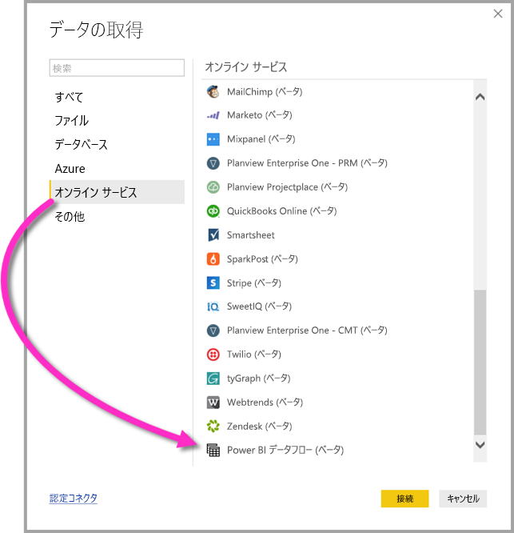

# Power BI Desktop で Power BI データフローによって作成されたデータに接続する (ベータ版)
**Power BI Desktop** では、Power BI Desktop の他のデータ ソースと同様に、**Power BI データフロー**によって作成されたデータに接続できます。

**Power BI データフロー (ベータ版)** コネクタを使用すると、Power BI サービスでデータフローによって作成されたエンティティに接続できます。 

## 考慮事項と制限事項

このベータ版の **Power BI データフロー コネクタ**を使用するには、最新バージョンの **Power BI Desktop** を実行している必要があります。 最新バージョンを確保するために、いつでも [Power BI Desktop をダウンロード](desktop-get-the-desktop.md)し、コンピューターにインストールできます。  

> [!NOTE]
> 以前のバージョンの Power BI データフロー コネクタでは、.MEZ ファイルをダウンロードしてフォルダーに配置する必要がありました。 現在のバージョンの **Power BI Desktop** には Power BI データフロー コネクタが含まれているため、このファイルは不要であり、付属のバージョンのコネクタとの競合の原因になる可能性があります。 この .MEZ ファイルをフォルダーに手動で配置した場合は、ダウンロードした .MEZ ファイルを **Documents > Power BI Desktop > カスタム コネクタ** フォルダーから削除して、競合を回避する "*必要があります*"。 

## デスクトップのパフォーマンス
**Power BI Desktop** は、インストールされているコンピューター上でローカルに実行します。 データフローのインジェストのパフォーマンスは、さまざまな要因によって決まります。 これらの要因には、データのサイズ、コンピューターの CPU と RAM、ネットワーク帯域幅、データ センターからの距離などが含まれます。

データフローのデータ インジェストのパフォーマンスを向上することができます。 たとえば、取り込むデータのサイズが大きすぎて **Power BI Desktop** によってコンピューター上で管理できない場合は、データフロー内のリンクおよび計算されたエンティティを使用して (データフロー内の) データを集約し、あらかじめ準備された集約データだけを取り込むことができます。 この方法では、大規模なデータの処理が **Power BI Desktop** の実行中のインスタンス内でローカルに実行されるのではなく、データフロー内でオンライン実行されます。 このアプローチにより、Power BI Desktop では少量のデータを取り込んで、データフローの応答性と迅速性を確保することができます。

## 考慮事項と制限事項

ほとんどのデータフローは、Power BI サービスのテナント内にあります。 ただし、**Power BI Desktop** の顧客は、データフローの所有者である場合か、データフローの CDM フォルダーに対して明示的に承認済みになっている場合を除いて、Azure Data Lake Storage Gen2 アカウント内に保管されているデータフローにはアクセスできません。 次の状況を検討します。

1.  アンナは新しいアプリのワークスペースを作成して、組織内の Data Lake にデータフローを格納するように構成しました。
2.  ベンは、アンナが作成したワークスペースのメンバーでもあり、Power BI Desktop とデータフロー コネクターを使用して、アンナが作成したデータフローからデータを取得することを考えています。
3.  ベンは Data Lake 内のデータフローの CDM フォルダーに対して承認されたユーザーとして追加されなかったので、エラーを受信します。

    

この問題を解決するには、ベンに CDM フォルダーとその中のファイルに対する閲覧者のアクセス許可を付与する必要があります。 CDM フォルダーへのアクセス権を付与する方法について詳しくは、[こちらの記事](https://go.microsoft.com/fwlink/?linkid=2029121)をご覧ください。

## 次の手順
Power BI データフローを使用して、さまざまな目的の処理を実行できます。 詳細については、次のリソースをご覧ください。

* [データフローを使用したセルフサービスのデータ作成](service-dataflows-overview.md)
* [Power BI でのデータフローの作成と使用](service-dataflows-create-use.md)
* [Power BI Premium での計算されたエンティティの使用 (プレビュー)](service-dataflows-computed-entities-premium.md)
* [オンプレミス データ ソースでのデータフローの使用 (プレビュー)](service-dataflows-on-premises-gateways.md)
* [Power BI データフロー用の開発者向けリソース (プレビュー)](service-dataflows-developer-resources.md)

Azure Data Lake Storage Gen2 との統合について詳しくは、次の記事をご覧ください。

* [データフローと Azure Data Lake の統合 (プレビュー)](service-dataflows-azure-data-lake-integration.md)
* [ワークスペース データ フローの設定の構成 (プレビュー)](service-dataflows-configure-workspace-storage-settings.md)
* [データ フロー としての CDM フォルダーの Power BI への追加 (プレビュー)](service-dataflows-add-cdm-folder.md)
* [データ フロー ストレージ用の Azure Data Lake Storage Gen2 の接続 (プレビュー)](service-dataflows-connect-azure-data-lake-storage-gen2.md)

**Power BI Desktop** に関する以下の記事が役立つ場合もあります。

* [Power BI Desktop のデータ ソース](desktop-data-sources.md)
* [Power BI Desktop でのデータの整形と結合](desktop-shape-and-combine-data.md)
* [Power BI Desktop にデータを直接入力する](desktop-enter-data-directly-into-desktop.md)   

