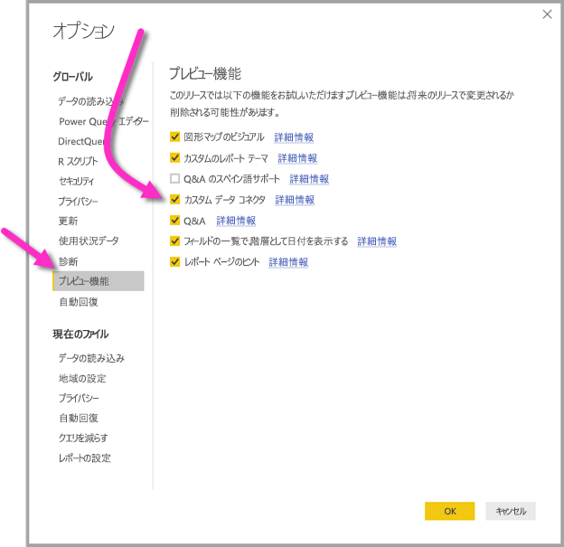

# Power BI Desktop で Power BI データフローによって作成されたデータに接続する (プレビュー)
**Power BI Desktop** では、Power BI Desktop の他のデータ ソースと同様に、**Power BI データフロー**によって作成されたデータに接続できます。

**Power BI データフロー (プレビュー)** コネクタを使用すると、Power BI サービスでデータフローによって作成されたエンティティに接続できます。 データフローはプレビュー段階なので、システムでデータフロー コネクタを使用できるようにするためにいくつかの手順を行う必要があります。 

## Power BI データフロー コネクタをダウンロードして有効にする (プレビュー)

**Power BI データフロー** コネクタのコピーをダウンロードし、コンピューター上の特定の場所にコピーする必要があります。 Power BI Desktop の次回の月次更新プログラムでは、データ コネクタの一覧にこのコネクタが自動的に含まれるので、この手順は不要になります。

**Power BI データフロー コネクタ**は次の場所からダウンロードできます: [Power BI データフロー コネクタ](https://visuals.azureedge.net/cds-analytics/PublicPreview/CDSA.mez)

**Power BI データフロー** コネクタ (プレビュー) をコンピューターで使用できるようにするには、次の手順を行います。

1. .MEZ ファイル (データ コネクタ ファイル) のコピーをダウンロードします。 プライベート プレビューのお客様は、.MEZ ファイルのダウンロード情報を Microsoft から直接受信します。

2. ダウンロードされたデータ コネクタ ファイルを、コンピューター上の**ドキュメント > Power BI Desktop > カスタム コネクタ フォルダー**に配置します。

3. Power BI Desktop で、**[ファイル]、[オプションと設定]、[オプション]** の順に選択し、左側のウィンドウで **[プレビュー機能]** を選択します。

    

4. **[カスタム データ コネクタ]** ボックスがオンになっていない場合は、オンにします。 

5. **Power BI Desktop** を再起動して、コネクタを表示します。

## Power BI データフロー コネクタを使用する (プレビュー)
**Power BI Desktop** が再起動されると、コネクタが利用可能なデータ ソースとして表示されます。 データプールに接続するには、次の図に示すように、**[データの取得]、[オンライン サービス]、[Power BI データフロー (ベータ)]** の順に選択します。

## 考慮事項と制限事項

このプレビュー バージョンの **Power BI データフロー コネクタ**を使用するには、最新バージョンの **Power BI Desktop** を実行している必要があります。 最新バージョンを確保するために、いつでも [Power BI Desktop をダウンロード](desktop-get-the-desktop.md)し、コンピューターにインストールできます。  

注: **Power BI Desktop** の次回の月次更新プログラムで Power BI データフロー コネクタが表示されたら、このダウンロードされた .MEZ ファイルを**ドキュメント > Power BI Desktop > カスタム コネクタ** フォルダーから削除する*必要があります*。 

## 次の手順
Power BI データ接続を使用して、さまざまな目的の処理を実行できます。また、**Power BI Desktop** に関する次の記事を参照すると役立ちます。

* [Power BI Desktop のデータ ソース](desktop-data-sources.md)
* [Power BI Desktop でのデータの整形と結合](desktop-shape-and-combine-data.md)
* [Power BI Desktop にデータを直接入力する](desktop-enter-data-directly-into-desktop.md)   

