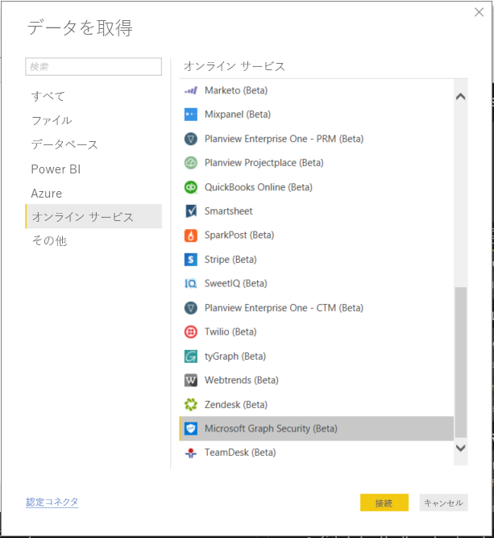
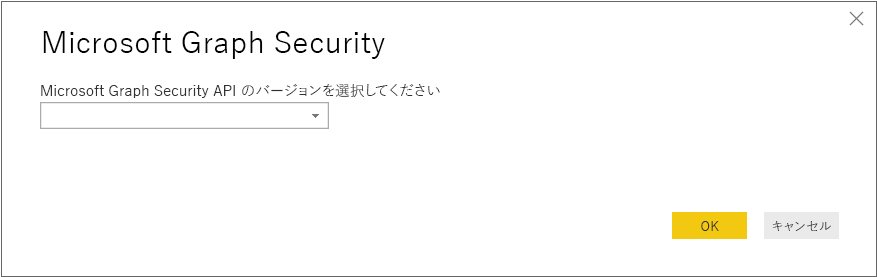
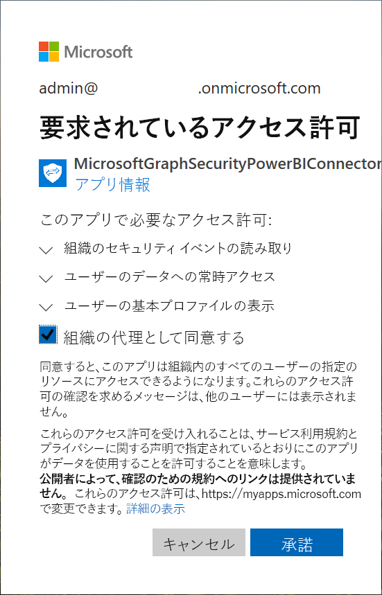
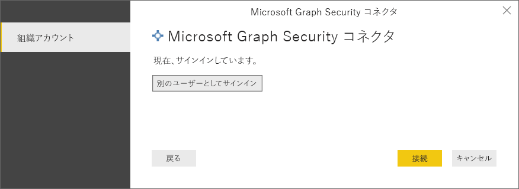
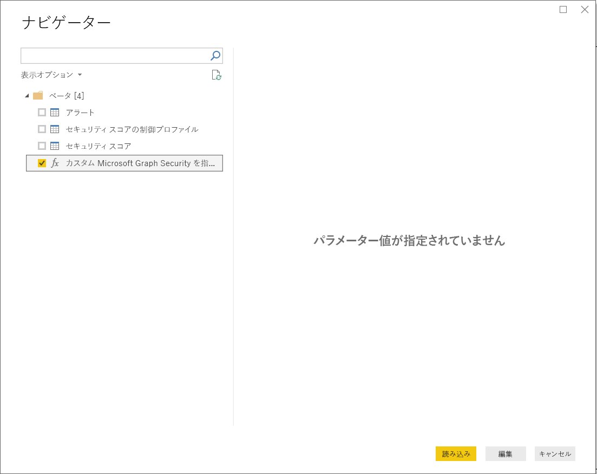
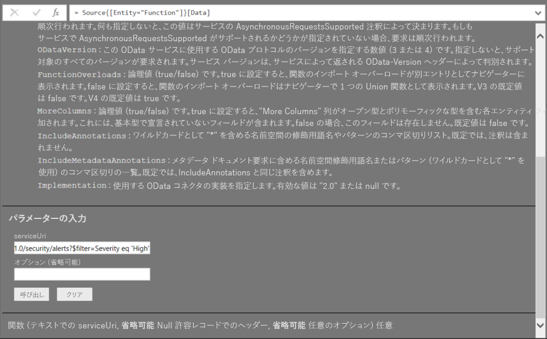

# Power BI Desktop の Microsoft Graph Security に接続する

Power BI Desktop を使用すれば、Microsoft Graph Security Power BI コネクタで Microsoft Graph Security API と接続できます。 接続によりダッシュボードやレポートの構築が可能になり、セキュリティ関連の[アラート](https://docs.microsoft.com/graph/api/resources/alert?view=graph-rest-1.0)や[セキュア スコア](https://docs.microsoft.com/graph/api/resources/securescores?view=graph-rest-beta)から分析情報を得ることができます。 [Microsoft Graph Security API](https://aka.ms/graphsecuritydocs) では、Microsoft やエコシステム パートナーの[複数のセキュリティ ソリューション](https://aka.ms/graphsecurityalerts)を接続することでアラートの相互関連付けを簡単にし、リッチ コンテキスト情報にアクセスできるようにし、自動化を簡単にします。 組織はセキュリティ製品全体から分析情報を短時間で取得し、行動に移せるのみならず、複数の統合を簡素化し、その構築と保守管理にかかるコストを下げることができます。

## Microsoft Graph Security コネクタで接続するための前提条件

* Microsoft Graph Security コネクタを使用するには、Azure Active Directory (AD) テナント管理者の同意が*明示的に与えられている*必要があります。これは [Microsoft Graph Security Authentication の要件](https://aka.ms/graphsecurityauth)に含まれます。 この同意には、Microsoft Graph Security Power BI コネクタのアプリケーション ID と名前が必要です。これは [Azure portal](https://portal.azure.com) でも確認できます。

   | プロパティ | 値 |
   |----------|-------|
   | **アプリケーション名** | `MicrosoftGraphSecurityPowerBIConnector` |
   | **アプリケーション ID** | `cab163b7-247d-4cb9-be32-39b6056d4189` |
   |||

   Azure AD テナント管理者は次のいずれかの手順でコネクタの同意を与えることができます。

   * [Azure AD アプリケーションに対してテナント管理者の同意を与えます](https://docs.microsoft.com/azure/active-directory/develop/v2-permissions-and-consent)。

   * ロジック アプリを最初に実行している間に、アプリでは、[アプリケーションの同意エクスペリエンス](https://docs.microsoft.com/azure/active-directory/develop/application-consent-experience)を介して Azure AD テナント管理者に同意を依頼できます。
   
* Microsoft Graph Security Power BI コネクタで接続する際のサインインに使用するユーザー アカウントは、Azure AD の Security Reader Limited Admin ロールに属している必要があります (Security Reader または Security Administrator)。 「[Assign Azure AD roles to users](https://docs.microsoft.com/graph/security-authorization#assign-azure-ad-roles-to-users)」 (Azure AD ロールをユーザーに割り当てる) セクションの手順に従ってください。 

## Microsoft Graph Security コネクタを使用する

次の手順で **Microsoft Graph Security** コネクタを使用します。

1. Power BI Desktop の **[ホーム]** リボンで  **[データの取得]、[詳細]** の順に選択します。
2. 左側のカテゴリから **[オンライン サービス]** を選択します。
3. **[Microsoft Graph Security (ベータ)]** をクリックします。

    
    
4. **[Microsoft Graph Security]** ウィンドウが表示されたら、クエリを実行する Microsoft Graph API バージョンを選択します。 v1.0 とベータから選択できます。

    
    
5. Azure Active Directory アカウントにサインインするように求められたら、サインインします。 このアカウントには、上記の前提条件セクションで説明したように、**Security Reader** ロールが与えられている必要があります。

    
    
6. テナント管理者であり、**かつ**、前提条件に基づく同意を Microsoft Graph Security Power BI コネクタ (アプリケーション) にまだ与えていない場合、次のダイアログが表示されます。 必ず **[組織の代理として同意する]** を選択してください。

    
    
7. サインインすると、認証されたことを示す次のウィンドウが表示されます。 **[接続]** を選択します。

    
    
8. 正常に接続されると、**[ナビゲーター]** ウィンドウが次のように表示され、前の手順で選択したバージョンの [Microsoft Graph Security API](https://aka.ms/graphsecuritydocs) で利用できるアラートなどのエンティティが表示されます。 インポートし、**Power BI Desktop** で使用するエンティティを 1 つまたは複数選択します。 **[読み込む]** をクリックすると、手順 10 の結果ビューが得られます。

   
    
9. Microsoft Graph Security API に高度なクエリを実行する場合、**[Specify custom Microsoft Graph Security URL to filter results]\(カスタム Microsoft Graph Security URL を指定して結果を絞り込む\)** 機能を選択します。 これで、API にアクセスするための許可があれば、Microsoft Graph Security API に [OData.Feed](https://docs.microsoft.com/power-bi/desktop-connect-odata) クエリを実行できます。

   > [!NOTE]
   > 下で使用されているサンプル serviceUri は `https://graph.microsoft.com/v1.0/security/alerts?$filter=Severity eq 'High'` です。 最近の最も多い結果を絞り込み、並べ替え、取得するクエリを作成する方法については、[Graph でサポートされている ODATA クエリ パラメーター](https://docs.microsoft.com/graph/query-parameters)に関するページを参照してください。

   
    
   **[呼び出す]** を選択すると、OData.Feed 機能によって API が呼び出され、クエリ エディターが起動します。使用するデータ セットにフィルターを適用して絞り込み、絞り込んだデータ セットを Power BI Desktop に読み込むことができます。

10. 次の画像は、クエリを実行した Microsoft Graph Security エンティティの結果ウィンドウです。

   
    

これで Power BI Desktop で Microsoft Graph Security コネクタからインポートしたデータを使用し、ビジュアルやレポートを作成したり、他の Excel ブック、データベース、その他のデータ ソースなど、接続してインポートするデータが他にあれば、それを操作したりできます。

## 次の手順
* [Microsoft Graph Security GitHub Power BI サンプル リポジトリ](https://aka.ms/graphsecuritypowerbiconnectorsamples)でこのコネクタを利用した Power BI のサンプルやテンプレートをチェックします。

* [Microsoft Graph Security Power BI Connector ブログ投稿](https://aka.ms/graphsecuritypowerbiconnectorblogpost)でユーザー シナリオや追加情報をチェックします。

* Power BI Desktop を使用して接続できるデータの種類は他にもあります。 データ ソースの詳細については、次のリソースを参照してください。

    * [Power BI Desktop とは何ですか?](desktop-what-is-desktop.md)
    * [Power BI Desktop のデータ ソース](desktop-data-sources.md)
    * [Power BI Desktop でのデータの整形と結合](desktop-shape-and-combine-data.md)
    * [Power BI Desktop で Excel ブックに接続する](desktop-connect-excel.md)
    * [Power BI Desktop にデータを直接入力する](desktop-enter-data-directly-into-desktop.md)
