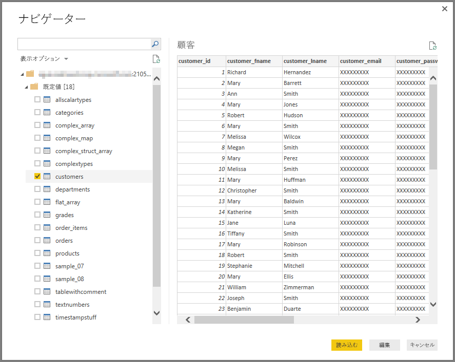

# Power BI Desktop で Impala データベースに接続する
Power BI Desktop では、**Impala** データベースに接続し、Power BI Desktop の他のデータ ソースの場合と同様に基になっているデータを使用できます。

## Impala データベースに接続する
**Impala** データベースに接続するには、Power BI Desktop の **[ホーム]** リボンで **[データの取得]** を選択します。 左側のカテゴリから **[データベース]** を選択します。**[Impala]** が表示されます。

表示された **[Impala]** ウィンドウ内のボックスに Impala サーバーの名前を入力するか、貼り付けます。**[OK]** をクリックします。 Power BI にデータを直接**インポート**したり、**DirectQuery** を使用したりできます。 詳しくは、「[Power BI Desktop の DirectQuery](desktop-use-directquery.md)」をご覧ください。

プロンプトが表示されたら、資格情報を入力するか、匿名で接続します。 Impala コネクタは、匿名、基本 (ユーザー名とパスワード)、および Windows 認証をサポートします。

> [!NOTE]
> 特定の **Impala** サーバーのユーザー名とパスワードを入力した場合、Power BI Desktop は以降もその同じ資格情報を使用して接続を試みます。 これらの資格情報を変更するには、**[ファイル]、[オプションと設定]、[データ ソース設定]** の順に移動します。
> 
> 

接続が正常に行われたら、**[ナビゲーター]** ウィンドウが開き、サーバー上で使用可能なデータが表示されます。その中から 1 つまたは複数の要素を選択し、**Power BI Desktop** にインポートして使用することができます。

## 考慮事項と制限事項
**Impala** コネクタにはいくつかの制限事項と考慮事項があるので注意してください。

* Impala コネクタは、3 つのサポートされた認証メカニズムのいずれかを使用して、オンプレミス データ ゲートウェイでサポートされます。

## 次の手順
Power BI Desktop を使用して接続できるデータの種類は他にもあります。 データ ソースの詳細については、次のリソースを参照してください。

* [Power BI Desktop の概要](desktop-getting-started.md)
* [Power BI Desktop のデータ ソース](desktop-data-sources.md)
* [Power BI Desktop でのデータの整形と結合](desktop-shape-and-combine-data.md)
* [Power BI Desktop で Excel ブックに接続する](desktop-connect-excel.md)   
* [Power BI Desktop にデータを直接入力する](desktop-enter-data-directly-into-desktop.md)   

