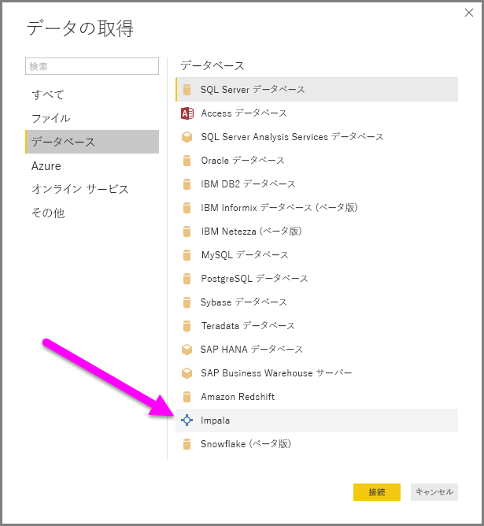
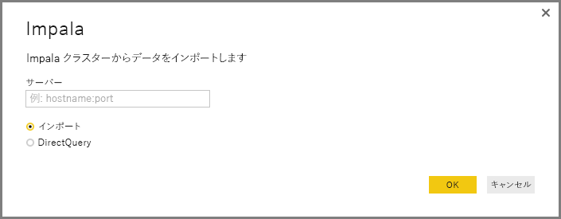
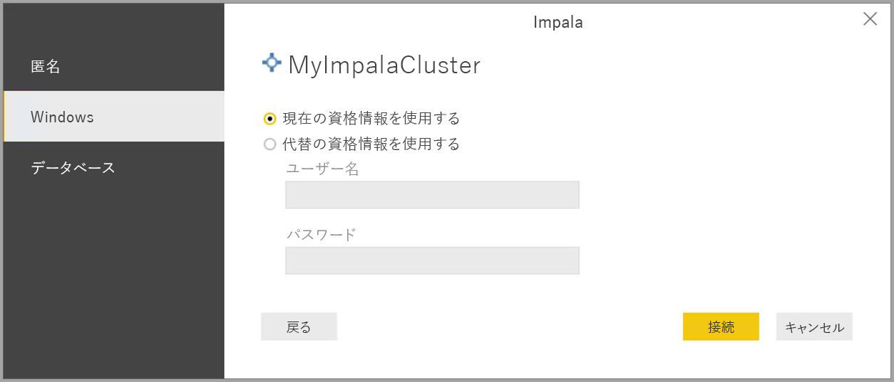

# Power BI Desktop で Impala データベースに接続する
Power BI Desktop では、**Impala** データベースに接続し、Power BI Desktop の他のデータ ソースの場合と同様に、基になっているデータを使用できます。

## Impala データベースに接続する
**Impala** データベースに接続するには、次の手順のようにします。 

1. Power BI Desktop の **[ホーム]** リボンで **[データを取得]** を選択します。 

2. 左側のカテゴリから **[データベース]** を選択します。 **Impala** が表示されます。

    

3. 表示された **[Impala]** ウィンドウで、ボックスに Impala サーバーの名前を入力するか、貼り付けます。 **[OK]** を選択します。 Power BI にデータを直接**インポート**したり、**DirectQuery** を使用したりできます。 詳しくは、[DirectQuery の使用](desktop-use-directquery.md)に関する記事をご覧ください。

    

4. プロンプトが表示されたら、資格情報を入力するか、匿名で接続します。 Impala コネクタは、匿名、基本 (ユーザー名とパスワード)、Windows 認証をサポートします。

    

    > [!NOTE]
    > 特定の **Impala** サーバーのユーザー名とパスワードを入力すると、Power BI Desktop は以降もその同じ資格情報を使用して接続を試みます。 これらの資格情報を変更するには、**[ファイル]、[オプションと設定]、[データ ソース設定]** の順に移動します。

5. 接続した後、**[ナビゲーター]** ウィンドウが表示され、サーバーで利用可能なデータが表示されます。 このデータから要素を選択してインポートし、**Power BI Desktop** で使用します。

    ![[ナビゲーター] ウィンドウ](media/desktop-connect-impala/connect_impala_5.png)

## 考慮事項と制限事項
**Impala** コネクタにはいくつかの制限事項と考慮事項があるので注意してください。

* Impala コネクタは、3 つのサポートされた認証メカニズムのいずれかを使用して、オンプレミス データ ゲートウェイでサポートされます。

## 次の手順
Power BI Desktop を使用して接続できるデータ ソースには、たくさんの種類があります。 データ ソースの詳細については、次のリソースを参照してください。

* [Power BI Desktop とは何ですか?](desktop-what-is-desktop.md)
* [Power BI Desktop のデータ ソース](desktop-data-sources.md)
* [Power BI Desktop でのデータの整形と結合](desktop-shape-and-combine-data.md)
* [Power BI Desktop で Excel ブックに接続する](desktop-connect-excel.md)   
* [Power BI Desktop にデータを直接入力する](desktop-enter-data-directly-into-desktop.md)   

