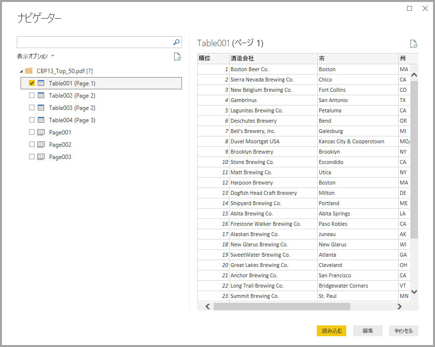

# Power BI Desktop で PDF ファイルに接続する (プレビュー)
Power BI Desktop では、Power BI Desktop の他のデータ ソースと同様に、**PDF ファイル**に接続してこのファイルに含まれるデータを使用できます。

次のセクションでは、**PDF ファイル**に接続し、データを選択して、そのデータを **Power BI Desktop** に取り込む方法について説明します。

## PDF のコネクタを有効にする
PDF コネクタは **Power BI Desktop** のプレビュー段階にあり、有効にする必要があります。 PDF コネクタを有効にするには、**[ファイル]、[オプションと設定]、[オプション]、[プレビュー機能]** の順に選択し、**[Get data from PDF files]/(PDF ファイルからデータを取得/)** のチェック ボックスをオンにします。 

![[オプション] の [プレビュー機能] で PDF コネクタを有効にする](media/desktop-connect-pdf/connect-pdf_01.png)

選択を行った後、**Power BI Desktop** を再起動する必要があります。

**PDF (ベータ)** コネクタを初めて使用すると、PDF コネクタはまだ開発中であり、今後変更される可能性があるという警告が表示されます。 コネクタを使用するには、**[続行]** を選択します。

常に、**Power BI Desktop** の最新リリースにアップグレードすることをお勧めします。これは、「[Power BI Desktop の取得](desktop-get-the-desktop.md)」内のリンクから取得できます。 

## PDF ファイルへの接続
**PDF** ファイルに接続するには、Power BI Desktop の **[ホーム]** リボンで **[データの取得]** を選択します。 左側のカテゴリから **[ファイル]** を選択します。**[PDF (ベータ)]** が表示されます。

![[データの取得] で PDF を選択する](media/desktop-connect-pdf/connect-pdf_01.png)

使用する PDF ファイルの場所を指定するよう求められます。 フィルの場所を指定し、PDF フィルが読み込まれたら、**[ナビゲーター]** ウィンドウが開き、ファイルから使用可能なデータが表示されます。その中から 1 つまたは複数の要素を選択し、**Power BI Desktop** にインポートして使用することができます。

PDF ファイル内の検出された要素の横にあるチェック ボックスをオンにすると、これらの要素が右側のウィンドウに表示されます。 インポートする準備ができたら、**[読み込み]** ボタンを選択して、そのデータを **Power BI Desktop** に取り込みます。

2018 年 11 月リリース以降の **Power BI Desktop** では、PDF 接続用の省略可能なパラメーターとして、**[開始ページ]** と **[最終ページ]** を選択できます。 また、以下の形式を使用して、M 式言語内でこれらのパラメーターを指定することもできます。

`Pdf.Tables(File.Contents("c:\sample.pdf"), [StartPage=10, EndPage=11])`

## 次の手順
Power BI Desktop を使用して接続できるデータの種類は他にもあります。 データ ソースの詳細については、次のリソースを参照してください。

* [Power BI Desktop とは何ですか?](desktop-what-is-desktop.md)
* [Power BI Desktop のデータ ソース](desktop-data-sources.md)
* [Power BI Desktop でのデータの整形と結合](desktop-shape-and-combine-data.md)
* [Power BI Desktop で Excel ブックに接続する](desktop-connect-excel.md)   
* [Power BI Desktop にデータを直接入力する](desktop-enter-data-directly-into-desktop.md)   

