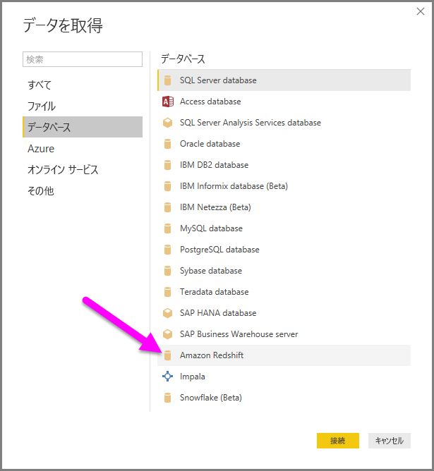
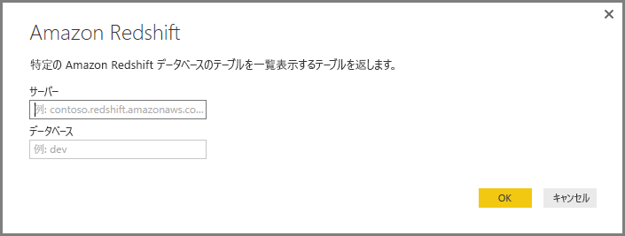
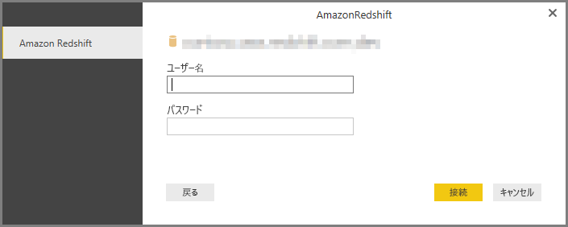
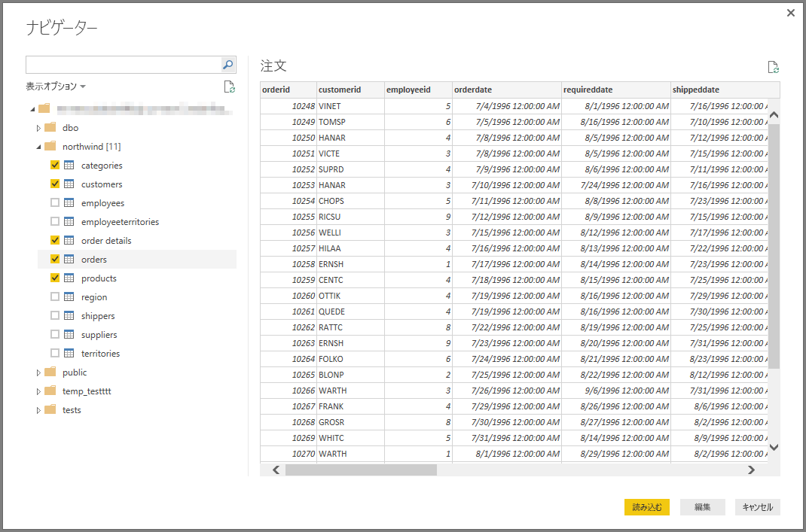

# Power BI Desktop で Amazon Redshift に接続する
**Power BI Desktop** では、**Amazon Redshift** データベースに接続し、Power BI Desktop の他のデータ ソースの場合と同様に基になっているデータを使用できます。

## Amazon Redshift データベースに接続する
**Amazon Redshift** データベースに接続するには、Power BI Desktop の **[ホーム]** リボンで **[データの取得]** を選択します。 左側のカテゴリから **[データベース]** を選択します。**[Amazon Redshift]** が表示されます。

表示された **[Amazon Redshift]** ウィンドウ内のボックスに、**Amazon Redshift** サーバーとデータベースの名前を入力するか、貼り付けます。 *[サーバー]* フィールドの一部として、ユーザーは次の形式でポートを指定できます:*ServerURL:Port*

プロンプトが表示されたら、ユーザー名とパスワードを入力します。 エラーを回避するには、SSL 証明書と正確に一致するサーバー名を使用する必要があります。 

接続が正常に行われたら、**[ナビゲーター]** ウィンドウが開き、サーバー上で使用可能なデータが表示されます。その中から 1 つまたは複数の要素を選択し、**Power BI Desktop** にインポートして使用することができます。

**[ナビゲーター]** ウィンドウで目的の選択を行うと、データの**読み込み**またはデータの**編集**を行うことができます。

* データの**読み込み**を選択した場合は、*インポート* モードまたは *DirectQuery* モードを使用してデータを読み込むように促されます。 詳細については、DirectQuery を説明している[こちらの記事](desktop-use-directquery.md)を参照してください。
* データの**編集**を選択した場合は、**クエリ エディター**が表示され、あらゆる種類の変換およびフィルターをデータに適用することができます。その多くは、基となる **Amazon Redshift** データベース自体 (サポートされている場合) に適用されます。

## 次の手順
Power BI Desktop を使用して接続できるデータの種類は他にもあります。 データ ソースの詳細については、次のリソースを参照してください。

* [Power BI Desktop とは何ですか?](desktop-what-is-desktop.md)
* [Power BI Desktop のデータ ソース](desktop-data-sources.md)
* [Power BI Desktop でのデータの整形と結合](desktop-shape-and-combine-data.md)
* [Power BI Desktop で Excel ブックに接続する](desktop-connect-excel.md)   
* [Power BI Desktop にデータを直接入力する](desktop-enter-data-directly-into-desktop.md)   

