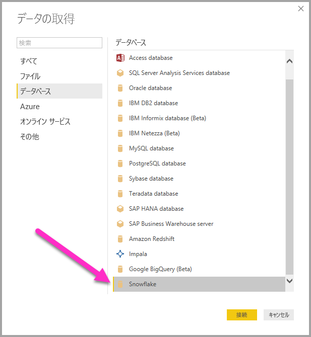
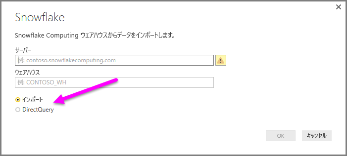
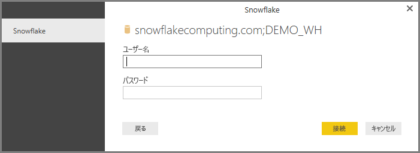
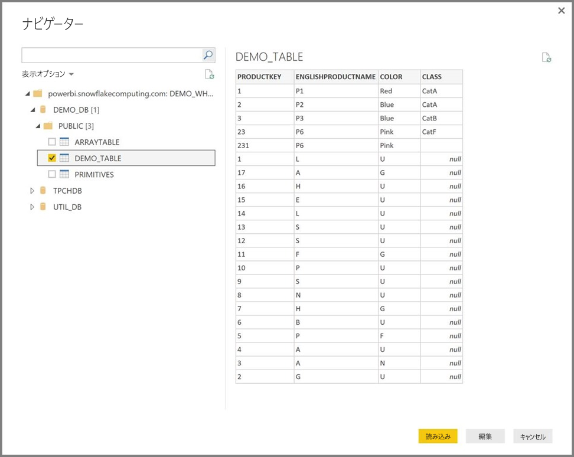

# Power BI Desktop で Snowflake に接続する
Power BI Desktop では、**Snowflake** Computing ウェアハウスに接続し、Power BI Desktop の他のデータ ソースの場合と同様に基になっているデータを使用できます。 

> [!NOTE]
> 32 ビットまたは 64 ビットのいずれかの **Power BI Desktop** のインストールに合致するアーキテクチャを使用して、**Snowflake** コネクタを使用するコンピューターに **Snowflake ODBC ドライバー**をインストールする*必要があります*。 次のリンクに従って、[適切な Snowflake ODBC ドライバーをダウンロード](http://go.microsoft.com/fwlink/?LinkID=823762)します。
> 
> 

## Snowflake Computing ウェアハウスに接続する
**Snowflake** Computing ウェアハウスに接続するには、Power BI Desktop の **[ホーム]** リボンで **[データの取得]** を選択します。 左側のカテゴリから **[データベース]** を選ぶと、**[Snowflake]** が表示されます。

表示された **[Snowflake]** ウィンドウ内のボックスに Snowflake Computing ウェアハウスの名前を入力するか、貼り付け、**[OK]** をクリックします。 Power BI にデータを直接**インポート**したり、**DirectQuery** を使用したりできます。 詳しくは、「[Power BI Desktop の DirectQuery](desktop-use-directquery.md)」をご覧ください。

プロンプトが表示されたら、ユーザー名とパスワードを入力します。

> [!NOTE]
> 特定の **Snowflake** サーバーのユーザー名とパスワードを入力した場合、Power BI Desktop は以降もその資格情報を使用して接続を試みます。 これらの資格情報を変更するには、**[ファイル]、[オプションと設定]、[データ ソース設定]** の順に移動します。
> 
> 

接続が正常に行われたら、**[ナビゲーター]** ウィンドウが開き、サーバー上で使用可能なデータが表示されます。その中から 1 つまたは複数の要素を選択し、**Power BI Desktop** にインポートして使用することができます。

選択したテーブルを**読み込んで**、テーブル全体を **Power BI Desktop** に取り込むことができます。またはクエリを**編集**して**クエリ エディター**を開き、使用するデータのセットをフィルターし、絞り込んでから、その絞り込んだデータのセットを **Power BI Desktop** に取り込むこともできます。

## 次の手順
Power BI Desktop を使用して接続できるデータの種類は他にもあります。 データ ソースの詳細については、次のリソースを参照してください。

* [Power BI Desktop とは何ですか?](desktop-what-is-desktop.md)
* [Power BI Desktop のデータ ソース](desktop-data-sources.md)
* [Power BI Desktop でのデータの整形と結合](desktop-shape-and-combine-data.md)
* [Power BI Desktop で Excel ブックに接続する](desktop-connect-excel.md)   
* [Power BI Desktop にデータを直接入力する](desktop-enter-data-directly-into-desktop.md)   

